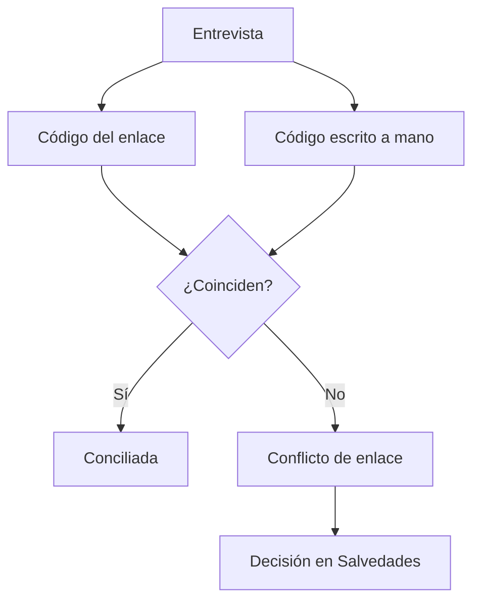

# Conciliación CodPulso telefónica

> Verifica a qué caso pertenece cada entrevista y detecta cuándo el encuestador levantó la encuesta con el enlace de otra persona.

## Objetivo

El código de caso es lo que une la entrevista con la persona del marco. Cuando ese vínculo falla, no se pierde una respuesta: se le atribuye a quien no corresponde, que es peor, porque la cifra sigue cuadrando mientras el expediente deja de ser cierto.

Esta pestaña existe para encontrar exactamente eso.

## Antes de empezar

- Conviene llegar desde una alerta de enlace o desde un caso registrado sin encuesta.
- Ten presente cómo llega el código: si el operativo usa enlaces personalizados, el código viaja en el enlace **y** lo escribe el encuestador. Son dos vías que pueden discrepar.
- Ten claro el formato canónico del código en este estudio.

## Mapa de la pantalla

## Elementos de la pantalla

| Elemento | Para qué sirve | Qué cambia o produce |
|---|---|---|
| Caso y entrevista | Identifica el par que se está conciliando | Es la unidad de revisión |
| Código del enlace | El que viajaba en la dirección con la que se abrió la encuesta | Una de las dos vías del código |
| Código registrado | El que el encuestador escribió durante la entrevista | La otra vía |
| Resultado de la conciliación | Si el par cruzó y contra qué caso | Decide la atribución |
| Marca de conflicto | Señala que las dos vías del código no coinciden | Es la detección del enlace equivocado |
| Detalle del caso | Muestra los datos del registro de base con el que cruzó | Permite verificar que la atribución es correcta |

## Cómo interpretar lo que ves

Hay dos tipos de discrepancia y **no son igual de graves**:

- Una diferencia de **formato** —el mismo código escrito con o sin separador, con espacios distintos— es cosmética. La persona es la misma y la atribución es correcta.
- Un código que **no cruza con nadie**, o que **cruza contra otro caso**, es crítico: la entrevista puede estar contando para la persona equivocada.

Ese segundo caso es el enlace confundido: el encuestador abrió el link de otro registro al levantar la encuesta. Cuando ocurre, el caso queda sin conciliar y se descuenta, así que aparece como pendiente pese a que la entrevista sí se hizo. Es la razón por la que un caso puede reaparecer en la lista de llamadas día tras día.

No todos los pendientes son conflictos de enlace: algunos son simplemente registros que nadie marcó. Separarlos es el trabajo de esta pantalla.

## Cómo se usa

1. Filtra o localiza los casos marcados como conflicto.
2. Descarta primero las diferencias de formato: no cambian la atribución.
3. Para los que quedan, compara el código del enlace con el registrado y mira el detalle del caso contra el que cruzó.
4. Determina cuál de los dos códigos corresponde a la persona realmente entrevistada.
5. Registra la decisión en Salvedades telefónicas; no la resuelvas por fuera.

## Ejemplo guiado

**Situación inicial.** Un caso aparece en la lista de pendientes cada día pese a que su responsable insiste en que la entrevista se levantó.

**Acciones.** Se abre esta pestaña y se localiza. La entrevista existe en la plataforma, pero el código del enlace y el que el encuestador escribió no coinciden, y no es una diferencia de formato: son dos códigos de casos distintos. Al mirar el detalle, el código del enlace pertenece a otra persona del marco.

**Resultado observable.** El encuestador abrió el enlace equivocado. La entrevista es válida y corresponde a la persona que el encuestador anotó a mano, no a la del enlace. Se registra la decisión en Salvedades, el caso deja de aparecer como pendiente y el otro caso —el del enlace— deja de figurar como entrevistado sin haberlo sido. Dos atribuciones corregidas con una sola decisión.

## Resultado y siguiente paso

- Cada entrevista queda con su atribución verificada, y los conflictos identificados con su evidencia.
- Las decisiones se registran en Salvedades telefónicas.

## Estados, alertas y límites

- Diferencia de **formato** del código: cosmética, no cambia la atribución.
- Código que **no cruza o cruza contra otro caso**: crítico, puede estar atribuyendo la entrevista a otra persona.
- Un caso con conflicto se descuenta del conciliado, por lo que reaparece como pendiente aunque la entrevista exista.
- La pestaña verifica y evidencia; la corrección se formaliza como decisión registrada.
- Sin código en la entrevista no hay conciliación posible por esta vía.

## Si algo no coincide

Si un caso reaparece como pendiente pese a tener entrevista, búscalo aquí antes de mandarlo a llamar de nuevo. Si hay muchísimos conflictos, filtra las diferencias de formato: suelen ser la mayoría y son inofensivas. Si un código no cruza con nadie, comprueba que el marco vinculado sea el correcto antes de tratarlo como error del encuestador.

## Ubicación en la jerarquía

- Padre: [[Consultas telefónicas]].
