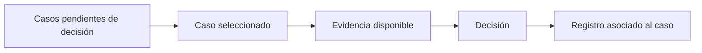

# Salvedades telefónicas

> Registra qué se decidió sobre cada caso que no cerró solo, y por qué.

## Objetivo

Toda operación telefónica acumula casos que no se resuelven con una regla: enlaces confundidos, entrevistas breves que sí se sostienen, registros sin encuesta. Alguien decide sobre ellos. Esta pestaña existe para que esa decisión quede **escrita y asociada al caso**, en lugar de vivir en un correo o en la memoria de quien revisó.

Es lo que convierte una cifra en una cifra defendible.

## Antes de empezar

- Conviene llegar desde Conciliación CodPulso o desde las alertas, con la evidencia ya revisada.
- Ten claro el criterio del estudio para admitir una salvedad: la aplicación registra la decisión, el criterio lo pone el equipo.
- Decide antes de entrar si el caso se sostiene o no; esta pantalla formaliza, no investiga.

## Mapa de la pantalla

## Elementos de la pantalla

| Elemento | Para qué sirve | Qué cambia o produce |
|---|---|---|
| Lista de casos | Reúne los que esperan decisión | Dimensiona el trabajo pendiente |
| Caso seleccionado | Muestra el registro completo con su procedencia | Es sobre lo que se decide |
| Evidencia | Reúne lo que sostiene o cuestiona el caso: códigos, duración, responsable, cruce | Es el fundamento de la decisión |
| Decisión | Registra qué se resolvió sobre ese caso | Queda asociada al caso y es auditable |
| Contador de decisiones | Cuántos casos llevan decisión manual | Indica cuánto del expediente descansa en criterio humano |

## Cómo interpretar lo que ves

Una salvedad no es una excepción vergonzante: en un operativo telefónico es normal que existan, y lo que se juzga no es su cantidad sino si están **justificadas**. Un expediente con decisiones registradas y fundadas es más sólido que uno sin casos raros, porque lo segundo suele significar que nadie los buscó.

Lo que sí conviene vigilar es el patrón. Muchas salvedades del mismo tipo indican una causa sistemática —una configuración, un procedimiento del equipo, un tramo de la base— y esa causa se corrige en su origen, no caso por caso.

Decidir aquí no reescribe la fuente: registra la resolución. La hoja de barrido y la plataforma siguen diciendo lo que decían, y esa trazabilidad es deliberada.

## Cómo se usa

1. Trabaja primero los casos que afectan a la cifra: los que cuentan o dejan de contar según la decisión.
2. Revisa la evidencia antes de decidir; si no alcanza, vuelve a la pestaña donde se investiga.
3. Registra la decisión con su motivo, no sólo el resultado.
4. Vigila si se repite un mismo tipo de caso: eso apunta a una causa de fondo.
5. Comprueba el contador antes de dar la revisión por cerrada.

## Ejemplo guiado

**Situación inicial.** La conciliación identificó varios casos donde el código del enlace y el registrado apuntan a personas distintas.

**Acciones.** Se abren uno a uno. En la mayoría, la evidencia —nombre, datos de contacto, responsable y hora— coincide con la persona que el encuestador anotó a mano, no con la del enlace. Se registran esas decisiones con su motivo. En dos casos la evidencia no alcanza para decidir y se dejan explicados como no atribuibles.

**Resultado observable.** Los casos resueltos dejan de figurar como pendientes y su entrevista queda atribuida a quien corresponde. Los dos sin evidencia quedan documentados en vez de contarse en silencio. Además, la repetición del mismo patrón lleva a una acción de fondo: recordarle al equipo que abra el enlace del caso que va a entrevistar.

## Resultado y siguiente paso

- Cada caso ambiguo queda con decisión registrada o explicado.
- Con la lista en cero, Avance telefónico puede leerse como cifra defendible.

## Estados, alertas y límites

- Una decisión es un registro auditable, no un recálculo silencioso.
- La pantalla no corrige la causa de fondo: si las salvedades se repiten, la corrección está en fuentes o en procedimiento.
- Decidir no modifica la hoja de barrido ni la plataforma.
- Un caso decidido puede reaparecer si el corte se regeneró antes de registrar la decisión.

## Si algo no coincide

Si la lista crece cada día, busca el patrón antes de seguir decidiendo caso por caso. Si un caso reaparece tras haber sido decidido, comprueba el orden entre la decisión y la regeneración del corte. Si no hay evidencia suficiente para decidir, déjalo explicado: es una salida válida y mejor que una decisión sin fundamento.

## Ubicación en la jerarquía

- Padre: [[Consultas telefónicas]].
