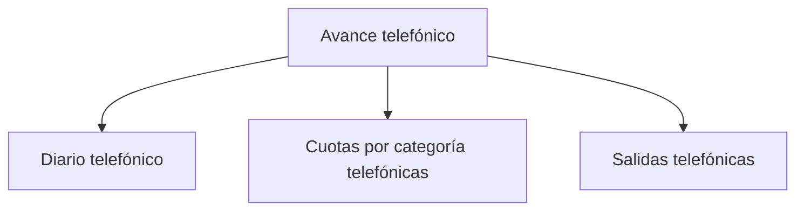

# Avance telefónico

> Lee el cumplimiento del operativo contra lo declarado y produce las entregas del corte.

## Propósito de esta guía

Es la sección de lectura y entrega. No calcula criterios: aplica los que se declararon en el modelo operativo. Su pregunta es doble —cuánto se lleva y si alcanza— y sólo la segunda parte requiere que la cuota y el plazo estén declarados.

## Antes de recorrer este nivel

- El paquete de fuentes debe estar fresco; el cumplimiento se calcula sobre lo que la plataforma acredita.
- La cuota debería estar declarada. Sin ella la sección sigue siendo útil, pero muestra producción en vez de cumplimiento.
- Idealmente las salvedades deben estar resueltas: un caso sin decidir es un hueco en la cifra que vas a entregar.

## Mapa de navegación

## Guía de destinos

| Destino | Cuándo entrar | Qué hacer allí | Qué deja listo |
|---|---|---|---|
| [[Diario telefónico]] | Para saber a qué ritmo avanza el operativo | Revisar la producción por día y su proyección | La respuesta a si se llega |
| [[Cuotas por categoría telefónicas]] | Para saber qué segmento va corto | Comparar cada categoría contra su mínimo | La brecha por categoría |
| [[Salidas telefónicas]] | Para entregar | Generar el reporte del corte | El artefacto con su procedencia |

## Recorrido recomendado

1. **Diario telefónico** para el ritmo y la proyección.
2. **Cuotas por categoría** para localizar dónde falta.
3. **Salidas** cuando lo anterior cuadre.

## Cómo interpretar avance y estados

Dos recordatorios que evitan la mayoría de los malentendidos de esta sección.

El primero: **la cifra de cumplimiento viene de la plataforma**, no del barrido. Si el reporte muestra menos de lo que el equipo levantó, la causa habitual es registro pendiente, y se localiza por responsable.

El segundo: **cubrir el mínimo es un cierre limpio**. Un cumplimiento por encima del 100 % no es un exceso que justificar, y la base que quedó sin trabajar es reserva, no deuda.

## Resultado de este nivel

Al terminar, el operativo tiene una lectura de cumplimiento con su ritmo y su proyección, la brecha localizada por categoría si la hay, y las entregas del corte generadas con su fecha y procedencia.

## Ubicación en la jerarquía

- Padre: [[Telefónico]].
