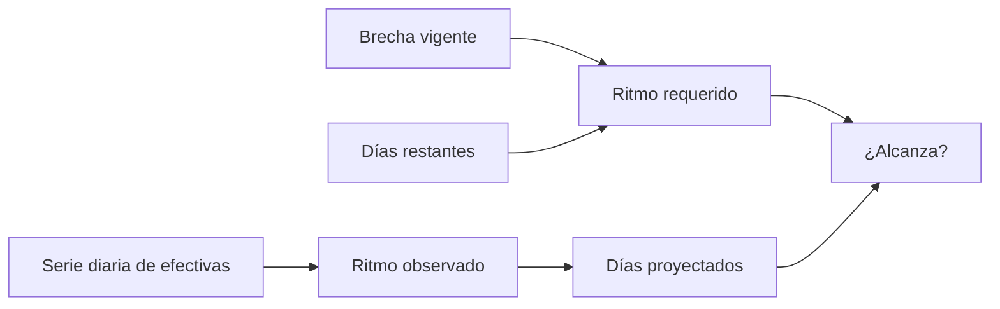

# Diario telefónico

> Muestra la producción por día y la contrasta con lo que haría falta para cerrar la brecha a tiempo.

## Objetivo

Responde la pregunta que decide si hay que reforzar: **¿se llega?** Para eso enfrenta dos cifras que apuntan en direcciones opuestas —lo que se produce y lo que haría falta producir— y traduce el ritmo actual a una fecha de cierre.

Es la pantalla que permite decidir con margen en vez de descubrirlo el último día.

## Antes de empezar

- El corte debe traer respuestas fechadas.
- Para el ritmo requerido hacen falta cuota y periodo declarados; sin ellos verás producción y tendencia, que siguen sirviendo.
- Conviene saber qué días trabaja realmente el equipo.

## Mapa de la pantalla

## Elementos de la pantalla

| Elemento | Para qué sirve | Qué cambia o produce |
|---|---|---|
| Serie diaria | Presenta las efectivas por día del periodo | Es la base de toda lectura de ritmo |
| Desglose por resultado | Separa efectivas, parciales y rechazos de cada día | Distingue menos llamadas de peores resultados |
| Días con datos | Cuenta los días que trajeron producción | Es el divisor honesto del promedio |
| Ritmo observado | Efectivas por día del operativo | Describe la capacidad actual |
| Ritmo requerido | Efectivas por día necesarias para cerrar la brecha en el plazo | Es la referencia contra la que se juzga |
| Días proyectados | Cuánto tardaría en cerrarse la brecha al ritmo actual | Traduce el ritmo a una fecha |

## Cómo interpretar lo que ves

Compara siempre **ritmo observado** contra **ritmo requerido**, no el observado contra sí mismo. Un ritmo que parece bueno puede ser insuficiente, y uno modesto puede sobrar si la brecha es pequeña.

El promedio cambia según el divisor: repartir el total entre todos los días del periodo da una cifra menor que repartirlo entre los días con producción. El segundo describe la capacidad del equipo cuando trabaja y es el que sirve para proyectar; el primero explica el rendimiento del periodo y es el que sirve para reportar.

Si los **días proyectados** superan a los días restantes, el operativo no cierra al paso actual. Ésa es la señal de decisión, y aparece antes de que el plazo se agote.

Sin brecha no hay ritmo requerido, y es correcto: no hay nada que cerrar a tiempo.

## Cómo se usa

1. Comprueba que la serie cubra el periodo real del operativo.
2. Lee el ritmo observado y contrástalo con el requerido.
3. Mira los días proyectados frente a los restantes: es la comparación que decide.
4. Ajusta mentalmente por los días no laborables, que la aplicación no conoce.
5. Si no alcanza, decide con margen: reforzar, ampliar el plazo o renegociar la cuota.

## Ejemplo guiado

**Situación inicial.** Quedan diez días de campo, hay brecha y el ritmo de los últimos días parece bueno.

**Acciones.** Se abre esta pestaña. El ritmo observado es sólido, pero el requerido es más alto, y los días proyectados para cerrar la brecha superan a los restantes. Además, de los diez días que quedan, varios caen en fin de semana.

**Resultado observable.** La lectura optimista se cae: al paso actual no se cierra. Se refuerza el equipo con una semana y media de margen y se vuelve a comprobar a los pocos días si el ritmo subió lo suficiente. La decisión se tomó a tiempo porque la pestaña compara contra lo requerido, no contra la impresión de que se va bien.

## Resultado y siguiente paso

- Queda una lectura del ritmo y una proyección de cierre.
- Continúa en Cuotas por categoría telefónicas para saber dónde se concentra la brecha.

## Estados, alertas y límites

- Sin respuestas fechadas no hay serie: es ausencia de evidencia temporal, no un cero.
- Sin cuota o sin periodo no hay ritmo requerido, sólo observado.
- Los días restantes son de calendario: incluyen días en que el equipo no llama.
- La serie describe lo ocurrido; la proyección supone que el ritmo se mantiene.
- La cifra diaria viene de la plataforma; el barrido puede mostrar otra cosa si hay registro pendiente.

## Si algo no coincide

Si la serie arranca más tarde que el campo real, comprueba el periodo del corte. Si el total de la serie no coincide con el cumplimiento, verifica que ambos vengan del mismo corte y que la cifra sea de plataforma. Si hay días vacíos en medio, contrasta con el resumen operativo: un día de llamadas sin efectivas se ve igual que un día sin trabajo.

## Ubicación en la jerarquía

- Padre: [[Avance telefónico]].
