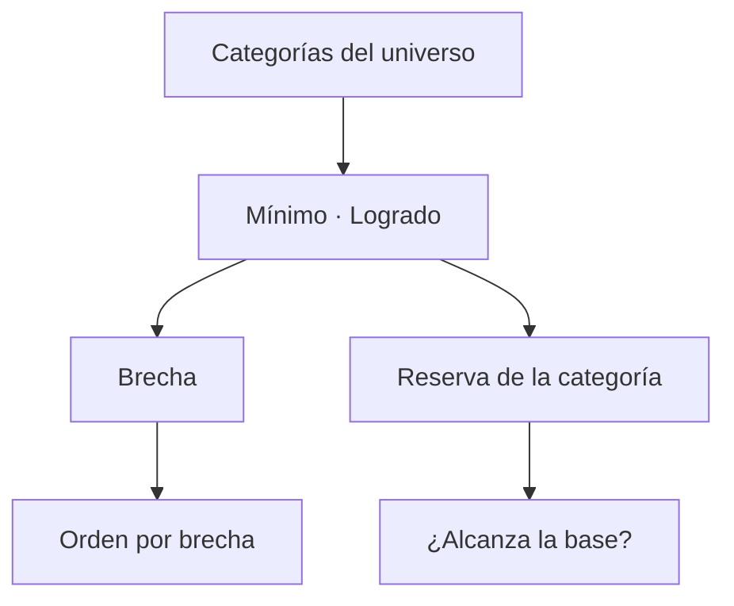

# Cuotas por categoría telefónicas

> Compara cada categoría contra su mínimo y ordena las que van cortas, para saber dónde concentrar el esfuerzo.

## Objetivo

El cumplimiento total esconde el reparto. Un operativo puede haber superado su meta general y tener una categoría muy por debajo, y en un estudio con cuotas eso importa: el sobrecumplimiento de un segmento no compensa el déficit de otro.

Esta pestaña ordena las categorías por brecha para que el esfuerzo restante vaya donde falta.

## Antes de empezar

- Las cuotas deben estar declaradas en Cuotas telefónicas. Sin ellas la pestaña muestra producción por categoría, no cumplimiento.
- Conviene traer del Diario si hay tiempo suficiente: cambia si la decisión es reforzar o renegociar.

## Mapa de la pantalla

## Elementos de la pantalla

| Elemento | Para qué sirve | Qué cambia o produce |
|---|---|---|
| Fila por categoría | Presenta cada segmento con sus cifras | Es la unidad de comparación |
| **Mínimo** | Cuota declarada de esa categoría | Es su referencia |
| **Logrado** | Efectivas acreditadas del segmento | Es su numerador |
| **Brecha** | Cuánto falta para el mínimo | Cero es cierre limpio |
| Orden por brecha | Coloca arriba las categorías que más faltan | Convierte la tabla en una prioridad |
| Reserva de la categoría | Base disponible sin trabajar en ese segmento | Dice si hay con qué cerrar |
| Categorías cubiertas | Cuántas alcanzaron su mínimo | Resume el estado del reparto |

## Cómo interpretar lo que ves

Una categoría con brecha y sin reserva es un problema distinto de una con brecha y reserva amplia: la primera no se cierra llamando porque no queda a quién llamar, y exige renegociar la cuota o ampliar el marco. La segunda es trabajo pendiente y nada más.

Cruza la reserva con el costo por efectiva que muestra Cuotas telefónicas antes de dar por hecho que alcanza: una reserva que parece amplia puede quedarse corta si hacen falta muchos registros por cada efectiva.

Un porcentaje por encima del 100 % en una categoría es cierre limpio, no un exceso que reasignar. Las cuotas son mínimos independientes: lo que sobra en una no cubre lo que falta en otra.

## Cómo se usa

1. Lee la lista en su orden: las categorías con más brecha van primero.
2. Para cada una con brecha, mira su reserva antes de planificar el esfuerzo.
3. Separa las que no tienen reserva: ésas exigen una decisión, no más llamadas.
4. Coordina el trabajo de las que sí la tienen con la lista de Sin efectiva telefónica.
5. Comprueba el conteo de categorías cubiertas antes de proponer el cierre del campo.

## Ejemplo guiado

**Situación inicial.** El operativo superó su meta total y se propone cerrar el campo.

**Acciones.** Se abre esta pestaña y se lee el reparto. La mayoría de las categorías superó su mínimo, pero una sigue corta. Se mira su reserva: quedan casos sin trabajar en ese segmento, más que suficientes según el costo por efectiva observado.

**Resultado observable.** Cerrar el campo habría dejado una cuota incumplida bajo un total que se veía holgado. Se dirige el esfuerzo restante a ese único segmento, que sí tiene con qué cerrarse, en lugar de repartirlo entre todos. El total no era el problema: el reparto sí.

## Resultado y siguiente paso

- Queda la brecha localizada por categoría y clasificada según tenga o no reserva.
- Continúa en Sin efectiva telefónica para tomar los casos del segmento que falta, o en Salidas telefónicas si el reparto ya cuadra.

## Estados, alertas y límites

- Sin cuotas declaradas la pestaña muestra producción por categoría, no cumplimiento.
- Un sobrecumplimiento en una categoría no compensa el déficit de otra.
- Reserva amplia no garantiza que alcance: depende del costo por efectiva.
- Una categoría con brecha y sin reserva no se cierra llamando.
- El logrado viene de la plataforma; el barrido puede diferir si hay registro pendiente.

## Si algo no coincide

Si una categoría muestra menos de lo esperado, comprueba si su déficit es de producción o de registro pendiente, mirando el cruce por responsable. Si la suma de categorías no da el total, busca casos sin categoría asignada en el universo. Si una categoría no aparece, revisa que su segmento esté presente en la hoja de universo.

## Ubicación en la jerarquía

- Padre: [[Avance telefónico]].
