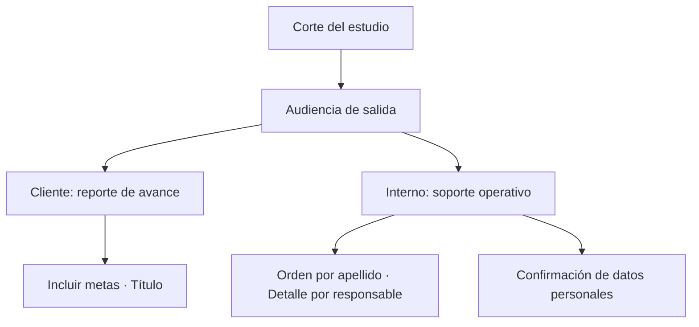

# Salidas telefónicas

> Genera las entregas del operativo telefónico, distinguiendo lo que va al cliente de lo que es soporte interno.

## Objetivo

Aquí el corte sale de la aplicación. La decisión que gobierna la pestaña es la **audiencia**: un reporte de avance para el cliente y un soporte operativo interno no llevan la misma información, y en un operativo telefónico la diferencia es sensible porque el detalle interno incluye nombres, teléfonos y desempeño por persona.

## Antes de empezar

- El corte debe ser el que quieres entregar; las salidas congelan lo que hay.
- Las salvedades deberían estar resueltas: cada caso sin decidir es un hueco en lo que estás por firmar.
- Comprueba antes el registro pendiente por responsable: un reporte generado sobre un barrido retrasado subrepresenta la producción.

## Mapa de la pantalla

## Elementos de la pantalla

| Elemento | Para qué sirve | Qué cambia o produce |
|---|---|---|
| **Corte del estudio** | Declara qué corte se exporta | Es la procedencia que viaja en el archivo |
| **Audiencia de salida** | Distingue entrega al cliente de soporte interno | Condiciona qué contenido admite el archivo |
| **Incluir metas** | Añade o retira las cuotas del reporte | Las cuotas son un instrumento interno; se incluyen sólo si el acuerdo lo pide |
| **Título del PDF** | Nombra el documento | Aparece en el archivo final |
| **Orden por apellido** | Ordena el listado operativo | Facilita el trabajo del equipo con el documento |
| **Detalle por responsable** | Añade el desglose por persona | Es información interna, no de cliente |
| Confirmación de datos personales | Exige declarar que la salida interna puede incluirlos | Evita que un archivo con datos personales salga por descuido |
| **Spreadsheet destino** | Publica el resultado en una hoja | Es la única acción que saca contenido de la aplicación |
| Estado de preparación | Indica si el corte alcanza para cada salida | Bloquea entregas incompletas |

## Cómo interpretar lo que ves

**Detalle por responsable** es la opción que más cuidado exige. El desempeño individual del equipo de llamadas es información de gestión interna: útil para coordinar, inadecuada para un entregable de cliente. Va con la audiencia interna, no con la externa.

La confirmación de datos personales no es un trámite. En un operativo telefónico la base incluye nombres y teléfonos, y ésa es la única barrera antes de que un archivo con esos datos circule.

Generar no publica: el archivo vive local hasta que alguien lo envía. La excepción es la publicación en una hoja de destino, que sí es una salida real y es explícita.

El estado de preparación mide suficiencia, no exactitud: un corte con salvedades pendientes se exporta igual.

## Cómo se usa

1. Confirma el corte y su fecha.
2. Elige la **audiencia** antes que nada; condiciona el resto.
3. Decide **incluir metas** según lo acordado con el cliente para este entregable.
4. Activa **detalle por responsable** sólo para la audiencia interna.
5. Marca la confirmación de datos personales de forma consciente cuando corresponda.
6. Genera y revisa el archivo antes de enviarlo.

## Ejemplo guiado

**Situación inicial.** Hay que mandar el avance semanal al cliente y, el mismo día, un reporte de gestión al coordinador del equipo.

**Acciones.** Se comprueba primero que no haya registro pendiente por responsable, para que la cifra no salga subrepresentada. Para el cliente se elige audiencia externa, se deja el detalle por responsable desactivado y se decide sobre las metas según el acuerdo. Para el coordinador se elige audiencia interna, se activa el detalle por responsable y se marca la confirmación de datos personales.

**Resultado observable.** El cliente recibe un documento de avance sin desempeño individual ni datos de contacto. El coordinador recibe el desglose que necesita para repartir el trabajo. Ambos archivos comparten corte y fecha, así que las cifras son consistentes entre sí.

## Resultado y siguiente paso

- Quedan generados los entregables del corte, cada uno con el contenido que su audiencia admite.
- Con las entregas cursadas, el operativo continúa según su cronograma o cierra.

## Estados, alertas y límites

- Las salidas **congelan** el corte visible; cambios posteriores no actualizan un archivo ya generado.
- El detalle por responsable es información interna.
- Generar no envía. Publicar en una hoja de destino sí saca contenido, y es explícito.
- El estado de preparación evalúa suficiencia, no exactitud.
- Los secretos y credenciales nunca viajan en los archivos generados.

## Si algo no coincide

Si el reporte muestra menos producción de la esperada, comprueba el registro pendiente por responsable antes de dudar del reporte. Si las cifras del archivo no coinciden con la pantalla, verifica que correspondan al mismo corte. Si una salida aparece bloqueada, el estado de preparación indica qué falta.

## Ubicación en la jerarquía

- Padre: [[Avance telefónico]].
