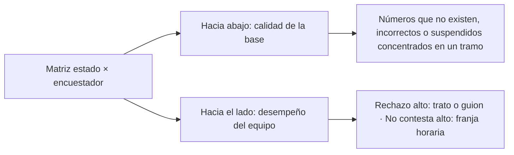
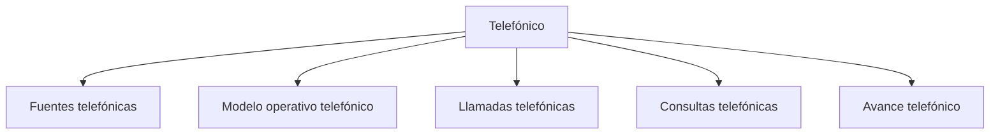

# Telefónico

> Gobierna una operación de llamadas sobre un marco contactable, conciliando lo que registra el equipo con lo que registra la plataforma.

## Propósito de esta guía

Este modo se usa cuando el estudio se levanta por teléfono sobre una base de contactos. Su unidad de trabajo es la **llamada**, y su dificultad característica es que hay **dos registros de la misma realidad**: la hoja donde el equipo anota lo que pasó en cada llamada, y la plataforma donde queda la encuesta. Buena parte del modo existe para conciliar ambas.

Es un modo independiente del de Acreditación aunque compartan vocabulario: sus fuentes, sus estados y sus salidas son propios.

## El contrato que hay que entender antes de leer cualquier cifra

**1. La cuota es un mínimo, y lo que falta por barrer es reserva.** La meta la declara el usuario y es un piso, no un techo ni un objetivo exacto. De ahí que superar el 100 % sea un cierre limpio y no una anomalía, y que *por barrer* no sea el titular de ninguna pantalla: es la base disponible que aún no se ha trabajado. La reserva sólo asciende a primer plano cuando hay brecha, y entonces con la lectura que decide: cuántas faltan, cuánta base queda y si alcanza al ritmo actual.

**2. Los estados telefónicos se leen en cruz.** Es la información más rica del campo telefónico, y sólo funciona si se miran las dos direcciones a la vez:

Sin el corte por encuestador **y** el general en la misma pieza, ninguna de las dos lecturas es posible.

**3. La diferencia entre plataforma y barrido es una señal temprana, no un dato de cierre.** Cuando la plataforma registra más efectivas que la hoja, significa que alguien está entrevistando sin registrar el estado. Se corrige pidiéndoselo a quien tiene los casos sin marcar, y por eso el corte relevante es **por responsable**, no el total del equipo.

**4. El enlace equivocado existe y hay que distinguirlo.** Cuando un encuestador abre el enlace de otro caso, el código que viajaba en el enlace y el que escribió a mano no coinciden, y el cruce apunta a la persona equivocada. Hay dos familias que no deben mezclarse: una diferencia de **formato** del código es cosmética; un código que **no cruza o cruza contra el caso equivocado** es crítico.

## Antes de recorrer este nivel

Confirma que existe un marco contactable con responsables asignados, que la plataforma tiene su encuesta activa y que sabes qué se declaró como cuota. Si no hay cuotas, el modo sigue funcionando: cambia el contenido de la pantalla, no su forma.

## Mapa de navegación

## Guía de destinos

| Destino | Cuándo entrar | Qué hacer allí | Qué deja listo |
|---|---|---|---|
| [[Fuentes telefónicas]] | Al montar el estudio y cuando una cifra no cuadre | Declarar la encuesta de plataforma, la base y el barrido | El paquete de tres piezas que alimenta el modo |
| [[Modelo operativo telefónico]] | Al fijar qué se espera del operativo | Declarar cuotas y cronograma | El criterio de cumplimiento |
| [[Llamadas telefónicas]] | Durante el campo, todos los días | Revisar estados, tiempos, pendientes, equipo y alertas | El gobierno diario de la operación |
| [[Consultas telefónicas]] | Cuando hay que responder por un caso | Revisar efectivas, conciliación por código y salvedades | La trazabilidad caso a caso |
| [[Avance telefónico]] | Para leer cumplimiento y entregar | Revisar ritmo y cuotas, y generar salidas | El reporte del corte |

## Recorrido recomendado

1. **Fuentes telefónicas** al configurar: las tres piezas —base, barrido y plataforma— se mantienen separadas a propósito.
2. **Modelo operativo telefónico** para declarar la cuota, que es lo que convierte la producción en cumplimiento.
3. **Llamadas telefónicas** en el día a día: es la sección de gobierno del operativo.
4. **Consultas telefónicas** cuando un caso concreto exige explicación.
5. **Avance telefónico** para cerrar y entregar.

## Cómo interpretar avance y estados

La regla que evita el malentendido más común: **la plataforma manda las efectivas**. La hoja de barrido describe el intento y su resultado; la encuesta acredita la respuesta. Que la primera muestre menos efectivas que la segunda no es un error de cálculo, es trabajo sin registrar.

Un mínimo cubierto es un estado terminal limpio. Si el estudio ya superó su cuota, la lectura correcta no es *quedan mil casos por barrer* sino *la meta está cubierta y queda esa reserva por si aparece una brecha*.

## Cómo se llega a cada pantalla

Este modo publica su ubicación: `/monitoreo?modo=telefonico&seccion=<sección>&pestana=<pestaña>`. El modo aparece escrito pero lo determina el estudio, no un click.

## Resultado de este nivel

Al completar Telefónico queda una operación de llamadas gobernada: qué se contactó y con qué resultado, quién lo hizo, qué diferencia hay entre lo registrado y lo acreditado, y si el cumplimiento se alcanzó con la reserva que quedó disponible.

## Ubicación en la jerarquía

- Padre: [[Monitoreo]].
