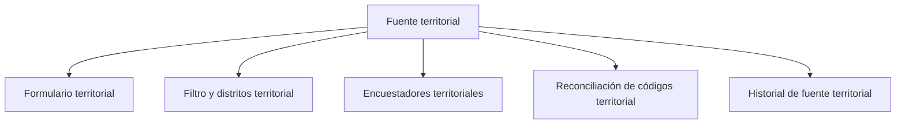

# Fuente territorial

> Declara de dónde sale el corte: qué formulario aporta las respuestas, qué distritos entran, quiénes son los encuestadores y cómo se reconcilian sus códigos.

## Propósito de esta guía

El modo territorial cruza dos mundos —las respuestas de Kobo y el marco de Hojas de ruta— y ese cruce sólo funciona si las llaves coinciden. Esta sección es donde se establecen esas llaves: el alcance de distritos, la identidad de cada encuestador y la correspondencia entre lo que el campo escribió y lo que el plan esperaba.

Cuando una cifra territorial no cuadra, la causa está aquí más veces que en cualquier otro sitio.

## Antes de recorrer este nivel

- Hojas de ruta debe tener un marco vigente: distritos, metas, UMP titulares y de reemplazo.
- El formulario de Kobo del operativo debe existir y estar recibiendo respuestas.
- Ten la lista real del equipo de campo con sus códigos: el mapeo de encuestadores se hace contra ella.

## Mapa de navegación

## Guía de destinos

| Destino | Cuándo entrar | Qué hacer allí | Qué deja listo |
|---|---|---|---|
| [[Formulario territorial]] | Al vincular la fuente de respuestas | Elegir el formulario Kobo y actualizar su ficha | La fuente del corte |
| [[Filtro y distritos territorial]] | Al definir el alcance del corte | Acotar qué respuestas y qué distritos entran | El universo del corte y su alineación con la ruta |
| [[Encuestadores territoriales]] | Al identificar al equipo | Mapear cada encuestador con su código Pulso | La atribución de cada respuesta a una persona |
| [[Reconciliación de códigos territorial]] | Cuando los códigos de campo no calzan con el plan | Revisar y resolver correspondencias de código y UMP | El puente entre lo levantado y lo planificado |
| [[Historial de fuente territorial]] | Para saber qué cambió y cuándo | Revisar los eventos del corte | La trazabilidad de la configuración |

## Recorrido recomendado

1. **Formulario territorial** primero: sin fuente no hay respuestas.
2. **Filtro y distritos** para acotar el alcance y comprobar que los distritos coinciden con la ruta.
3. **Encuestadores territoriales** para que cada respuesta tenga dueño.
4. **Reconciliación de códigos** cuando aparezcan correspondencias que no calzan.
5. **Historial** cuando haya que explicar por qué una cifra cambió entre dos cortes.

## Cómo interpretar avance y estados

Tres cifras aparecen juntas en el resumen de esta sección y significan cosas distintas: **distritos alineados** —cuántos del formulario corresponden a la ruta—, **respuestas recibidas** —lo que Kobo entregó— y **respuestas que pasan el filtro** —lo que realmente entra al corte—. La distancia entre las dos últimas es el efecto del filtro, y conviene entenderla antes de interpretar cualquier avance.

Un distrito no alineado no es un distrito vacío: es un distrito cuyas respuestas existen pero no encuentran correspondencia en el marco operativo.

## Resultado de este nivel

Al terminar, el corte tiene fuente declarada, alcance acotado, encuestadores identificados y códigos reconciliados. Ése es el punto de partida para que Validación y Avance digan algo cierto.

## Ubicación en la jerarquía

- Padre: [[Territorial]].
