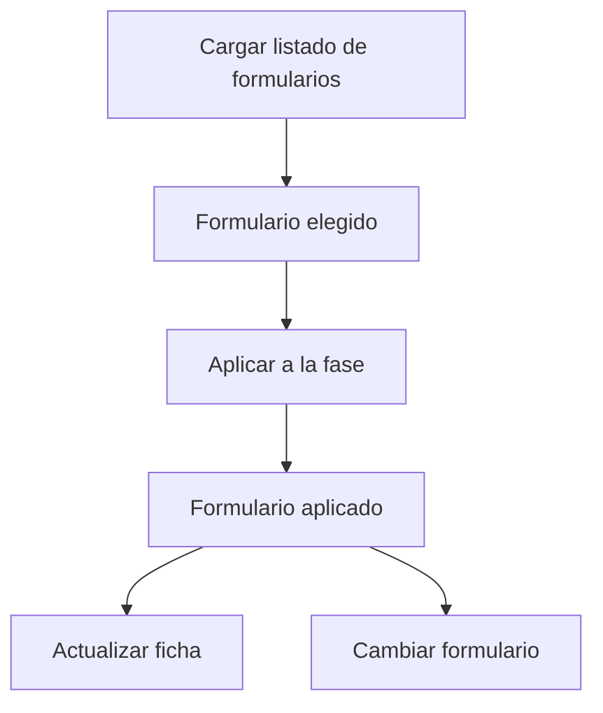

# Formulario territorial

> Vincula el formulario Kobo del operativo y mantiene su ficha al día, incluso cuando el estudio usa un formulario distinto por fase.

## Objetivo

Es la fuente de las respuestas del modo. Sin formulario vinculado no hay corte, y con el formulario equivocado el corte describe otro operativo.

Su particularidad territorial es que muchos estudios de campo cambian de formulario entre fases —piloto, ola principal, refuerzo—, y esta pestaña admite esa realidad en lugar de forzar un único formulario para todo el estudio.

## Antes de empezar

- La conexión con Kobo debe estar configurada.
- Ten claro qué formulario corresponde a la fase que vas a monitorear.
- Si el estudio tiene varias fases, conoce cuál es la activa: el corte se lee sobre ella.

## Mapa de la pantalla

## Elementos de la pantalla

| Elemento | Para qué sirve | Qué cambia o produce |
|---|---|---|
| **Cargar listado** | Trae los formularios disponibles de la cuenta Kobo | Permite elegir sin escribir identificadores |
| Filtros del listado | Acotan la búsqueda dentro del catálogo | Facilitan encontrar el formulario del operativo |
| **Aplicar a la fase** | Declara ese formulario como fuente de la fase activa | Es lo que fija la fuente del corte |
| **Formulario aplicado** | Muestra el que está vigente, con su estado | Confirma sobre qué se está leyendo |
| **Actualizar ficha** | Vuelve a leer la definición del formulario | Recoge cambios de estructura del instrumento |
| **Cambiar formulario** | Sustituye la fuente de la fase | Reapunta el corte a otro formulario |
| Formularios por fase | Presenta qué formulario tiene cada fase del estudio | Evita mezclar olas distintas en una sola lectura |

## Cómo interpretar lo que ves

**Aplicar** y **actualizar ficha** hacen cosas distintas. Aplicar elige la fuente; actualizar la ficha vuelve a leer su estructura. Si el instrumento cambió en Kobo —una pregunta nueva, una lista modificada— hace falta lo segundo, aunque el formulario vinculado sea el mismo.

Un formulario aplicado no implica respuestas sincronizadas: la vinculación declara de dónde leer, y la sincronización trae los datos.

Cuando el estudio tiene formularios por fase, el corte se lee sobre la fase activa. Comparar cifras entre fases que usan formularios distintos exige comprobar antes que ambas midan lo mismo.

## Cómo se usa

1. Pulsa **Cargar listado** y localiza el formulario del operativo.
2. **Aplica** el formulario a la fase que corresponda.
3. Comprueba que el formulario aplicado sea el esperado antes de leer cualquier cifra.
4. Usa **Actualizar ficha** cuando el instrumento haya cambiado en Kobo.
5. Reserva **Cambiar formulario** para correcciones reales: cambia la fuente de todo el corte de esa fase.

## Ejemplo guiado

**Situación inicial.** El equipo añadió una pregunta al formulario en Kobo y en el corte esa variable no aparece por ningún lado.

**Acciones.** Se abre esta pestaña. El formulario aplicado es el correcto, así que no hay que cambiarlo. Se pulsa **Actualizar ficha** para releer su definición y luego se sincroniza.

**Resultado observable.** La nueva variable aparece disponible en el corte. El problema no era de vinculación ni de respuestas: era que la aplicación conservaba la definición anterior del instrumento. Cambiar el formulario habría sido innecesario y habría reapuntado la fuente sin motivo.

## Resultado y siguiente paso

- La fase tiene su fuente de respuestas declarada y su ficha al día.
- Continúa en Filtro y distritos territorial para acotar qué respuestas entran al corte.

## Estados, alertas y límites

- Aplicar el formulario no sincroniza las respuestas.
- Actualizar la ficha relee la estructura del instrumento, no los datos.
- Cambiar el formulario de una fase reapunta todo su corte: no es una acción menor.
- Esta pantalla no edita el instrumento; eso vive en el Editor de formularios.
- Cifras de fases con formularios distintos no son directamente comparables.

## Si algo no coincide

Si falta una variable que sí existe en Kobo, actualiza la ficha antes de sospechar de los datos. Si no llegan respuestas, comprueba que el formulario aplicado sea el que el equipo está usando en campo. Si el corte describe otra ola, revisa qué formulario tiene asignado la fase activa.

## Ubicación en la jerarquía

- Padre: [[Fuente territorial]].
