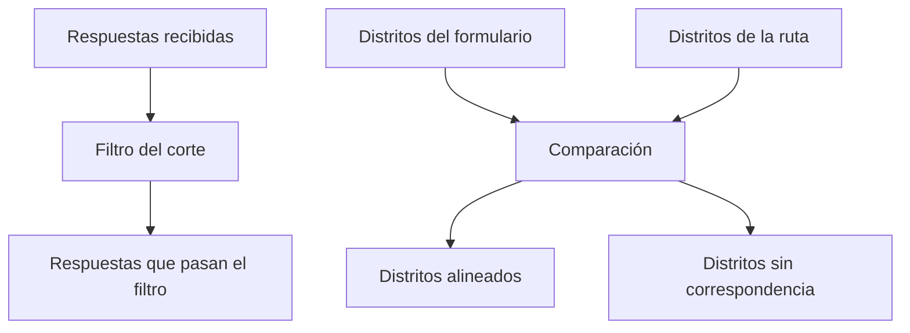

# Filtro y distritos territorial

> Acota qué respuestas entran al corte y comprueba que los distritos del formulario correspondan a los de la ruta.

## Objetivo

Dos decisiones se toman aquí, y ambas cambian todas las cifras posteriores: qué respuestas cuentan como efectivas para el corte, y qué distritos forman el alcance.

La comprobación de **alineación de distritos** es la que más problemas evita. Si el formulario reporta distritos que la ruta no contempla —o al revés—, las respuestas existen pero no encuentran marco contra el cual medirse, y el avance aparece incompleto sin motivo aparente.

## Antes de empezar

- El formulario debe estar aplicado y sincronizado al menos una vez.
- Hojas de ruta debe tener su marco vigente con los distritos del estudio.
- Ten claro qué criterio define una respuesta efectiva en este operativo.

## Mapa de la pantalla

## Elementos de la pantalla

| Elemento | Para qué sirve | Qué cambia o produce |
|---|---|---|
| **Respuestas recibidas** | Cuántas entregó Kobo en la última sincronización | Es el punto de partida, no el avance |
| Filtro del corte | Define qué respuestas cuentan | Determina el universo del corte |
| **Respuestas que pasan el filtro** | Cuántas quedan tras aplicarlo | Es la base real de todas las cifras del modo |
| **Distritos alineados** | Cuántos distritos del formulario corresponden a la ruta | Es la comprobación clave de la pestaña |
| Distritos sin correspondencia | Los que aparecen en una fuente y no en la otra | Localiza el desajuste de alcance |
| Selector de alcance | Acota el corte a determinados distritos | Permite trabajar por zona sin mezclar |

## Cómo interpretar lo que ves

La diferencia entre **recibidas** y **las que pasan el filtro** es el efecto del filtro, y conviene conocerla antes de leer cualquier avance: si esa distancia es grande, casi todas las cifras del modo hablan de una fracción de lo levantado.

Un distrito **sin correspondencia** puede serlo en dos direcciones opuestas. Si el formulario trae un distrito que la ruta no tiene, se está levantando fuera del alcance planificado. Si la ruta tiene un distrito que el formulario nunca reporta, ese distrito no ha empezado o su código se está escribiendo distinto. Son diagnósticos contrarios y la pantalla los distingue.

Acotar el alcance no borra datos: cambia qué se está mirando. Recuerda restablecerlo antes de leer totales del estudio.

## Cómo se usa

1. Compara **recibidas** con **las que pasan el filtro** y entiende la distancia antes de seguir.
2. Revisa **distritos alineados** contra el número de distritos del estudio.
3. Para cada distrito sin correspondencia, determina en qué dirección falla: fuera de alcance o sin reportar.
4. Si el desajuste es de escritura del código, resuélvelo en Reconciliación de códigos territorial.
5. Usa el alcance para trabajar por zona, y restablécelo antes de leer totales.

## Ejemplo guiado

**Situación inicial.** El avance de un distrito aparece en cero pese a que el equipo lleva días trabajando allí.

**Acciones.** Se abre esta pestaña. Las respuestas recibidas incluyen ese distrito, pero figura entre los **sin correspondencia**: el formulario lo reporta con un código distinto al que usa la ruta. No es que falten respuestas, es que no encuentran su distrito en el marco.

**Resultado observable.** El diagnóstico pasa de *el equipo no está produciendo* a *el código del distrito no calza*. La corrección se hace en Reconciliación de códigos territorial y, tras regenerar el corte, el distrito aparece con su avance real. Ninguna respuesta nueva entró.

## Resultado y siguiente paso

- El corte tiene universo acotado y alcance comprobado contra la ruta.
- Continúa en Encuestadores territoriales para que cada respuesta tenga responsable, o en Reconciliación de códigos si hay desajustes.

## Estados, alertas y límites

- **Recibidas** no es avance: es lo que Kobo entregó antes de filtrar.
- Un distrito sin correspondencia falla en una de dos direcciones opuestas; identificar cuál es el diagnóstico.
- Acotar el alcance cambia lo que ves, no lo que existe.
- Cambiar el filtro con el campo abierto redefine el universo: las cifras previas dejan de ser comparables.

## Si algo no coincide

Si un distrito aparece vacío, comprueba primero si está alineado antes de mirar la producción. Si el filtro descarta más de lo esperado, revisa su criterio contra la definición de efectiva del estudio. Si el número de distritos no coincide con el marco, revisa Hojas de ruta.

## Ubicación en la jerarquía

- Padre: [[Fuente territorial]].
