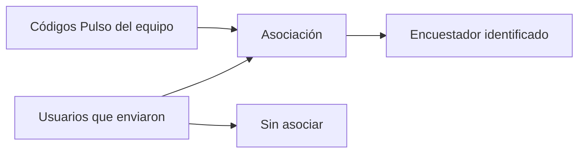

# Encuestadores territoriales

> Asocia a cada persona que envía respuestas desde Kobo con su código Pulso, para que el trabajo tenga dueño identificable.

## Objetivo

Kobo identifica a quien envía por su usuario de plataforma; el operativo identifica a su equipo por código Pulso. Mientras esos dos identificadores no estén asociados, las respuestas llegan pero no se pueden atribuir a una persona del equipo, y todas las lecturas por responsable —carga, desempeño, cruce con UMP— quedan mudas o incompletas.

## Antes de empezar

- Debe haber respuestas sincronizadas: los usuarios de envío aparecen a partir de ellas.
- Ten la lista oficial del equipo con sus códigos Pulso.
- Conviene saber si alguien compartió dispositivo o cuenta: produce un usuario con trabajo de varias personas.

## Mapa de la pantalla

## Elementos de la pantalla

| Elemento | Para qué sirve | Qué cambia o produce |
|---|---|---|
| Lista de usuarios de envío | Muestra quién ha enviado respuestas desde Kobo | Es el punto de partida real, no la lista teórica del equipo |
| **Código Pulso** | Asocia ese usuario con la persona del operativo | Da dueño a sus respuestas |
| Conteo por usuario | Cuántas respuestas envió cada uno | Ayuda a identificar quién es quién |
| Estado de asociación | Señala los usuarios aún sin código | Es el trabajo pendiente de la pestaña |
| Nombre visible | Cómo aparecerá esa persona en el resto del modo | Sustituye al usuario técnico en las lecturas |

## Cómo interpretar lo que ves

La lista se construye desde las **respuestas recibidas**, no desde el equipo declarado. Un miembro del equipo que aún no ha enviado nada no aparece, y eso no es un error: es que todavía no hay trabajo suyo que atribuir.

Un usuario **sin asociar** no pierde sus respuestas: entran al corte, pero no suman a ninguna persona en las lecturas por responsable. Es el equivalente territorial de una fuente sin actor declarado.

Cuando un usuario acumula muchas más respuestas que el resto, sospecha de cuenta compartida antes que de productividad excepcional: dos personas enviando desde el mismo usuario se ven como una sola muy prolífica, y eso distorsiona cualquier diagnóstico de equipo.

## Cómo se usa

1. Revisa la lista de usuarios que enviaron y compárala con el equipo real.
2. Asocia cada uno con su **código Pulso**, empezando por los que tienen más respuestas.
3. Comprueba que no queden usuarios sin asociar antes de leer cualquier cifra por responsable.
4. Si un usuario reúne trabajo de varias personas, resuélvelo en campo: la aplicación no puede separarlo después.
5. Vuelve aquí cuando entre alguien nuevo al equipo.

## Ejemplo guiado

**Situación inicial.** El cruce por responsable muestra un bloque grande de respuestas sin dueño, y el coordinador no entiende de quién son.

**Acciones.** Se abre esta pestaña. Aparecen dos usuarios de envío con volumen alto y sin código Pulso asociado: son dos encuestadores que se incorporaron a mitad de campo. Se les asocia su código y se les da nombre visible.

**Resultado observable.** Las respuestas dejan de estar sin dueño y aparecen atribuidas a las dos personas en todas las lecturas por responsable. La carga del equipo se puede comparar de forma justa, cosa que antes era imposible porque un bloque del trabajo no pertenecía a nadie.

## Resultado y siguiente paso

- Cada usuario de envío queda asociado a una persona del operativo.
- Continúa en Reconciliación de códigos territorial si además hay códigos de UMP o distrito que no calzan.

## Estados, alertas y límites

- **Sin asociar**: las respuestas cuentan en el corte pero no se atribuyen a nadie.
- La lista sale de las respuestas recibidas, no del equipo declarado.
- La aplicación no puede separar el trabajo de dos personas que comparten usuario: eso se corrige en campo.
- Asociar no reprocesa el pasado por sí solo; el efecto se ve al regenerar el corte.

## Si algo no coincide

Si un encuestador no aparece, comprueba si ha enviado alguna respuesta: la lista se construye desde los envíos. Si alguien muestra un volumen desproporcionado, revisa si hay cuenta compartida antes de sacar conclusiones. Si tras asociar sigue habiendo respuestas sin dueño, regenera el corte.

## Ubicación en la jerarquía

- Padre: [[Fuente territorial]].
