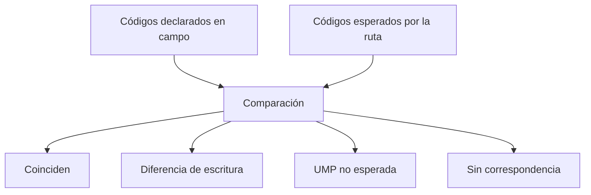

# Reconciliación de códigos territorial

> Resuelve las correspondencias entre lo que el campo escribió —códigos de UMP, manzana y distrito— y lo que el plan de Hojas de ruta esperaba.

## Objetivo

El campo escribe códigos a mano o los elige de una lista, y el plan tiene los suyos. Cuando no coinciden, la respuesta existe pero no se puede ubicar en el marco: no suma a su UMP, no cuenta para su distrito y aparece como si el trabajo no se hubiera hecho.

Esta pestaña es el puente entre ambos vocabularios, y es la causa más frecuente de avances que parecen incompletos sin serlo.

## Antes de empezar

- Hojas de ruta debe tener el marco vigente: sus UMP titulares y de reemplazo son la referencia.
- Conviene traer de Filtro y distritos qué distritos aparecieron sin correspondencia.
- Ten claro el formato canónico de los códigos en este estudio.

## Mapa de la pantalla

## Elementos de la pantalla

| Elemento | Para qué sirve | Qué cambia o produce |
|---|---|---|
| Código declarado | Lo que el encuestador registró como UMP, manzana o distrito | Es lo que llegó de campo |
| Código esperado | El que la ruta contempla para esa unidad | Es la referencia del plan |
| Resultado de la correspondencia | Si el par calza, difiere en escritura o no existe en la ruta | Clasifica el caso |
| **UMP sospechosa** | Señala unidades cuya correspondencia no es defendible | Es el foco de revisión |
| Detalle de la unidad | Muestra el bloque de la ruta con el que se comparó | Permite verificar la decisión |
| Resolución | Establece la correspondencia para el corte | Reincorpora las respuestas a su unidad |

## Cómo interpretar lo que ves

Hay tres situaciones distintas y sólo una es grave:

- **Diferencia de escritura**: el mismo código con otro formato, mayúsculas o separadores. La unidad es la misma; sólo hay que declarar la equivalencia.
- **UMP no esperada**: la unidad existe pero no pertenece a la ruta de ese equipo. Puede ser un reemplazo usado sin registrar, o trabajo en la manzana equivocada.
- **Sin correspondencia**: el código no existe en ninguna parte del marco. Suele ser un error de digitación o un tramo del plan que nunca se cargó.

La segunda es la que importa de verdad, porque afecta a la fidelidad de la muestra y no sólo al conteo. Un reemplazo usado es legítimo; usarlo sin que quede registrado es lo que después no se puede explicar.

Resolver una correspondencia no reescribe lo que el campo declaró: establece cómo se interpreta para el corte, y esa decisión queda visible.

## Cómo se usa

1. Empieza por las diferencias de escritura: son muchas, se resuelven rápido y despejan el ruido.
2. Con lo que queda, separa las **UMP no esperadas** de las que no tienen correspondencia alguna.
3. Para cada UMP no esperada, comprueba en el detalle si corresponde a un reemplazo previsto.
4. Resuelve las correspondencias que sean claras y deja las dudosas para revisión con el equipo de campo.
5. Regenera el corte y comprueba que las respuestas se hayan reincorporado a su unidad.

## Ejemplo guiado

**Situación inicial.** Un distrito muestra la mitad del avance que el equipo reporta, y en Filtro y distritos aparecía sin correspondencia completa.

**Acciones.** Se abre esta pestaña acotada a ese distrito. Casi todas las respuestas huérfanas comparten el mismo patrón: el código de UMP se escribió con un separador distinto al del plan. Se declara la equivalencia. Quedan tres casos aparte, marcados como **UMP no esperada**, que corresponden a manzanas de reemplazo que el equipo usó sin avisar.

**Resultado observable.** Tras regenerar, el avance del distrito sube al nivel que el equipo reportaba. Los tres reemplazos quedan identificados y se documentan como sustituciones, que es lo que permitirá explicar después por qué esas manzanas entraron en lugar de las titulares.

## Resultado y siguiente paso

- Las respuestas quedan ubicadas en su unidad del marco y los reemplazos no registrados, identificados.
- Continúa en UMPs territoriales para ver la cobertura resultante, o en Historial de fuente territorial para dejar constancia de lo resuelto.

## Estados, alertas y límites

- **Diferencia de escritura**: cosmética, la unidad es la misma.
- **UMP no esperada**: crítica para la fidelidad de la muestra, no sólo para el conteo.
- **Sin correspondencia**: el código no existe en el marco; revisa digitación o carga del plan.
- Resolver no reescribe lo declarado en campo: fija cómo se interpreta en el corte.
- El efecto se ve al regenerar; resolver por sí solo no actualiza las cifras.

## Si algo no coincide

Si un distrito o una UMP muestran menos avance del esperado, búscalos aquí antes de dudar del equipo. Si hay muchísimos casos, filtra primero las diferencias de escritura: suelen ser la mayoría y son inofensivas. Si un código no existe en ninguna parte, comprueba que el marco de Hojas de ruta esté completo antes de tratarlo como error de campo.

## Ubicación en la jerarquía

- Padre: [[Fuente territorial]].
