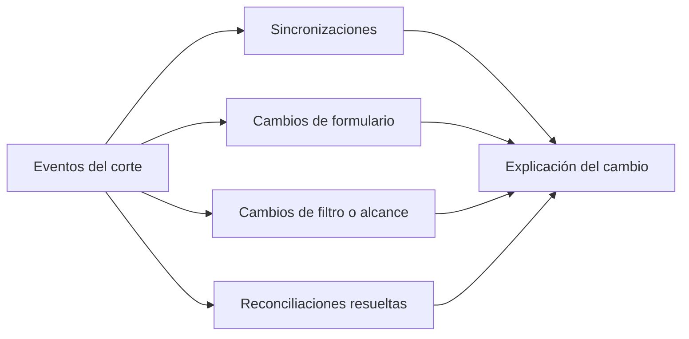

# Historial de fuente territorial

> Registra los eventos del corte —sincronizaciones, cambios de formulario, filtros, reconciliaciones— para poder explicar por qué una cifra cambió.

## Objetivo

En un operativo territorial las cifras se mueven por dos razones: porque entró trabajo nuevo o porque cambió la configuración. Distinguirlas es lo que evita discusiones estériles con el equipo y con el cliente, y para eso hace falta saber qué se tocó y cuándo.

Esta pestaña es la memoria del corte.

## Antes de empezar

- Conviene llegar con una pregunta concreta: qué cifra cambió y entre qué momentos.
- Ten a mano el reporte anterior si estás comparando contra una entrega ya hecha.

## Mapa de la pantalla

## Elementos de la pantalla

| Elemento | Para qué sirve | Qué cambia o produce |
|---|---|---|
| Línea de eventos | Lista cronológicamente lo que ocurrió sobre la fuente | Es el registro completo |
| Tipo de evento | Distingue sincronización, cambio de configuración o resolución | Separa datos nuevos de configuración cambiada |
| Momento del evento | Cuándo ocurrió | Permite acotar entre dos cortes |
| Detalle del evento | Qué se cambió concretamente | Convierte el registro en explicación |

## Cómo interpretar lo que ves

La distinción que hace útil esta pantalla: una **sincronización** trae trabajo nuevo, un **cambio de configuración** redefine cómo se cuenta lo que ya había. Si una cifra subió tras una sincronización, el equipo produjo; si subió tras una reconciliación, el trabajo ya existía y sólo se reincorporó al marco.

Un cambio de filtro o de alcance es el evento más consecuente: redefine el universo, y las cifras anteriores a él dejan de ser comparables con las posteriores aunque lleven la misma etiqueta.

El historial describe la fuente, no el trabajo de campo. Un día sin eventos no es un día sin llamadas ni sin encuestas: es un día en que nadie tocó la configuración.

## Cómo se usa

1. Acota el periodo entre las dos cifras que estás comparando.
2. Separa los eventos de sincronización de los de configuración.
3. Si hubo cambio de filtro, alcance o formulario, comprueba si las dos cifras son comparables antes de explicar la diferencia.
4. Usa el detalle para redactar la explicación, en lugar de reconstruirla de memoria.

## Ejemplo guiado

**Situación inicial.** El cliente compara el reporte de esta semana con el de la anterior y observa que un distrito bajó de avance, lo cual no debería poder ocurrir.

**Acciones.** Se abre esta pestaña acotada a esos días. Entre ambos reportes hubo un cambio de alcance: se ajustó el filtro del corte para excluir un tipo de respuesta que antes entraba. No hubo pérdida de datos ni retroceso del equipo.

**Resultado observable.** La explicación es concreta y verificable: el denominador cambió entre los dos reportes, y las dos cifras no son comparables directamente. Se documenta el cambio en la entrega en lugar de justificar un retroceso que nunca ocurrió.

## Resultado y siguiente paso

- Queda explicado qué cambió entre dos momentos del corte y si las cifras son comparables.
- Con la explicación en mano, continúa donde corresponda: Avance territorial para reportar, o Fuente para corregir.

## Estados, alertas y límites

- Una sincronización trae datos; un cambio de configuración redefine el conteo.
- Tras un cambio de filtro o alcance, las cifras anteriores no son comparables con las posteriores.
- El historial cubre la fuente del modo, no la actividad del equipo en campo.
- Los eventos no se editan: son el registro de lo ocurrido.

## Si algo no coincide

Si una cifra retrocedió, busca aquí un cambio de filtro o de alcance antes de sospechar pérdida de datos. Si una cifra subió sin sincronización, busca una reconciliación resuelta: el trabajo ya existía. Si no hay eventos en el periodo, la diferencia no viene de la fuente y hay que buscarla en las respuestas.

## Ubicación en la jerarquía

- Padre: [[Fuente territorial]].
