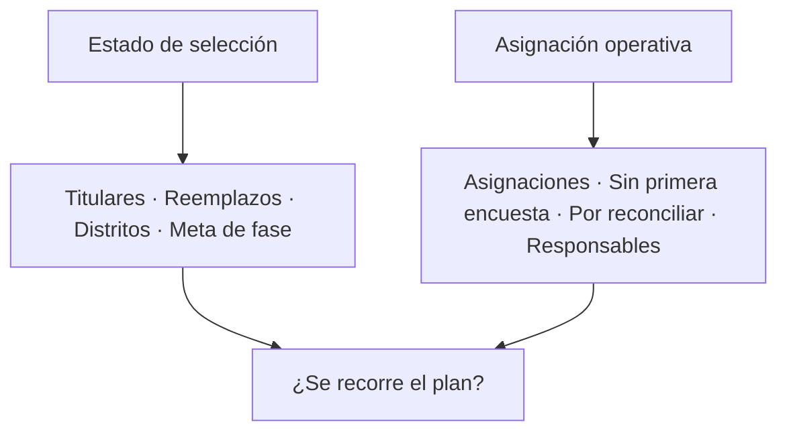

# Cobertura territorial

> Resume el marco vigente: cuántas UMP titulares y de reemplazo hay, en cuántos distritos, con qué meta y cuánto se ha trabajado.

## Objetivo

Es la lectura agregada del plan. Sirve para responder, sin bajar al detalle, si el operativo está recorriendo el territorio que se diseñó o concentrándose en una parte de él.

También es donde se detecta el problema silencioso de esta sección: asignaciones que existen en el plan y todavía no han producido ninguna encuesta.

## Antes de empezar

- La selección de Hojas de ruta debe estar corrida y sincronizada.
- Los códigos deben estar reconciliados: una unidad trabajada con código no reconciliado aparece como no cubierta.
- Ten presente el número de UMP titulares que el plan contempla.

## Mapa de la pantalla

## Elementos de la pantalla

| Elemento | Para qué sirve | Qué cambia o produce |
|---|---|---|
| **Titulares** | Cuántas UMP titulares tiene el marco | Es el plan a cubrir |
| **Reemplazos** | Cuántas unidades de sustitución hay disponibles | Es el margen ante inviabilidades |
| **Distritos** | En cuántos distritos se despliega el marco | Sitúa el alcance geográfico |
| **Meta de fase** | Encuestas acordadas para la fase | Es el otro denominador, distinto de la cobertura |
| **Asignaciones** | Cuántas unidades tienen responsable asignado | Es el trabajo repartido |
| **Sin primera encuesta** | Asignaciones que aún no produjeron ninguna respuesta | Es la señal temprana de esta pestaña |
| **Por reconciliar** | Unidades cuya correspondencia no está resuelta | Explica cobertura que parece faltar |
| **Responsables** | Cuántas personas tienen unidades asignadas | Dimensiona el equipo en campo |
| **Releer modelo** | Vuelve a leer el marco desde Hojas de ruta | Recoge cambios del plan |
| Aviso de sin manzanas seleccionadas | Indica que el proyecto no tiene selección corrida | Explica una sección vacía |

## Cómo interpretar lo que ves

**Sin primera encuesta** es la cifra más accionable de la pantalla. Una asignación que lleva días sin producir nada suele significar una de tres cosas: la unidad es inviable y hay que activar su reemplazo, el responsable no ha llegado allí, o sus respuestas están cayendo con código no reconciliado. Las tres se corrigen, pero en sitios distintos.

**Por reconciliar** explica cobertura fantasma. Si la cobertura parece baja y esta cifra es alta, el trabajo probablemente existe y no está encontrando su unidad.

Cobertura y **meta de fase** no se comparan entre sí. Cubrir el plan y alcanzar la meta son dos logros distintos: se puede alcanzar la meta concentrando encuestas en pocas UMP, y eso empobrece la dispersión de la muestra sin que ningún porcentaje lo delate.

## Cómo se usa

1. Compara titulares con lo cubierto para saber cuánto del plan se ha recorrido.
2. Mira **sin primera encuesta** y determina, para cada caso, cuál de las tres causas aplica.
3. Si **por reconciliar** es alto, resuélvelo antes de sacar conclusiones sobre cobertura.
4. Contrasta cobertura con meta de fase: son lecturas independientes y ambas importan.
5. Usa **Releer modelo** cuando Hojas de ruta haya cambiado el plan.

## Ejemplo guiado

**Situación inicial.** El estudio va bien contra su meta de encuestas, y se propone cerrar el campo.

**Acciones.** Se abre esta pestaña. La meta de fase está prácticamente cubierta, pero al comparar titulares contra unidades trabajadas queda un grupo de UMP que nunca produjo nada, y **sin primera encuesta** confirma que tienen responsable asignado. Se revisa **por reconciliar**, que es bajo, así que no es un problema de códigos.

**Resultado observable.** El operativo alcanzó la meta concentrando encuestas en menos manzanas de las previstas. Cerrar así habría entregado una muestra con peor dispersión que la diseñada. Se redirige el esfuerzo final a las UMP sin trabajar, en lugar de sumar encuestas donde ya sobran.

## Resultado y siguiente paso

- Queda claro cuánto del plan se ha recorrido y qué unidades siguen sin producir.
- Continúa en Manzanas territoriales para trabajar unidad por unidad.

## Estados, alertas y límites

- **Sin manzanas seleccionadas**: el proyecto no tiene selección corrida en Hojas de ruta; la sección no puede mostrar marco.
- **Sin primera encuesta** tiene tres causas posibles y no dice cuál aplica.
- **Por reconciliar** alto invalida la lectura de cobertura hasta resolverlo.
- Cobertura y meta de fase son denominadores distintos y no se comparan.
- Releer el modelo actualiza el marco, no las respuestas.

## Si algo no coincide

Si la cobertura parece baja pese al trabajo hecho, revisa **por reconciliar** antes que nada. Si el número de titulares no coincide con el plan, usa **Releer modelo**. Si una unidad figura sin primera encuesta y el equipo asegura haber ido, busca sus respuestas en Reconciliación de códigos territorial.

## Ubicación en la jerarquía

- Padre: [[UMPs territoriales]].
