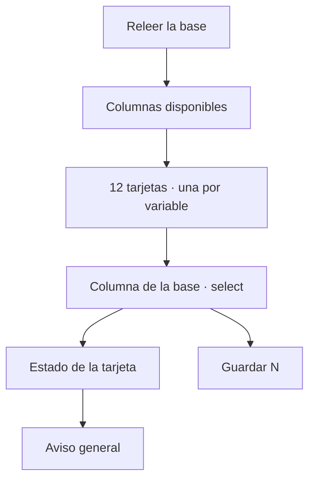

# Variables territoriales

> Declara a qué columna de la base responde cada una de las doce variables que el módulo necesita, y lo hace a mano para que ninguna se resuelva sola y en silencio.

## Objetivo

El módulo territorial siempre pide las mismas doce variables, pero cada instrumento las escribe a su manera y en su propio orden. Esta pestaña es donde esa correspondencia se declara explícitamente.

Existe porque la alternativa —autodetectar el nombre de la columna— falla de dos maneras que no se ven: apunta a una columna que la base no tiene y todas las filas salen «S/D», o casa por subcadena con una columna real que no es la variable buscada. El segundo caso es el peligroso, porque produce cifras plausibles y equivocadas.

Por eso va primera en UMPs territoriales: es lo que hay que resolver antes de creerle una cifra al resto del módulo.

## Antes de empezar

- Debe haber una base sincronizada en Fuente territorial; sin columnas no hay nada que mapear.
- Conviene tener a mano el instrumento, para saber qué pregunta corresponde a cada variable cuando el nombre de la columna no es evidente.
- Recuerda que mapear no transforma nada: solo declara dónde está cada dato.

## Mapa de la pantalla

## Elementos de la pantalla

| Elemento | Para qué sirve | Qué cambia o produce |
|---|---|---|
| **Releer la base** | Vuelve a leer columnas y mapeo vigente | Recoge una sincronización nueva de Fuente |
| **Guardar N** | Envía solo las variables que cambiaste | N es el número de cambios pendientes; sin cambios queda inerte |
| **Aviso general** | Resume si las doce apuntan a columnas que la base tiene | Distingue verde real de verde con columnas vacías |
| **Tarjeta de variable** | Una por cada variable que el módulo necesita | Muestra etiqueta y nombre técnico del campo |
| **Columna de la base** | Elige a qué columna responde esa variable | Es la declaración que el resto del módulo consume |
| **Sin asignar** | Deja la variable explícitamente sin columna | Es distinto de mapear mal |
| **(no está en la base)** | Conserva un valor guardado que la base actual no tiene | Evita borrarlo sin que nadie lo decida |
| **Pista de cobertura** | Porcentaje con dato y un ejemplo real | Permite confirmar que la columna elegida es la correcta |

Las doce variables son: Distrito, UMP / manzana, Código Pulso, Georreferencia, Consentimiento, Edad, Sexo, Estado del envío, Identificador, Encuestador, Fecha de envío y Duración.

## Cómo interpretar lo que ves

**El porcentaje con dato y el ejemplo son la verificación real.** El nombre de una columna puede sonar correcto y contener otra cosa; el ejemplo lo desmiente en un vistazo. Si eliges la columna de UMP y el ejemplo muestra un nombre de encuestador, el mapeo es incorrecto aunque el aviso general esté en verde.

**Una columna vacía mapea sin error y no sirve.** El aviso del backend responde a «¿existe la columna?», no a «¿tiene datos?». Por eso la pantalla cuenta aparte las variables que apuntan a una columna vacía en todas las filas: pasan el filtro de existencia y no alimentan ninguna cifra.

**Sin asignar y mal asignada no son el mismo problema.** Una variable sin asignar se nota enseguida porque el módulo no muestra ese dato. Una mal asignada muestra un dato equivocado, que es más difícil de detectar aguas abajo.

**El estado de cada tarjeta refleja lo que hay en pantalla, no lo guardado.** Si acabas de elegir una columna válida, la tarjeta deja de acusar pendiente aunque todavía no hayas guardado.

## Cómo se usa

1. Si acabas de sincronizar en Fuente, pulsa **Releer la base**.
2. Recorre las doce tarjetas y, en cada una, elige la columna correspondiente.
3. Confirma cada elección con el porcentaje con dato y el ejemplo, no solo con el nombre.
4. Resuelve las que apunten a una columna ausente o vacía.
5. Pulsa **Guardar N** y verifica que el aviso general quede en verde sin menciones a columnas vacías.

## Ejemplo guiado

**Situación inicial.** El avance territorial muestra casi todas las encuestas sin distrito, y el equipo sospecha que el campo no está registrando la ubicación.

**Acciones.** Se abre esta pestaña. La tarjeta **Distrito** está en verde: apunta a una columna que la base sí tiene. Pero su pista dice que la columna viene vacía en todas las filas. Al desplegar el select aparece otra columna con nombre parecido cuya pista muestra 98 % con dato y un ejemplo reconocible. Se cambia la asignación y se guarda.

**Resultado observable.** El problema nunca estuvo en campo: la autodetección había casado con una columna homónima que el instrumento dejó de usar. El avance por distrito se puebla sin tocar una sola respuesta.

## Resultado y siguiente paso

- Las doce variables quedan declaradas contra columnas que existen y tienen datos.
- Recién entonces tiene sentido leer Cobertura territorial y Manzanas territoriales, que dependen de este mapeo.

## Estados, alertas y límites

- **Todavía no hay base que mapear**: no hay columnas porque el formulario no está sincronizado; se resuelve en Fuente territorial.
- **Apunta a una columna que la base no tiene**: saldrá «S/D» en todas las filas de esa variable.
- **La columna existe pero viene vacía en todas las filas**: mapea sin error y no alimenta ninguna cifra.
- El aviso general en verde solo garantiza existencia de la columna, no que sea la correcta.
- Guardar afecta la configuración del proyecto, no las respuestas: nada de lo que se hace aquí modifica la base.

## Si algo no coincide

Si una cifra del módulo sale vacía o absurda, esta es la primera pestaña que hay que revisar, antes de sospechar del campo o del motor. Si la columna correcta no aparece en el select, la base sincronizada no la contiene: vuelve a Fuente territorial y revisa el corte. Si un valor guardado aparece marcado como «no está en la base», el instrumento cambió de nombres entre cortes y hay que reasignarlo a mano.

## Ubicación en la jerarquía

- Padre: [[UMPs territoriales]].
