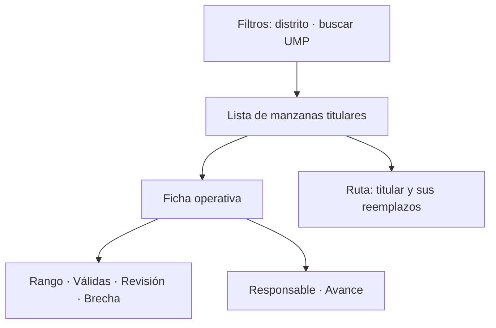

# Manzanas territoriales

> Detalle unidad por unidad: cada manzana con su orden, su responsable, su meta, sus válidas y la cadena de reemplazos que la respalda.

## Objetivo

Es donde se trabaja el marco a nivel de unidad. Sirve para dos cosas: consultar la ficha operativa de una manzana concreta —quién la tiene, qué lleva, qué le falta— y entender la relación entre una titular y sus reemplazos cuando hubo sustitución.

## Antes de empezar

- Conviene traer de Cobertura territorial qué unidades aparecen sin producir.
- Ten claro el criterio del estudio para declarar inviable una manzana y activar su reemplazo.
- Los códigos deben estar reconciliados para que las válidas aparezcan donde corresponde.

## Mapa de la pantalla

## Elementos de la pantalla

| Elemento | Para qué sirve | Qué cambia o produce |
|---|---|---|
| Filtro por **distrito** | Acota la lista a una zona | Hace manejable un marco grande |
| **Buscar UMP** | Localiza una unidad concreta | Es la vía rápida cuando ya sabes cuál |
| Lista de manzanas titulares | Presenta las unidades del plan con su orden | Es el recorrido previsto |
| **Rango** | Tramo de la manzana asignado | Delimita el trabajo dentro de la unidad |
| **Válidas** | Encuestas válidas conseguidas allí | Es el logro de la unidad |
| **Revisión** | Casos de esa unidad pendientes de comprobación | Advierte que las válidas pueden moverse |
| **Brecha** | Cuánto falta para la meta de la unidad | Es la cifra accionable |
| **Responsable** | Quién tiene asignada la manzana | Permite dirigir la acción |
| **Avance** | Progreso de la unidad contra su meta | Resume su estado |
| **Ruta UMP titular y reemplazos** | Muestra la cadena de sustitución prevista | Explica qué unidad entra si la titular es inviable |

## Cómo interpretar lo que ves

**Válidas** y **revisión** se leen juntas. Una unidad con la meta cubierta pero muchos casos en revisión no está cerrada: si esos casos se caen, vuelve a tener brecha. Dar por terminada una manzana mirando sólo las válidas es la forma habitual de descubrir el problema tarde.

El **orden** de las manzanas no es decorativo: refleja el recorrido previsto. Trabajar fuera de ese orden no invalida nada, pero conviene saberlo cuando se compara el ritmo entre equipos.

La **cadena de reemplazos** dice qué unidad debe entrar si la titular resulta inviable, y en qué orden. Elegir un reemplazo distinto del previsto es una decisión que hay que poder justificar: la cadena existe para que la sustitución no sea discrecional.

## Cómo se usa

1. Filtra por distrito o busca la UMP concreta.
2. Revisa la ficha: válidas, revisión y brecha juntas, no la primera sola.
3. Para una unidad sin producir, comprueba su responsable y decide si es problema de asignación o de viabilidad.
4. Si la unidad es inviable, consulta su cadena de reemplazos y activa el que corresponda por orden.
5. Deja registrada la sustitución: un reemplazo sin motivo documentado no se puede defender después.

## Ejemplo guiado

**Situación inicial.** Una manzana lleva varios días sin producir encuestas y su responsable reporta que el acceso está cerrado por obras.

**Acciones.** Se busca la UMP en la lista y se abre su ficha: cero válidas, brecha completa. Se consulta su **ruta de titular y reemplazos** y se identifica el primer reemplazo previsto para esa unidad. Se activa ése y no otro, respetando el orden de la cadena.

**Resultado observable.** El equipo se traslada a la unidad de reemplazo correcta y la sustitución queda documentada con su motivo. Cuando el cliente revise por qué esa manzana no se trabajó, la respuesta es una decisión trazable y no una omisión, y la muestra conserva su lógica de selección.

## Resultado y siguiente paso

- Cada unidad tiene su estado consultable y las sustituciones quedan hechas por la cadena prevista.
- Continúa en Validación territorial para comprobar que lo levantado en esas unidades se sostiene.

## Estados, alertas y límites

- Válidas sin mirar **revisión** puede dar por cerrada una unidad que no lo está.
- El orden de la lista refleja el recorrido previsto, no una obligación.
- Elegir un reemplazo fuera de la cadena es una decisión que exige justificación.
- Esta pestaña muestra el marco y su avance; no reasigna responsables ni edita el plan, que vive en Hojas de ruta.
- Una unidad sin válidas puede tener trabajo con código no reconciliado.

## Si algo no coincide

Si una unidad muestra cero válidas y el equipo asegura haber trabajado allí, revisa Reconciliación de códigos territorial. Si la brecha no cuadra con las válidas, comprueba cuántos casos están en revisión. Si una manzana no aparece en la lista, verifica que el marco esté releído desde Hojas de ruta.

## Ubicación en la jerarquía

- Padre: [[UMPs territoriales]].
