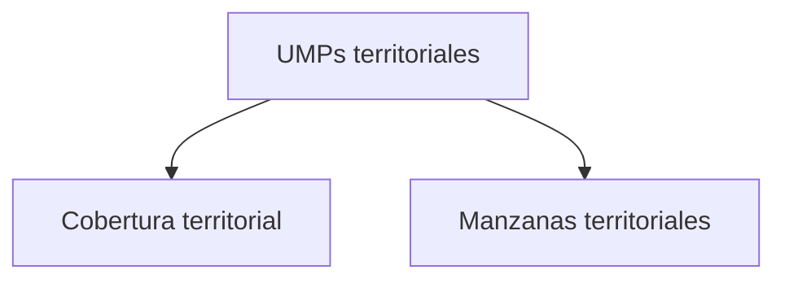

# UMPs territoriales

> Muestra el marco operativo vigente —titulares, reemplazos, responsables y metas— y cuánto se ha cubierto de él.

## Propósito de esta guía

Esta sección responde una pregunta que el avance por cifras no contesta: **¿se está trabajando el plan que se diseñó?** Un operativo puede ir bien en número de encuestas y estar cubriendo manzanas distintas de las seleccionadas, y eso compromete la muestra aunque el total cuadre.

Aquí vive el marco que Hojas de ruta produjo, leído contra lo que el campo efectivamente hizo.

## Antes de recorrer este nivel

- Hojas de ruta debe tener su selección corrida: sin manzanas seleccionadas esta sección no tiene qué mostrar.
- Los códigos deben estar reconciliados; si no, unidades trabajadas aparecerán como no cubiertas.
- Ten claro cuántas UMP titulares contempla el plan: es la referencia de cobertura.

## Mapa de navegación

## Guía de destinos

| Destino | Cuándo entrar | Qué hacer allí | Qué deja listo |
|---|---|---|---|
| [[Cobertura territorial]] | Para la lectura agregada del plan | Revisar zonas, UMP y responsables cubiertos | El estado global del marco |
| [[Manzanas territoriales]] | Para el detalle unidad por unidad | Revisar el orden, los titulares y sus reemplazos | La ficha operativa de cada manzana |

## Recorrido recomendado

1. **Cobertura territorial** para saber cuánto del plan se ha trabajado.
2. **Manzanas territoriales** para bajar a las unidades que aparezcan sin cubrir o con sustitución.

## Cómo interpretar avance y estados

La distinción central es **titular** frente a **reemplazo**. Cada UMP titular tiene reemplazos previstos por si resulta inviable, y usarlos es parte del diseño. Lo que no es parte del diseño es sustituir sin dejar registro: un reemplazo usado y documentado se defiende, uno silencioso no.

Cobertura y meta son dos denominadores distintos. La cobertura mide contra el plan de UMP; la meta, contra el número de encuestas acordado. Un distrito puede cumplir su meta habiendo trabajado menos UMP de las previstas —concentrando encuestas en pocas manzanas—, y eso es un problema de dispersión que sólo esta sección detecta.

## Resultado de este nivel

Al terminar queda claro cuánto del marco se ha cubierto, qué unidades siguen sin trabajar y qué sustituciones se hicieron, que es la información con la que se defiende la fidelidad de la muestra.

## Ubicación en la jerarquía

- Padre: [[Territorial]].
