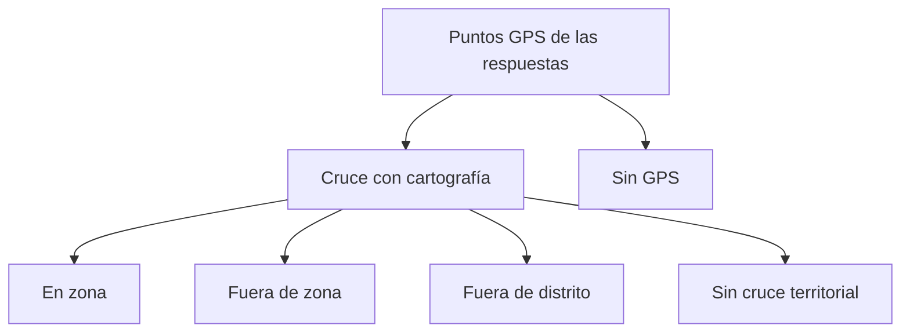

# Geolocalización territorial

> Compara el punto GPS de cada respuesta con la cartografía de su zona y distrito, y clasifica su disposición territorial.

## Objetivo

Es el control con más alcance del modo: sitúa cada encuesta en el mapa y dice si ocurrió donde el plan decía. Un operativo puede cumplir su meta con encuestas correctamente respondidas y mal ubicadas, y ése es un problema que no aparece en ningún conteo.

Su resultado no es un aprobado o suspenso, sino una **escala de defendibilidad**.

## Antes de empezar

- Debe haber cartografía disponible para los distritos del estudio; sin ella el control queda en S/D.
- Los códigos deben estar reconciliados: sin UMP asignada no hay zona contra la que comparar.
- Ten presente que el GPS de un teléfono tiene error de decenas de metros: un punto justo en el límite de una zona no prueba nada por sí solo.

## Mapa de la pantalla

## Elementos de la pantalla

| Elemento | Para qué sirve | Qué cambia o produce |
|---|---|---|
| Mapa de puntos | Sitúa cada respuesta sobre la cartografía | Es la lectura visual del control |
| **En zona** | El punto cae dentro de la zona de su UMP | Es el resultado esperado |
| **Fuera de zona** | Cae en el distrito correcto pero fuera de la zona asignada | Exige revisión: deriva del GPS o manzana equivocada |
| **Fuera de distrito** | Cae en otro distrito | No es defendible sin explicación |
| **Sin cruce territorial** | No hay ruta ni correspondencia con la que comparar | No se pudo evaluar |
| **Sin GPS** | La respuesta no trae coordenadas | Ausencia de evidencia |
| Filtros por disposición | Acotan el mapa y la lista a una categoría | Permiten trabajar una clase de caso a la vez |
| Detalle del punto | Muestra la respuesta, su UMP declarada y su responsable | Convierte el punto en un caso concreto |

## Cómo interpretar lo que ves

Las cinco categorías forman una escala, y confundir sus extremos es el error habitual. **Sin GPS** significa que no hay información: no acusa a nadie, y descartar esas encuestas sería descartar casos válidos por una limitación del dispositivo. **Fuera de distrito**, en cambio, sí es información, y de la mala.

**Fuera de zona** es la categoría que exige criterio. El error del GPS en un teléfono basta para sacar un punto de una manzana pequeña, así que un caso aislado en el borde no prueba nada. Lo que sí significa algo es el patrón: muchos puntos de un mismo responsable sistemáticamente fuera de sus zonas, o un grupo entero desplazado a la misma distancia.

**Sin cruce territorial** no es un problema del encuestador: es que falta la ruta o la correspondencia con la que comparar, y se resuelve en Fuente territorial.

## Cómo se usa

1. Empieza por **fuera de distrito**: es lo más grave y suele ser poco volumen.
2. Pasa a **fuera de zona** y busca patrones por responsable o por día antes de mirar casos sueltos.
3. Deja **sin GPS** aparte: no es un hallazgo de calidad por sí solo.
4. Si **sin cruce territorial** es alto, resuélvelo en Fuente territorial antes de seguir.
5. Para los casos que exijan más análisis espacial, continúa en Reconciliación UMP territorial.

## Ejemplo guiado

**Situación inicial.** El control muestra un número apreciable de encuestas fuera de zona y se plantea anular esa producción.

**Acciones.** Se filtra por esa disposición y se mira la distribución. Los casos no se reparten al azar: casi todos son de un mismo responsable y de los mismos días, y en el mapa aparecen desplazados de forma consistente respecto de sus manzanas asignadas. Se comprueba que ninguno cae fuera del distrito.

**Resultado observable.** El patrón descarta la deriva del GPS y apunta a que ese encuestador trabajó manzanas contiguas a las asignadas. El caso pasa a Reconciliación UMP para confirmar la ubicación real, y la conversación con el equipo se dirige a una persona y a un tramo concreto, en lugar de anular producción de todo el operativo.

## Resultado y siguiente paso

- Cada respuesta queda clasificada en la escala de disposición territorial.
- Los casos dudosos continúan en Reconciliación UMP territorial; los insostenibles, en Anulación territorial.

## Estados, alertas y límites

- **Sin GPS** y **fuera de distrito** son opuestos: la primera es ausencia de evidencia, la segunda es evidencia negativa.
- **Fuera de zona** aislado puede ser error del dispositivo; el patrón es lo que significa algo.
- **Sin cruce territorial** indica falta de ruta o correspondencia, no un fallo de campo.
- Sin cartografía el control queda en S/D, que no es cero.
- Esta pestaña clasifica; retirar producción exige la acción explícita de Anulación territorial.

## Si algo no coincide

Si muchas respuestas aparecen sin cruce, revisa la reconciliación de códigos antes que el trabajo de campo. Si un responsable concentra casos fuera de zona, comprueba si sus manzanas asignadas son contiguas a las trabajadas. Si el mapa está vacío, verifica que exista cartografía para esos distritos.

## Ubicación en la jerarquía

- Padre: [[Validación territorial]].
