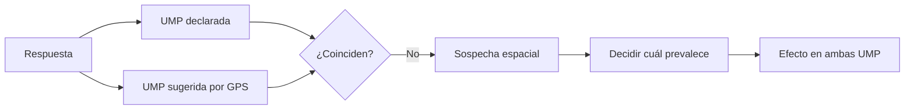

# Reconciliación UMP territorial

> Investiga los casos en que la UMP declarada por el encuestador y la que sugiere el GPS no coinciden.

## Objetivo

La pestaña anterior clasifica; ésta resuelve. Cuando una respuesta declara haber ocurrido en una manzana pero su punto GPS apunta a otra, hay que decidir cuál de las dos es cierta: puede haberse equivocado al declarar, o el GPS puede estar desviado.

La decisión importa porque afecta a dos unidades a la vez: la que gana la encuesta y la que la pierde.

## Antes de empezar

- Conviene traer de Geolocalización territorial los casos fuera de zona, con su patrón identificado.
- Ten a mano el marco de UMP y sus zonas: la comparación es contra ellas.
- Recuerda el margen de error del GPS antes de dar por falsa una declaración.

## Mapa de la pantalla

## Elementos de la pantalla

| Elemento | Para qué sirve | Qué cambia o produce |
|---|---|---|
| Lista de sospechas espaciales | Reúne los casos donde declaración y GPS discrepan | Es el trabajo de la pestaña |
| **UMP declarada** | La que registró el encuestador | Una de las dos hipótesis |
| **UMP sugerida** | La que corresponde al punto GPS | La otra hipótesis |
| Distancia | Cuán lejos cae el punto de la zona declarada | Ayuda a distinguir deriva de error real |
| Responsable | Quién levantó la respuesta | Permite detectar patrón por persona |
| Detalle del caso | Reúne la evidencia disponible | Fundamenta la decisión |

## Cómo interpretar lo que ves

La **distancia** es el dato que más orienta. Un punto a pocas decenas de metros del borde de su zona es compatible con el error del dispositivo; uno a varias manzanas de distancia no lo es.

Una sospecha aislada rara vez es un problema. Lo que importa es el patrón: un responsable con muchas discrepancias en la misma dirección, o un tramo de la ruta cuyas zonas están mal delimitadas en la cartografía. La segunda causa es más común de lo que parece y no es culpa del campo.

Decidir tiene efecto doble: la UMP que gana la encuesta sube su avance y la que la pierde vuelve a tener brecha. Por eso una reconciliación masiva puede mover el mapa de cobertura de forma apreciable.

## Cómo se usa

1. Ordena por distancia: los casos lejanos son los que exigen decisión, los cercanos suelen ser deriva.
2. Comprueba si hay patrón por responsable o por tramo antes de resolver caso por caso.
3. Para cada caso, contrasta la evidencia y determina qué UMP prevalece.
4. Ten presente el efecto en las dos unidades implicadas antes de confirmar.
5. Si el patrón apunta a cartografía mal delimitada, resuélvelo en el marco y no caso por caso.

## Ejemplo guiado

**Situación inicial.** Un grupo de respuestas declara una UMP y su GPS apunta consistentemente a la contigua.

**Acciones.** Se ordena por distancia y se comprueba que todas caen a pocas decenas de metros del límite entre ambas zonas, en un tramo donde la manzana declarada y la sugerida comparten frontera. El patrón es geométrico, no de una persona: varios responsables presentan el mismo caso en ese mismo borde.

**Resultado observable.** El diagnóstico apunta a la delimitación de la zona en la cartografía, no a error de campo. Se conserva la UMP declarada, que es la que el equipo trabajó realmente, y el caso queda documentado como límite cartográfico. Reasignar las respuestas al GPS habría vaciado una UMP correctamente trabajada.

## Resultado y siguiente paso

- Los casos con discrepancia quedan resueltos o documentados con su causa.
- Continúa en Duración territorial y Cuotas territoriales para los otros controles, o en Anulación territorial si algún caso no se sostiene.

## Estados, alertas y límites

- Una discrepancia a poca distancia del borde es compatible con el error del GPS.
- El patrón distingue tres causas: error de declaración, desplazamiento real del trabajo, o cartografía mal delimitada.
- Resolver mueve el avance de dos unidades: la que gana y la que pierde.
- La pestaña decide atribución territorial; no retira producción, que es competencia de Anulación.

## Si algo no coincide

Si muchas discrepancias comparten borde entre dos zonas, sospecha de la cartografía antes que del campo. Si un responsable concentra los casos, revisa qué manzanas tenía asignadas. Si tras resolver una unidad queda con brecha inesperada, comprueba cuántas respuestas se le reasignaron a otra.

## Ubicación en la jerarquía

- Padre: [[Validación territorial]].
