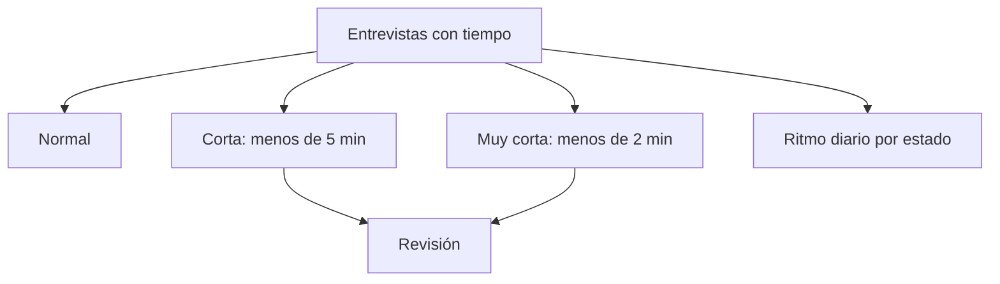

# Duración territorial

> Clasifica las entrevistas en normales, cortas y muy cortas, y muestra cómo evoluciona esa mezcla día a día.

## Objetivo

El tiempo es el control de calidad más simple y uno de los más reveladores: una encuesta que debía tomar veinte minutos y se resolvió en dos no puede haberse aplicado. Esta pestaña usa **tres categorías operativas** con umbrales explícitos, en lugar de una escala continua que nadie sabe dónde cortar.

Verlo por día es lo que distingue un caso puntual de una práctica que se está instalando en el equipo.

## Antes de empezar

- Las respuestas deben traer tiempo de aplicación; sin él no hay clasificación posible.
- Ten presente cuánto debería durar el instrumento: los umbrales son operativos, no metodológicos.
- Recuerda que un cuestionario con muchos saltos produce duraciones legítimamente cortas en ciertos perfiles.

## Mapa de la pantalla

## Elementos de la pantalla

| Elemento | Para qué sirve | Qué cambia o produce |
|---|---|---|
| Resumen de duración | Cuenta entrevistas con tiempo, normales, cortas y muy cortas | Es la foto del control |
| **Normal** | Duración dentro de lo esperado | No exige revisión |
| **Corta** | Por debajo del umbral de cinco minutos | Exige comprobación |
| **Muy corta** | Por debajo del umbral de dos minutos | Es lo más difícil de defender |
| Reglas operativas | Muestra los umbrales aplicados | Hace explícito el criterio |
| **Ritmo diario por estado de duración** | Evolución de las tres categorías día a día | Distingue un caso suelto de una tendencia |
| Casos por estado | Lista los casos, con las muy cortas primero | Ordena la revisión por gravedad |

## Cómo interpretar lo que ves

Los umbrales son **operativos**: sirven para ordenar la revisión, no para declarar inválida una encuesta. Una entrevista muy corta es la primera que hay que mirar, no una que ya esté descartada.

La lectura por día es la que aporta el diagnóstico. Unas pocas cortas repartidas a lo largo del campo son ruido normal; una proporción que crece a partir de cierta fecha indica que algo cambió —presión por la meta, un tramo del cuestionario que se está saltando, un encuestador nuevo mal formado—.

Sólo se clasifican las **entrevistas con tiempo**. Si el total con tiempo es menor que el total del corte, el control se está aplicando sobre una parte, y conviene saber sobre cuál.

## Cómo se usa

1. Empieza por las **muy cortas**: la lista ya viene ordenada con ellas primero.
2. Mira el ritmo diario antes de juzgar: la tendencia dice más que el total.
3. Cruza los casos con Geolocalización: una encuesta muy corta y fuera de zona es un caso distinto de una muy corta bien ubicada.
4. Comprueba si los casos se concentran en un responsable o se reparten.
5. Lleva a Anulación territorial sólo lo que no se sostenga tras la verificación.

## Ejemplo guiado

**Situación inicial.** El total de entrevistas cortas es bajo y nadie le presta atención.

**Acciones.** Se abre el ritmo diario por estado de duración. Hasta cierta fecha casi no hay cortas; a partir de ahí aparecen todos los días y en aumento. Al mirar los casos, se concentran en dos encuestadores que se incorporaron esa misma semana.

**Resultado observable.** El total bajo escondía una tendencia: dos personas nuevas están aplicando el cuestionario demasiado rápido. Se les refuerza la formación con el campo todavía abierto, en lugar de descubrirlo al cerrar cuando ya no hay forma de recuperar esas entrevistas. La cifra agregada nunca lo habría mostrado.

## Resultado y siguiente paso

- Las entrevistas quedan clasificadas y las tendencias identificadas.
- Los casos que no se sostengan continúan en Anulación territorial; los patrones por persona, en la revisión con el equipo.

## Estados, alertas y límites

- Los umbrales son operativos: ordenan la revisión, no invalidan.
- Sólo se clasifican las entrevistas que traen tiempo.
- Una duración corta puede ser legítima si el cuestionario tiene saltos para ese perfil.
- La pestaña no retira producción; eso exige Anulación territorial.

## Si algo no coincide

Si casi todas las entrevistas parecen cortas, comprueba la duración esperada del instrumento antes de sospechar del equipo. Si el número con tiempo es mucho menor que el total, revisa que el formulario esté registrando el dato. Si las cortas se concentran en un día, busca qué ocurrió ese día antes de atribuirlo a las personas.

## Ubicación en la jerarquía

- Padre: [[Validación territorial]].
