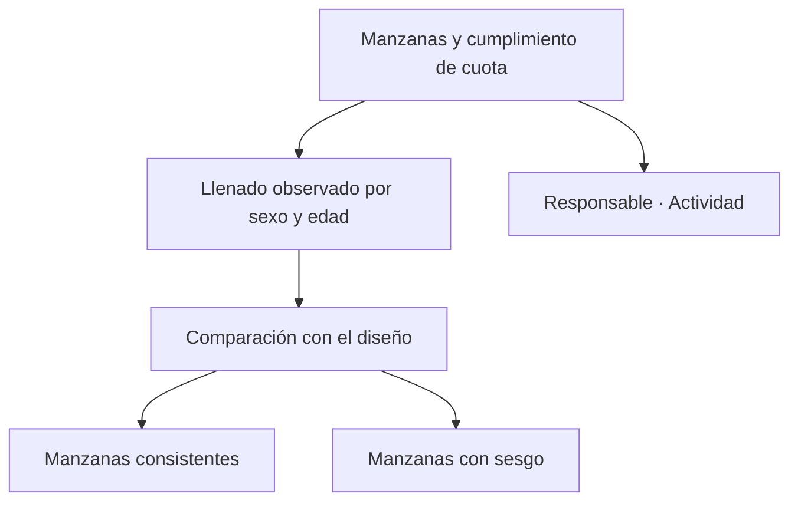

# Cuotas territoriales

> Comprueba que el llenado por sexo y edad respete el diseño dentro de cada manzana, y no sólo en el total del estudio.

## Objetivo

Las cuotas se cumplen o se incumplen **en el grano en que se diseñaron**. Un estudio puede tener sus marginales de sexo y edad perfectas a nivel global y estar mal repartidas manzana por manzana, porque los encuestadores tienden a completar con quien está disponible: quien abre la puerta a media mañana no es una muestra aleatoria del vecindario.

Esta pestaña mira el llenado observado en el nivel donde el sesgo aparece.

## Antes de empezar

- Las cuotas del estudio deben estar definidas; sin diseño no hay contra qué comparar.
- Conviene traer de UMPs territoriales qué manzanas están más avanzadas: son las que ya pueden juzgarse.
- Ten presente que una manzana con pocas encuestas todavía no dice nada sobre su reparto.

## Mapa de la pantalla

## Elementos de la pantalla

| Elemento | Para qué sirve | Qué cambia o produce |
|---|---|---|
| **Manzanas y cumplimiento de cuota** | Lista las unidades con su estado de cuota | Es la vista principal |
| **Llenado observado por sexo y edad** | Muestra el reparto real de cada manzana | Es lo que se compara con el diseño |
| Filtro por estado | Acota a las manzanas consistentes o a las que no lo son | Permite trabajar sólo lo problemático |
| **Responsable** | Quién trabaja esa manzana | Detecta patrones por persona |
| **Actividad** | Cuánto se ha levantado allí | Indica si la unidad ya es juzgable |
| **Reemplazos** | Señala las unidades de sustitución | Distingue titular de reemplazo en la lectura |
| Capas operativas de cuota | Separa lo diseñado de lo levantado en campo | Evita confundir plan con resultado |

## Cómo interpretar lo que ves

Una manzana con **poca actividad** no puede juzgarse: un reparto desequilibrado sobre tres encuestas no es un sesgo, es azar. Mira primero la actividad y sólo después el llenado.

El sesgo típico de campo territorial es predecible y conviene buscarlo específicamente: sobrerrepresentación de mujeres y de edades mayores, porque son quienes con más frecuencia están en casa en horario laboral. Si el patrón aparece repetido en muchas manzanas, la corrección no es por unidad sino de horarios de visita.

Las cuotas globales pueden estar cumplidas con manzanas individualmente sesgadas que se compensan entre sí. Ese resultado satisface el diseño en el papel y no en el terreno, y sólo esta pestaña lo muestra.

## Cómo se usa

1. Filtra las manzanas con actividad suficiente para ser juzgadas.
2. Revisa el llenado observado de las que están más avanzadas.
3. Busca si el desequilibrio se repite en el mismo sentido: apunta a horarios, no a manzanas.
4. Comprueba si se concentra en un responsable.
5. Corrige mientras el campo esté abierto: las cuotas no se arreglan después, sólo se ponderan.

## Ejemplo guiado

**Situación inicial.** Las cuotas globales del estudio van bien y nadie revisa el detalle por manzana.

**Acciones.** Se filtran las manzanas con actividad suficiente y se revisa su llenado observado. La mayoría muestra el mismo desequilibrio en el mismo sentido, compensado a nivel global por unas pocas unidades con el patrón contrario. Se comprueba que no es cosa de un responsable: ocurre en casi todo el equipo.

**Resultado observable.** El patrón apunta al horario de visita, no a las personas. Se ajusta la franja horaria del trabajo de campo para alcanzar a los perfiles ausentes, con el campo todavía abierto. Las cuotas globales seguían viéndose bien, así que sin esta revisión el sesgo habría llegado intacto a la base final.

## Resultado y siguiente paso

- Queda comprobado si el llenado respeta el diseño en el grano donde se diseñó.
- Si hay sesgo sistemático, la corrección es operativa; si hay excedentes o brechas concretas, continúa en Subsanaciones territoriales.

## Estados, alertas y límites

- Una manzana con poca actividad no es juzgable: el desequilibrio es azar.
- Cuotas globales cumplidas no implican cuotas cumplidas por manzana.
- El sesgo por horario es sistemático y se corrige con operación, no unidad por unidad.
- La pestaña compara lo observado con lo diseñado; no reasigna ni pondera.
- Una vez cerrado el campo, un sesgo de cuotas ya no se corrige: sólo se pondera en Procesamiento.

## Si algo no coincide

Si el llenado de una manzana parece raro, mira primero cuántas encuestas tiene. Si el desequilibrio se repite en el mismo sentido en muchas unidades, revisa horarios de visita antes que a las personas. Si las cuotas globales cuadran y las locales no, no lo trates como resultado satisfactorio: es exactamente el caso que esta pestaña existe para detectar.

## Ubicación en la jerarquía

- Padre: [[Validación territorial]].
