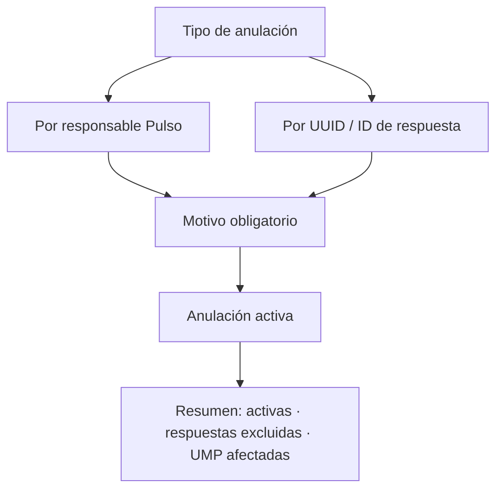

# Anulación territorial

> Retira producción del corte —de un responsable completo o de un caso concreto— dejando siempre el motivo registrado.

## Objetivo

Es la única acción correctiva del modo y la más delicada: retira trabajo del corte. Por eso está separada de los controles que la justifican y por eso el **motivo es obligatorio**.

Existe en dos granos porque los problemas vienen en dos tamaños: a veces se cae una encuesta suelta, y a veces hay que retirar todo lo de un encuestador cuando se detecta una práctica inaceptable.

## Antes de empezar

- Debe haber evidencia previa: esta pestaña ejecuta una decisión, no la investiga.
- Ten claro el criterio del estudio para anular; es una decisión con consecuencias sobre metas y cobertura.
- Si vas a anular por responsable, ten identificado su código Pulso.

## Mapa de la pantalla

## Elementos de la pantalla

| Elemento | Para qué sirve | Qué cambia o produce |
|---|---|---|
| **Tipo de anulación** | Elige entre retirar por responsable o por caso | Determina el grano de la acción |
| **Responsable Pulso** | Busca por código o nombre a quien se le anula la producción | Retira todo su trabajo del corte |
| **UUID / ID respuesta** | Identifica un caso concreto | Retira sólo esa respuesta |
| **Motivo obligatorio** | Registra por qué se anula | Sin él no se puede ejecutar |
| Aviso de anulación existente | Advierte que ese responsable o caso ya tiene una anulación activa | Evita duplicar la acción |
| **Activas** | Cuántas anulaciones están vigentes | Es el estado del control |
| **Respuestas excluidas** | Cuántas respuestas salieron del corte | Mide el efecto real |
| **UMP afectadas** | Qué unidades perdieron producción | Es la consecuencia que suele olvidarse |

## Cómo interpretar lo que ves

**UMP afectadas** es la cifra que hay que mirar antes de confirmar, no después. Anular la producción de un responsable no sólo baja el total: deja sin cubrir las manzanas que esa persona trabajó, y esas unidades vuelven a tener brecha. Si el campo está por cerrar, puede no haber tiempo de rehacerlas.

Las anulaciones son **activas**, no destrucciones: la respuesta sigue existiendo en la plataforma y el registro de la anulación queda con su motivo. Eso es lo que permite explicar después por qué el corte tiene menos casos que la fuente.

El motivo obligatorio no es burocracia. Una anulación sin motivo es indistinguible de una pérdida de datos cuando alguien revise el estudio meses después.

## Cómo se usa

1. Llega con la evidencia ya revisada en los controles anteriores.
2. Elige el grano: por caso si es un problema puntual, por responsable si es una práctica.
3. Comprueba el aviso de anulación existente para no duplicar.
4. Escribe un motivo que se entienda sin contexto: quien lo lea después no estará en esta conversación.
5. Revisa **UMP afectadas** antes de dar por buena la acción y planifica cómo se recuperan esas unidades.

## Ejemplo guiado

**Situación inicial.** Los controles de duración y geolocalización coinciden en señalar a un encuestador: entrevistas muy cortas y fuera de zona de forma sistemática.

**Acciones.** Se elige anulación **por responsable**, se le localiza por su código Pulso y se escribe el motivo con referencia a los dos controles. Antes de confirmar, se revisa el resumen: la acción excluye sus respuestas y deja varias UMP afectadas.

**Resultado observable.** La producción cuestionable sale del corte y queda registrada la razón. Las manzanas que esa persona trabajaba vuelven a tener brecha, así que se reasignan a otro encuestador con el campo aún abierto. El coste de la decisión se conoció antes de tomarla, no después.

## Resultado y siguiente paso

- La producción insostenible queda fuera del corte con su motivo registrado.
- Las unidades que perdieron cobertura vuelven a Manzanas territoriales para su reasignación.

## Estados, alertas y límites

- El motivo es obligatorio; sin él la anulación no se ejecuta.
- Anular no borra: la respuesta sigue en la plataforma y la anulación queda registrada.
- **UMP afectadas** es la consecuencia principal y hay que mirarla antes de confirmar.
- Un responsable o caso con anulación activa no se anula dos veces.
- Esta pestaña ejecuta decisiones; la evidencia se construye en los otros controles.

## Si algo no coincide

Si el total del corte bajó más de lo esperado, revisa cuántas respuestas excluyó cada anulación activa. Si una UMP aparece con brecha nueva, comprueba si perdió producción por una anulación. Si no puedes anular, verifica que el responsable o el caso no tengan ya una anulación vigente.

## Ubicación en la jerarquía

- Padre: [[Validación territorial]].
