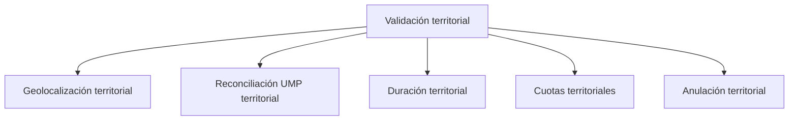

# Validación territorial

> Comprueba que lo levantado se sostiene: dónde ocurrió, cuánto duró, si respeta las cuotas y qué hacer cuando no se sostiene.

## Propósito de esta guía

En campo territorial una encuesta puede estar completa y aun así no ser defendible: levantada en otra manzana, resuelta en dos minutos, o llenando una cuota que ya estaba cubierta. Esta sección reúne los cuatro controles que se aplican sobre la producción, más la única acción correctiva del modo.

Es la sección que hay que recorrer **durante** el campo. Los cuatro controles detectan problemas que en caliente se corrigen y en frío sólo se documentan.

## Antes de recorrer este nivel

- Los códigos deben estar reconciliados y los encuestadores mapeados: sin eso, los controles no pueden atribuir nada.
- Debe haber cartografía disponible para que el control geográfico diga algo; sin ella, quedará en S/D.
- Ten claro el criterio del estudio sobre duración mínima aceptable y sobre cuándo se anula producción.

## Mapa de navegación

## Guía de destinos

| Destino | Cuándo entrar | Qué hacer allí | Qué deja listo |
|---|---|---|---|
| [[Geolocalización territorial]] | Para comprobar dónde ocurrió cada encuesta | Revisar los puntos GPS contra la cartografía | La disposición territorial de cada respuesta |
| [[Reconciliación UMP territorial]] | Cuando el GPS y la UMP declarada no concuerdan | Revisar las sospechas espaciales | Los casos con ubicación cuestionable |
| [[Duración territorial]] | Para separar entrevistas defendibles de las que no | Revisar normales, cortas y muy cortas | Los casos que exigen verificación |
| [[Cuotas territoriales]] | Para comprobar que el llenado respeta el diseño | Revisar marginales y brechas por manzana | La consistencia de las cuotas |
| [[Anulación territorial]] | Cuando hay que retirar producción | Tachar por responsable o por caso, con motivo | La corrección auditada |

## Recorrido recomendado

1. **Geolocalización** primero: sitúa cada respuesta y es el control con más alcance.
2. **Reconciliación UMP** para los casos donde el GPS contradice lo declarado.
3. **Duración** y **Cuotas** como controles paralelos sobre la producción.
4. **Anulación** sólo cuando la evidencia lo justifique, y siempre con motivo.

## Cómo interpretar avance y estados

Los controles de esta sección **señalan**, no invalidan. Una encuesta con GPS fuera de zona, o resuelta en tres minutos, es una encuesta que hay que mirar; sólo la anulación explícita la retira del corte, y esa acción exige motivo.

Distingue siempre un control que se ejecutó y no encontró casos —cero— de uno que no pudo evaluarse —S/D—. En territorial esto es constante, porque el control geográfico depende de que exista cartografía para el distrito.

Los cuatro controles no son independientes entre sí: una encuesta muy corta con GPS fuera de zona es un caso distinto de una muy corta bien ubicada. Cruzarlos es lo que separa el error puntual del patrón.

## Resultado de este nivel

Al terminar, la producción del corte queda clasificada entre lo que se sostiene, lo que exige verificación y lo que se retiró con motivo registrado.

## Ubicación en la jerarquía

- Padre: [[Territorial]].
