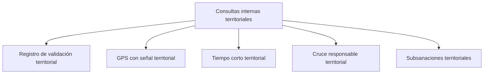

# Consultas internas territoriales

> Trabaja caso por caso lo que Validación señaló, y resuelve los desajustes de cuota moviendo excedentes donde hay brecha.

## Propósito de esta guía

Validación clasifica en agregado; esta sección baja al registro individual. Su nombre lo dice: son consultas **internas**, para el equipo que revisa, no material de cliente. Aquí están los casos con observación y las herramientas para resolverlos.

Se recorre **después de Validación**, y ése no es un orden arbitrario: los filtros de esta sección corresponden a los controles de la anterior.

## Antes de recorrer este nivel

- Haber pasado por Validación territorial: esta sección trabaja lo que aquélla señaló.
- Los encuestadores deben estar mapeados: casi todo se filtra por responsable.
- Para las subsanaciones hace falta que Consultas o Avance hayan preparado la matriz operativa; sin ella no hay brechas ni excedentes que cruzar.

## Mapa de navegación

## Guía de destinos

| Destino | Cuándo entrar | Qué hacer allí | Qué deja listo |
|---|---|---|---|
| [[Registro de validación territorial]] | Como entrada general a los casos | Filtrar por distrito, responsable y estado | El caso localizado |
| [[GPS con señal territorial]] | Para los casos con ubicación cuestionable | Revisar distancia y cruce de cada punto | La verificación espacial caso a caso |
| [[Tiempo corto territorial]] | Para los casos de duración anómala | Revisar cortas y muy cortas individualmente | La verificación de tiempos |
| [[Cruce responsable territorial]] | Para ver el trabajo por persona y UMP | Revisar qué levantó cada quien y dónde | El diagnóstico por equipo |
| [[Subsanaciones territoriales]] | Cuando hay excedentes en una celda y brecha en otra | Aplicar movimientos que conserven la cuota | El ajuste operativo registrado |

## Recorrido recomendado

1. **Registro de validación** como entrada, filtrando por lo que investigas.
2. **GPS con señal** y **Tiempo corto** para las dos observaciones más frecuentes.
3. **Cruce responsable** cuando el patrón apunte a una persona.
4. **Subsanaciones** al final, cuando ya sabes qué sobra y qué falta.

## Cómo interpretar avance y estados

Los casos de esta sección llevan **observación**, que no es lo mismo que estar mal: es que un control los señaló y alguien tiene que mirarlos. Un registro sin observación no aparece aquí, y eso es lo normal para la mayoría de la producción.

Las tablas de esta sección paginan. Cuando compares un total con otra pantalla, usa el total declarado y no las filas visibles.

Las **subsanaciones** son la única herramienta de la sección que modifica el reparto, y su regla es que el movimiento debe conservar la cuota: se mueve producción de donde sobra a donde falta, no se inventa.

## Resultado de este nivel

Al terminar, los casos observados quedan revisados uno a uno y los desajustes de cuota resueltos con movimientos que conservan el diseño.

## Ubicación en la jerarquía

- Padre: [[Territorial]].
