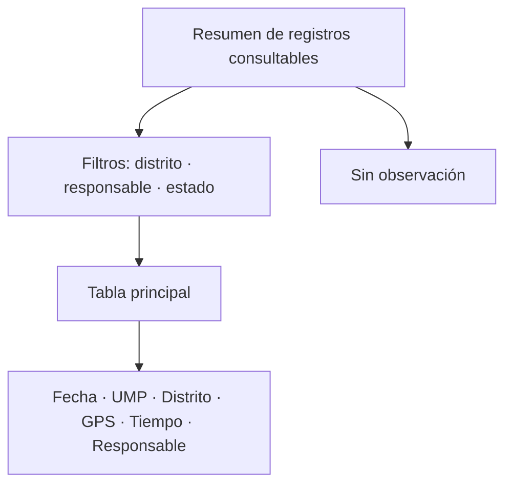

# Registro de validación territorial

> Tabla principal de los registros que quedaron con observación tras Validación, filtrable por distrito, responsable y estado.

## Objetivo

Es la puerta de entrada a la revisión caso por caso. Reúne en una sola tabla todo lo que los controles señalaron, con las columnas que permiten decidir sin abrir cada registro: fecha, UMP, distrito, GPS, tiempo y responsable.

Las tres pestañas siguientes son vistas especializadas de esta misma tabla; ésta es la general.

## Antes de empezar

- Haber pasado por Validación territorial: sin controles ejecutados no hay observaciones que revisar.
- Ten claro qué investigas: un distrito, una persona, un tipo de observación.
- Los encuestadores deben estar mapeados para que el filtro por responsable sirva.

## Mapa de la pantalla

## Elementos de la pantalla

| Elemento | Para qué sirve | Qué cambia o produce |
|---|---|---|
| Resumen de registros consultables | Cuenta cuántos casos hay tras Validación y cuántos sin observación | Dimensiona la revisión |
| **Sin observación** | Registros que ningún control señaló | Es lo normal, no aparece en la tabla |
| Filtro por **distrito** | Acota a una zona | Hace manejable la tabla |
| Filtro por **responsable** | Acota a una persona | Es la vía para investigar patrones |
| Filtro por **estado** | Acota al tipo de observación | Separa GPS de tiempo y de cruce |
| **Limpiar** | Restablece los filtros | Evita confundir un filtro olvidado con ausencia de casos |
| Columna **Fecha** | Cuándo se levantó la respuesta | Sitúa el caso en el campo |
| Columna **UMP** | Unidad declarada, normalizada | Ubica el caso en el marco |
| Columna **GPS** | Disposición territorial del punto | Resultado del control geográfico |
| Columna **Tiempo** | Categoría de duración | Resultado del control de tiempos |
| Columna **Responsable** | Quién la levantó | Permite ver el patrón |

## Cómo interpretar lo que ves

Un registro con observación **no está mal**: está señalado. La mayoría de la producción no aparece aquí, y eso es lo esperado. El conteo de **sin observación** existe precisamente para que el volumen de esta tabla no se lea como el estado general del operativo.

Las columnas de GPS y tiempo permiten cruzar los dos controles sin cambiar de pestaña, y ése es el uso más valioso: un caso muy corto **y** fuera de zona pesa mucho más que uno con una sola observación.

La tabla pagina. Si comparas su total con el de otra pantalla, usa el declarado en el resumen.

## Cómo se usa

1. Filtra por lo que investigas y fíjate en cuántos casos quedan.
2. Ordena tu revisión por casos con **dos observaciones** antes que por los de una.
3. Cuando varios casos compartan responsable o día, trátalos como patrón y no uno por uno.
4. Baja a la vista especializada —GPS, tiempo o responsable— cuando necesites el detalle.
5. Limpia los filtros antes de sacar conclusiones sobre totales.

## Ejemplo guiado

**Situación inicial.** El coordinador quiere saber si hay algún encuestador con problemas antes de la reunión semanal de campo.

**Acciones.** Se abre la tabla sin filtros y se comprueba el resumen: la mayoría de los registros está sin observación. Se filtra por estado para quedarse con los casos que tienen a la vez observación de GPS y de tiempo. Quedan pocos, y casi todos comparten responsable.

**Resultado observable.** La reunión se prepara con un caso concreto y con evidencia: una persona con encuestas simultáneamente cortas y fuera de zona, frente a un equipo cuyo resto de producción no tiene observaciones. La conversación deja de ser general y pasa a ser específica y verificable.

## Resultado y siguiente paso

- Los casos observados quedan localizados y priorizados.
- Continúa en GPS con señal territorial o en Tiempo corto territorial para el detalle, o en Cruce responsable territorial si el patrón es de una persona.

## Estados, alertas y límites

- **Con observación** significa señalado, no inválido.
- Los registros sin observación no aparecen en la tabla: no están perdidos.
- La tabla pagina; el total está en el resumen.
- Esta pestaña no corrige nada: las decisiones viven en Anulación territorial y Subsanaciones territoriales.

## Si algo no coincide

Si la tabla aparece vacía, comprueba los filtros antes de concluir que no hay observaciones. Si el total no cuadra con Validación, verifica que ambas vistas correspondan al mismo corte. Si un responsable no aparece en el filtro, revisa que esté mapeado en Encuestadores territoriales.

## Ubicación en la jerarquía

- Padre: [[Consultas internas territoriales]].
