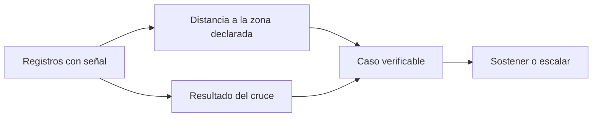

# GPS con señal territorial

> Revisa uno a uno los registros que sí traen coordenadas y cuya ubicación quedó cuestionada.

## Objetivo

Es la vista especializada para el control geográfico, y su recorte es deliberado: **sólo los registros con señal**. Los que no traen GPS quedan fuera, porque sobre ellos no hay nada que verificar espacialmente.

Ese recorte evita el error más caro del control territorial: mezclar ausencia de evidencia con evidencia de un problema.

## Antes de empezar

- Conviene traer de Geolocalización territorial el patrón identificado: por responsable, por día o por borde de zona.
- Ten presente el margen de error del GPS antes de juzgar una distancia pequeña.

## Mapa de la pantalla

## Elementos de la pantalla

| Elemento | Para qué sirve | Qué cambia o produce |
|---|---|---|
| Lista de registros con señal | Reúne sólo los casos con coordenadas | Es el universo verificable |
| **Distancia** | Cuán lejos cae el punto de su zona declarada | Es el dato que más orienta la decisión |
| **Cruce** | Resultado de la comparación con la cartografía | Clasifica la ubicación |
| Responsable | Quién levantó el registro | Permite ver el patrón |
| UMP declarada | Lo que el encuestador registró | Una de las dos hipótesis de ubicación |
| Detalle del caso | Reúne la evidencia disponible | Fundamenta la decisión |

## Cómo interpretar lo que ves

La **distancia** ordena la revisión mejor que cualquier otra columna. Los casos a pocas decenas de metros son compatibles con el error del dispositivo y rara vez merecen esfuerzo; los que caen a varias manzanas sí.

Que un registro aparezca aquí significa que **tiene señal**: ya es más verificable que uno sin GPS. El hecho de estar en esta lista no lo hace sospechoso, lo hace comprobable.

Como en el control agregado, el patrón manda sobre el caso: varios registros del mismo responsable desplazados en la misma dirección dicen algo; uno suelto en un borde, no.

## Cómo se usa

1. Ordena por distancia y empieza por los casos más lejanos.
2. Descarta los que estén dentro del margen razonable del dispositivo.
3. Comprueba si los que quedan comparten responsable, día o tramo.
4. Para los que exijan decidir la ubicación real, continúa en Reconciliación UMP territorial.
5. Lleva a Anulación territorial sólo lo que no se sostenga con evidencia.

## Ejemplo guiado

**Situación inicial.** Un cliente pregunta por qué algunas encuestas figuran fuera de su zona asignada.

**Acciones.** Se abre esta pestaña y se ordena por distancia. La gran mayoría de los casos está a pocas decenas de metros del límite de su zona, coherente con el error de un teléfono. Sólo un puñado supera esa distancia, y todos son del mismo día y del mismo responsable.

**Resultado observable.** La respuesta al cliente distingue las dos cosas: la mayor parte es precisión del dispositivo y no cuestiona nada, y hay un grupo pequeño que sí se revisó individualmente, con su resolución documentada. Sin esta separación, una cifra agregada de *fuera de zona* habría parecido un problema mucho mayor del real.

## Resultado y siguiente paso

- Los registros con ubicación cuestionada quedan revisados y separados entre deriva y desplazamiento real.
- Los que exigen decidir ubicación continúan en Reconciliación UMP territorial.

## Estados, alertas y límites

- La lista incluye sólo registros **con señal**: los sin GPS no son verificables aquí ni sospechosos por ello.
- Distancias pequeñas son compatibles con el error del dispositivo.
- El patrón pesa más que el caso aislado.
- La pestaña verifica; no reasigna ubicación ni retira producción.

## Si algo no coincide

Si la lista es mucho menor que los casos fuera de zona del control agregado, la diferencia son registros sin GPS. Si todos los casos comparten un borde entre zonas, sospecha de la cartografía. Si un responsable concentra los desplazamientos, revisa qué manzanas tenía asignadas.

## Ubicación en la jerarquía

- Padre: [[Consultas internas territoriales]].
