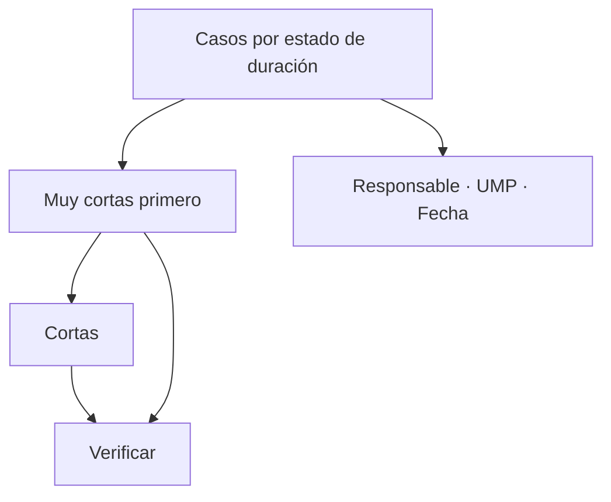

# Tiempo corto territorial

> Revisa individualmente las entrevistas clasificadas como cortas o muy cortas.

## Objetivo

Es la vista especializada del control de tiempos. Toma las dos categorías que exigen atención —corta y muy corta— y las presenta caso por caso, con las muy cortas primero.

Sirve para pasar de *hay entrevistas rápidas* a *estas entrevistas concretas hay que verificarlas o descartarlas*.

## Antes de empezar

- Conviene traer de Duración territorial si hay tendencia por día o concentración por responsable.
- Ten presente la duración esperada del instrumento y qué perfiles tienen saltos legítimos.

## Mapa de la pantalla

## Elementos de la pantalla

| Elemento | Para qué sirve | Qué cambia o produce |
|---|---|---|
| Lista ordenada por gravedad | Presenta las muy cortas antes que las cortas | Ordena la revisión sin que haya que decidirlo |
| **Tiempo** | Duración de la entrevista | Es el dato del control |
| Responsable | Quién la levantó | Detecta concentración |
| UMP y distrito | Dónde ocurrió | Permite cruzar con el control geográfico |
| Fecha | Cuándo | Permite cruzar con la tendencia diaria |
| Detalle del caso | Reúne la evidencia disponible | Fundamenta la decisión |

## Cómo interpretar lo que ves

El orden de la lista ya es una recomendación: las **muy cortas** son las que menos se sostienen y por eso van primero. Revisar en orden inverso desperdicia el tiempo del revisor en los casos más defendibles.

Una entrevista corta con perfil de saltos es explicable; una muy corta rara vez lo es, salvo que el cuestionario tenga un filtro inicial que cierre la entrevista de inmediato. Comprueba si ése es el caso antes de tratar el volumen como un problema de campo.

Cruzar con la ubicación es lo que da el diagnóstico más sólido: una entrevista muy corta y además fuera de zona es un caso que no se sostiene por dos vías independientes.

## Cómo se usa

1. Revisa en el orden que la lista propone: muy cortas primero.
2. Comprueba si el cuestionario tiene un filtro que explique duraciones mínimas legítimas.
3. Cruza los casos con su ubicación y su responsable.
4. Verifica en campo los que lo merezcan mientras el operativo siga abierto.
5. Lleva a Anulación territorial sólo lo que no se sostenga.

## Ejemplo guiado

**Situación inicial.** Aparece un grupo de entrevistas muy cortas y se plantea anularlas en bloque.

**Acciones.** Se revisa la lista en orden. Buena parte corresponde a un perfil que el cuestionario filtra en las primeras preguntas y cierra: son legítimamente breves. El resto no tiene esa explicación, y al cruzarlos con la ubicación varios están además fuera de zona, todos del mismo responsable.

**Resultado observable.** Se anula sólo el subconjunto que no se sostiene por ninguna vía, con motivo registrado, y se conservan las entrevistas breves por diseño del instrumento. Anular en bloque habría descartado casos válidos y habría dejado sin explicar la responsabilidad concreta.

## Resultado y siguiente paso

- Los casos de duración anómala quedan verificados y separados entre explicables y no sostenibles.
- Lo insostenible continúa en Anulación territorial.

## Estados, alertas y límites

- El orden por gravedad es una recomendación de revisión, no una clasificación de validez.
- Una duración breve puede ser legítima si el cuestionario filtra ese perfil.
- Sólo aparecen registros con tiempo registrado.
- La pestaña verifica; retirar producción exige Anulación territorial.

## Si algo no coincide

Si hay muchas muy cortas, comprueba si el instrumento tiene un filtro inicial que las explique. Si se concentran en un día, busca qué ocurrió ese día. Si un caso no aparece pese a ser breve, verifica que su respuesta traiga tiempo registrado.

## Ubicación en la jerarquía

- Padre: [[Consultas internas territoriales]].
