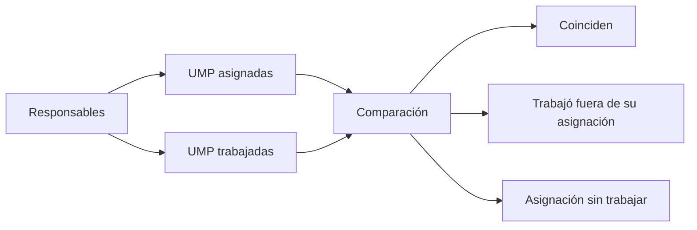

# Cruce responsable territorial

> Cruza a cada encuestador con las UMP en que trabajó, para ver si su producción coincide con lo que tenía asignado.

## Objetivo

Las demás pestañas de la sección parten del caso; ésta parte de la **persona**. Responde dos preguntas que sólo se ven cruzando equipo con territorio: ¿cada quien trabajó donde le tocaba?, ¿y hay unidades asignadas que su responsable nunca tocó?

Es también la pantalla donde un patrón de observaciones deja de ser una sospecha y se vuelve un hecho atribuible.

## Antes de empezar

- Los encuestadores deben estar mapeados: sin código Pulso, su trabajo no se puede cruzar.
- El marco de UMP debe estar leído, con sus asignaciones.
- Conviene traer de las otras pestañas si algún nombre se repite entre las observaciones.

## Mapa de la pantalla

## Elementos de la pantalla

| Elemento | Para qué sirve | Qué cambia o produce |
|---|---|---|
| Lista de responsables | Presenta a cada encuestador del operativo | Es la unidad de análisis |
| UMP asignadas | Qué unidades le correspondían según el marco | Es la referencia del plan |
| UMP trabajadas | Dónde levantó respuestas realmente | Es lo observado |
| Producción por unidad | Cuántas respuestas aportó en cada una | Dimensiona su trabajo |
| Observaciones asociadas | Cuántos de sus casos tienen señalamiento | Convierte el patrón en dato |
| Detalle por persona | Baja a sus registros concretos | Permite verificar antes de concluir |

## Cómo interpretar lo que ves

**Trabajar fuera de la asignación** no siempre es un problema: los equipos se reorganizan en campo, alguien cubre a un compañero, se activa un reemplazo. Lo que importa es que sea explicable. Lo que no es explicable es que ocurra de forma sistemática y sin que nadie lo haya decidido.

**Asignación sin trabajar** es la otra cara y suele ser más urgente: una unidad que su responsable nunca tocó y que nadie más cubrió es cobertura que se está perdiendo mientras el campo sigue abierto.

Cuando cruzas las observaciones con la persona, cuidado con el volumen: quien más produce acumula más observaciones en términos absolutos. Compara en proporción, no en total.

## Cómo se usa

1. Revisa primero las **asignaciones sin trabajar**: es lo que se puede corregir hoy.
2. Para quien trabajó fuera de su asignación, comprueba si hubo una reorganización que lo explique.
3. Mira las observaciones en proporción a la producción, no en total.
4. Baja al detalle antes de concluir sobre una persona.
5. Si el patrón se sostiene, lleva la evidencia a la conversación con el equipo o a Anulación territorial.

## Ejemplo guiado

**Situación inicial.** Un encuestador acumula más observaciones que el resto y se plantea retirarle producción.

**Acciones.** Se abre esta pestaña y se mira su caso en proporción: produce bastante más que la media del equipo, y su tasa de observaciones es similar a la de los demás. Al cruzar con territorio, sí aparece algo: trabajó varias UMP que no tenía asignadas, mientras dos de las suyas siguen sin tocar.

**Resultado observable.** No hay un problema de calidad sino de asignación: la persona se desplazó a unidades que no le correspondían y dejó las propias sin cubrir. La corrección es redirigirlo a sus UMP pendientes, no anular su producción. La lectura en proporción evitó una decisión injusta y el cruce territorial encontró el problema real.

## Resultado y siguiente paso

- Queda claro quién trabajó dónde y qué asignaciones siguen sin cubrir.
- Las unidades sin trabajar vuelven a Manzanas territoriales para su reasignación.

## Estados, alertas y límites

- Trabajar fuera de la asignación puede ser legítimo; lo que importa es que sea explicable.
- **Asignación sin trabajar** es cobertura en riesgo mientras el campo esté abierto.
- Las observaciones se comparan en proporción a la producción, no en total.
- La pestaña diagnostica; la asignación se cambia en Hojas de ruta y la producción se retira en Anulación territorial.

## Si algo no coincide

Si un responsable no aparece, comprueba que esté mapeado en Encuestadores territoriales. Si su producción no coincide con lo que reporta, revisa si parte de sus respuestas tiene código no reconciliado. Si alguien parece problemático por volumen de observaciones, recalcula en proporción antes de decidir.

## Ubicación en la jerarquía

- Padre: [[Consultas internas territoriales]].
