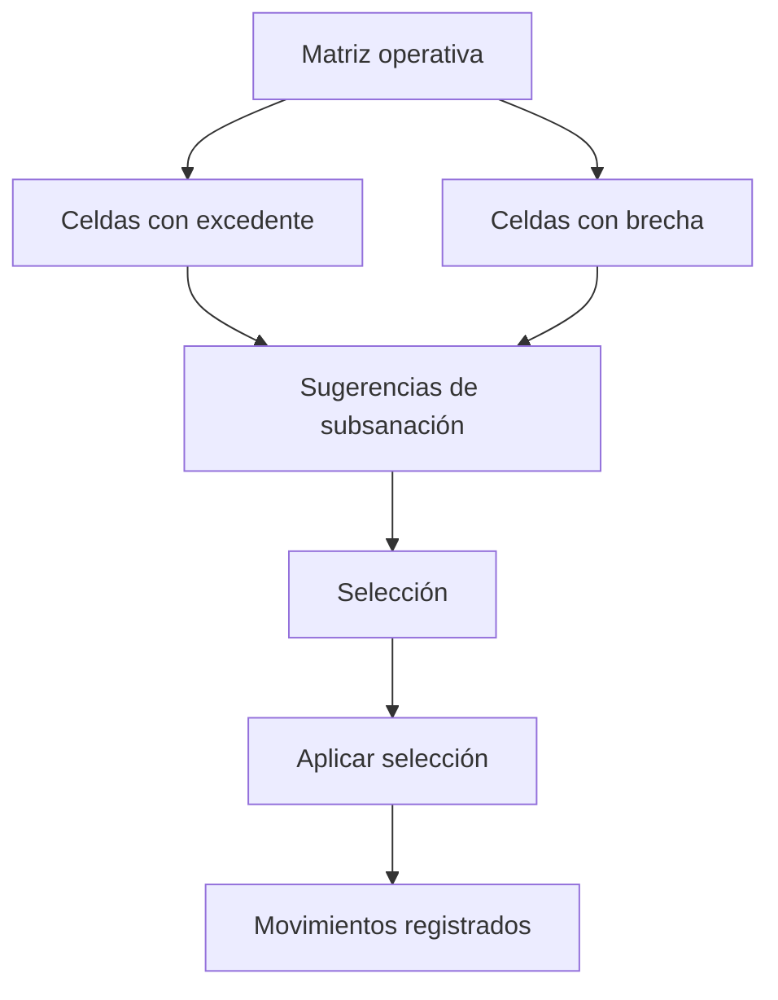

# Subsanaciones territoriales

> Propone y aplica movimientos que llevan excedentes reales de una celda de cuota a donde hay brecha, conservando el diseño.

## Objetivo

En un operativo con cuotas es habitual terminar con celdas que sobrepasaron su objetivo y otras que se quedaron cortas. Esta pestaña cruza ambas y propone movimientos concretos: qué caso pasa de dónde a dónde.

La regla que la gobierna está en su propio encabezado: se mueven **excedentes reales** y en **paquetes completos**. No se inventa producción ni se reparte a medias.

## Antes de empezar

- Consultas o Avance deben haber preparado la matriz operativa; sin ella no hay brechas ni excedentes que cruzar.
- Conviene tener resueltas las anulaciones: mover producción que después se retira deshace el trabajo.
- Ten claro el diseño de cuotas del estudio: el movimiento debe conservarlo.

## Mapa de la pantalla

## Elementos de la pantalla

| Elemento | Para qué sirve | Qué cambia o produce |
|---|---|---|
| **Sugerencias de subsanación** | Propone movimientos posibles entre celdas | Es el trabajo propuesto, no ejecutado |
| **Celda** | Identifica el cruce de cuota implicado | Es la unidad del movimiento |
| **Movimientos** | Cuántos casos implica esa sugerencia | Dimensiona el ajuste |
| **ID fuente** | De qué caso concreto sale el movimiento | Da trazabilidad al ajuste |
| **Origen ok** | Confirma que la celda de origen conserva su cuota tras el movimiento | Es la comprobación que evita romper el diseño |
| Filtro de sugerencias | Acota las propuestas | Permite trabajar por partes |
| **Selección por aplicar** | Reúne lo que se va a ejecutar | Permite revisar antes de confirmar |
| **Aplicar selección** | Ejecuta los movimientos elegidos | Es la acción que modifica el reparto |
| **Reiniciar** | Descarta la selección en curso | Vuelve al estado anterior sin aplicar |
| Detalle de la subsanación | Explica el movimiento seleccionado | Fundamenta la decisión |

## Cómo interpretar lo que ves

**Origen ok** es la comprobación clave y conviene mirarla siempre: confirma que la celda de la que sale el caso sigue cumpliendo su cuota después del movimiento. Un ajuste que cierra una brecha abriendo otra no resuelve nada, sólo la traslada.

Las sugerencias son **propuestas**, no decisiones tomadas. Nada cambia hasta aplicar la selección, y por eso conviene revisar el detalle de cada movimiento antes de confirmar en bloque.

Un excedente **real** es producción que sobra sobre la cuota de esa celda, no producción que parece sobrar porque otra celda va corta. La distinción evita mover casos que en realidad hacían falta donde estaban.

## Cómo se usa

1. Comprueba que la matriz operativa esté lista; si no, prepara Consultas o Avance primero.
2. Revisa las sugerencias y filtra las que correspondan al problema que estás resolviendo.
3. Para cada una, comprueba **origen ok** y lee el detalle.
4. Arma la selección y revísala completa antes de aplicar.
5. Aplica y verifica el efecto en las cuotas de ambas celdas.

## Ejemplo guiado

**Situación inicial.** Una celda de cuota quedó corta al final del campo y otra del mismo distrito tiene producción de sobra.

**Acciones.** Se abre esta pestaña con la matriz operativa preparada. Aparecen varias sugerencias que cruzan ambas celdas. Se revisa cada una: en dos, la celda de origen deja de cumplir su cuota si se mueve el caso, así que se descartan pese a cerrar la brecha. Se seleccionan sólo las que mantienen **origen ok** y se aplican.

**Resultado observable.** La celda con brecha queda cubierta y la de origen conserva su cumplimiento. Aplicar todas las sugerencias sin mirar habría cerrado una brecha abriendo otra, con la ventaja engañosa de que el total no habría cambiado.

## Resultado y siguiente paso

- Los desajustes de cuota quedan resueltos con movimientos trazables que conservan el diseño.
- Continúa en Avance territorial para leer el resultado, o en Cuotas territoriales para confirmar la consistencia.

## Estados, alertas y límites

- **Sin matriz operativa lista**: hay que preparar Consultas o Avance antes de ver brechas y excedentes.
- Las sugerencias son propuestas: nada cambia hasta aplicar la selección.
- **Origen ok** evita cerrar una brecha abriendo otra; ignorarlo traslada el problema.
- Se mueven excedentes reales y en paquetes completos.
- Aplicar movimientos después de anular producción puede deshacer el ajuste: resuelve las anulaciones primero.

## Si algo no coincide

Si no aparecen sugerencias pese a haber brechas, comprueba que existan excedentes reales y que la matriz esté preparada. Si tras aplicar una celda quedó corta, revisa si su movimiento tenía **origen ok**. Si el total de casos cambió, comprueba que no haya anulaciones aplicadas después de las subsanaciones.

## Ubicación en la jerarquía

- Padre: [[Consultas internas territoriales]].
