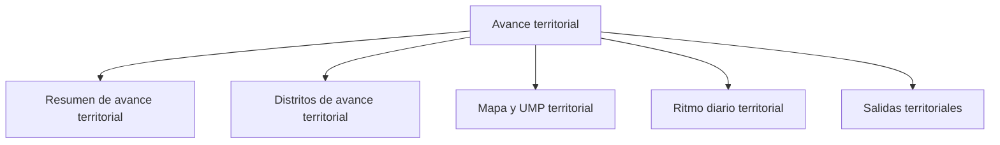

# Avance territorial

> Lee el estado del campo desde cuatro ángulos —general, distrito, mapa y ritmo— y produce las entregas del corte.

## Propósito de esta guía

Es la sección de lectura y entrega del modo. Su particularidad es que el avance territorial no se resume en un porcentaje: hay que leerlo por **cuota**, por **UMP** y por **distrito** a la vez, porque un operativo puede ir bien en uno de esos ejes y mal en otro.

## Antes de recorrer este nivel

- Los controles de Validación deberían estar revisados: un avance con casos pendientes de anular no es definitivo.
- El marco de UMP debe estar leído y los códigos reconciliados.
- Ten claro el distrito o el alcance sobre el que quieres leer: casi todo se filtra por él.

## Mapa de navegación

## Guía de destinos

| Destino | Cuándo entrar | Qué hacer allí | Qué deja listo |
|---|---|---|---|
| [[Resumen de avance territorial]] | Para la lectura general del corte | Revisar el estado del campo, las UMP y las cuotas cerradas | La foto del operativo |
| [[Distritos de avance territorial]] | Para saber qué zona va corta | Comparar cobertura y cuotas por distrito | La brecha geográfica |
| [[Mapa y UMP territorial]] | Para ver la cobertura sobre el terreno | Revisar el atlas de manzanas y zonas | La dispersión real del trabajo |
| [[Ritmo diario territorial]] | Para saber si se llega | Revisar la tendencia del corte | La proyección de cierre |
| [[Salidas territoriales]] | Para entregar | Generar el reporte del corte | El artefacto con su procedencia |

## Recorrido recomendado

1. **Resumen** para situarte en los tres ejes a la vez.
2. **Distritos** para localizar dónde falta.
3. **Mapa y UMP** cuando la duda sea de dispersión y no de volumen.
4. **Ritmo diario** para decidir si hay que reforzar.
5. **Salidas** al final.

## Cómo interpretar avance y estados

Los tres ejes de avance de este modo responden preguntas distintas y no se sustituyen:

| Eje | Pregunta | Riesgo si se ignora |
|---|---|---|
| **Cuota** | ¿Hay suficientes encuestas de cada perfil? | Muestra sesgada |
| **UMP** | ¿Se recorrió el plan de manzanas? | Muestra concentrada |
| **Distrito** | ¿Está equilibrado el territorio? | Zonas sin representación |

Un operativo con la cuota cumplida, las UMP a medias y un distrito rezagado tiene tres lecturas simultáneamente ciertas, y sólo mirando las tres se sabe si puede cerrarse.

## Resultado de este nivel

Al terminar, el campo tiene una lectura en sus tres ejes, una proyección de cierre y las entregas del corte generadas con su procedencia.

## Ubicación en la jerarquía

- Padre: [[Territorial]].
