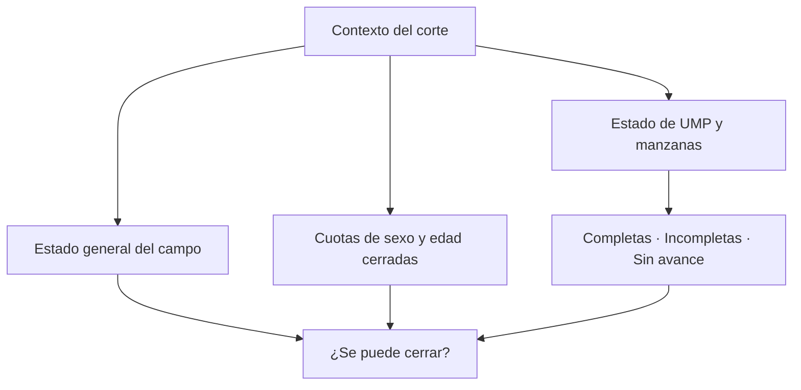

# Resumen de avance territorial

> Tablero del campo: estado general, distribución de UMP y cuotas cerradas, todo referido al corte visible.

## Objetivo

Es la lectura de entrada de la sección y la única pantalla donde los tres ejes del modo —cuota, UMP y territorio— aparecen juntos. Sirve para saber en un vistazo si el operativo puede cerrarse, que es una pregunta que ninguno de los tres contesta solo.

## Antes de empezar

- Comprueba el **distrito filtrado**: si hay uno activo, todo lo que veas se refiere a él y no al estudio.
- Los controles de Validación deberían estar revisados; el avance con anulaciones pendientes cambia.

## Mapa de la pantalla

## Elementos de la pantalla

| Elemento | Para qué sirve | Qué cambia o produce |
|---|---|---|
| **Contexto del corte** | Declara el alcance y si hay distrito filtrado | Fija a qué se refiere todo lo demás |
| **Distrito filtrado** | Indica que la lectura está acotada | Evita leer una zona como si fuera el estudio |
| **Estado general del campo** | Avance agregado del operativo | Es el titular, no la conclusión |
| **Estado de UMP y manzanas** | Distribución entre completas, incompletas y sin avance | Es el eje de fidelidad al plan |
| Detalle porcentual por estado UMP | Reparte las unidades entre los tres estados | Muestra cuánto del marco está intacto |
| **Cuotas de sexo y edad cerradas** | Cuántas celdas demográficas alcanzaron su objetivo | Es el eje de composición |
| Meta demográfica agregada | Avance del conjunto contra la meta | Complementa el conteo de celdas cerradas |

## Cómo interpretar lo que ves

Lo primero que hay que mirar no es una cifra sino el **distrito filtrado**. Un avance del que se olvida que está acotado a una zona se lee como si fuera el del estudio, y es el malentendido más frecuente de esta pantalla.

**UMP sin avance** es la cifra que más anticipa problemas: son unidades del plan que nadie ha tocado. Mientras el campo esté abierto se pueden recuperar; al cerrar, se convierten en un hueco de la muestra que no tiene arreglo.

Cuotas cerradas y avance general no se implican mutuamente. Se puede tener el avance general alto con pocas celdas cerradas —producción concentrada en los perfiles fáciles— y también lo contrario. Las dos cifras juntas son la lectura; ninguna sola.

## Cómo se usa

1. Comprueba el contexto y el distrito filtrado antes que ninguna cifra.
2. Lee el estado general para situarte, sin sacar conclusiones todavía.
3. Mira **UMP sin avance**: es lo accionable con el campo abierto.
4. Contrasta cuotas cerradas con el avance general; si divergen, hay concentración por perfil.
5. Baja a Distritos o a Mapa y UMP según cuál de los ejes muestre el problema.

## Ejemplo guiado

**Situación inicial.** El estado general del campo se ve alto y el equipo propone cerrar.

**Acciones.** Se comprueba primero el contexto: no hay distrito filtrado, así que la cifra es del estudio. El estado de UMP muestra un grupo apreciable de unidades sin avance, y las cuotas cerradas son menos de las que el avance general sugeriría.

**Resultado observable.** Las tres lecturas juntas dicen que no se puede cerrar: hay volumen, pero concentrado en menos manzanas de las previstas y en los perfiles más accesibles. Se redirige el esfuerzo final a las UMP sin avance y a las celdas demográficas abiertas. El avance general por sí solo habría autorizado un cierre prematuro.

## Resultado y siguiente paso

- Queda la lectura del corte en sus tres ejes.
- Continúa en Distritos de avance territorial para localizar la brecha geográfica, o en Mapa y UMP territorial para verla sobre el terreno.

## Estados, alertas y límites

- Un **distrito filtrado** activo cambia el significado de todas las cifras.
- **UMP sin avance** es recuperable sólo mientras el campo esté abierto.
- Avance general y cuotas cerradas son ejes independientes.
- El resumen refleja el corte: las anulaciones o subsanaciones posteriores lo modifican.

## Si algo no coincide

Si una cifra parece baja o alta sin motivo, comprueba el distrito filtrado. Si el avance general y las cuotas cerradas divergen mucho, revisa la composición en Cuotas territoriales. Si las UMP sin avance no cuadran con el plan, verifica la reconciliación de códigos.

## Ubicación en la jerarquía

- Padre: [[Avance territorial]].
