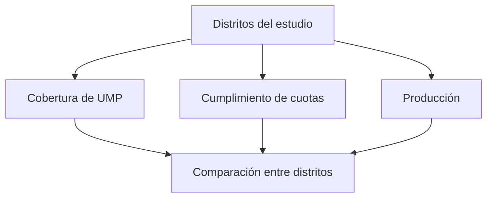

# Distritos de avance territorial

> Compara los distritos entre sí en cobertura y cuotas, para localizar qué zona va corta y por qué.

## Objetivo

El total del estudio esconde el reparto geográfico. Un operativo puede ir bien en conjunto con un distrito claramente rezagado, y en un estudio territorial eso importa: la representación de esa zona en la base final será más débil que la del resto.

Esta pestaña pone los distritos lado a lado para que la comparación sea directa.

## Antes de empezar

- Los distritos deben estar alineados entre el formulario y la ruta; si no, alguno aparecerá vacío sin estarlo.
- Conviene traer del Resumen si el problema es de cuota o de UMP: aquí se localiza dónde.

## Mapa de la pantalla

## Elementos de la pantalla

| Elemento | Para qué sirve | Qué cambia o produce |
|---|---|---|
| Fila por distrito | Presenta cada zona con sus cifras | Es la unidad de comparación |
| Cobertura de UMP | Cuántas unidades del plan se han trabajado allí | Es el eje de fidelidad |
| Cumplimiento de cuotas | Cómo va la composición demográfica de esa zona | Es el eje de calidad |
| Producción | Cuántas encuestas se han levantado | Es el eje de volumen |
| Orden por brecha | Coloca arriba los distritos que más faltan | Convierte la tabla en prioridad |

## Cómo interpretar lo que ves

Compara los distritos entre sí antes que contra su meta. Un distrito con un avance modesto pero similar al de los demás va al ritmo del operativo; uno con la mitad que el resto tiene un problema propio, y la causa suele ser local: menos encuestadores, acceso difícil, base de manzanas peor.

Cobertura de UMP y producción pueden divergir dentro del mismo distrito: mucha producción con pocas UMP significa concentración, que en el conjunto del estudio se traduce en peor dispersión de esa zona.

Un distrito en cero merece comprobarse en Filtro y distritos antes de tratarlo como retraso: puede ser que sus respuestas existan y no estén alineadas.

## Cómo se usa

1. Ordena por brecha y quédate con los distritos rezagados.
2. Para cada uno, mira si el retraso es de producción, de cobertura o de cuotas.
3. Comprueba que ninguno esté rezagado por desalineación en vez de por trabajo.
4. Contrasta con el equipo asignado a esa zona antes de concluir.
5. Redirige el esfuerzo restante al distrito con mayor brecha, no al que más produce.

## Ejemplo guiado

**Situación inicial.** El estudio va bien en conjunto, pero un distrito aparece muy por debajo del resto.

**Acciones.** Se revisa su fila: la producción es baja, pero la cobertura de UMP es proporcionalmente aún más baja. Se comprueba en Filtro y distritos que el distrito está alineado, así que no es un problema de códigos. Al cruzar con el equipo, ese distrito tiene menos encuestadores asignados que los demás.

**Resultado observable.** El diagnóstico es de recursos, no de rendimiento: la zona nunca tuvo capacidad para ir al ritmo del resto. Se refuerza el equipo allí en lugar de exigir más al que ya está. Sin la comparación entre distritos, el retraso se habría leído como bajo desempeño individual.

## Resultado y siguiente paso

- Queda localizada la brecha geográfica y clasificada su causa.
- Continúa en Mapa y UMP territorial para ver la dispersión sobre el terreno, o en Ritmo diario para saber si hay tiempo.

## Estados, alertas y límites

- Un distrito en cero puede estar desalineado y no retrasado.
- Cobertura y producción pueden divergir: mucha producción con pocas UMP es concentración.
- La comparación entre distritos exige tener en cuenta el equipo asignado a cada uno.
- La pestaña compara; no reasigna equipos ni modifica el plan.

## Si algo no coincide

Si un distrito aparece vacío, revísalo en Filtro y distritos territorial antes que nada. Si su cobertura y su producción no cuadran entre sí, mira la concentración en Mapa y UMP. Si la suma de distritos no da el total, busca respuestas sin distrito asignado.

## Ubicación en la jerarquía

- Padre: [[Avance territorial]].
