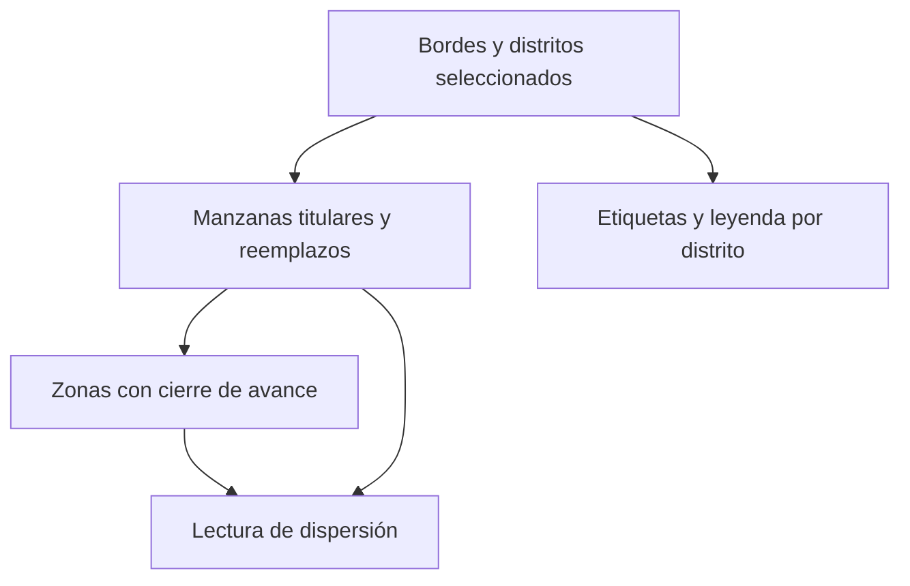

# Mapa y UMP territorial

> Atlas de cobertura: dibuja distritos, manzanas titulares y de reemplazo, y las zonas con avance cerrado sobre el terreno.

## Objetivo

Es la única pantalla que muestra la **dispersión** del operativo. Las tablas dicen cuántas UMP se cubrieron; el mapa dice si están repartidas por el territorio o agrupadas en una esquina. Dos operativos con el mismo número de manzanas cubiertas pueden tener muestras muy distintas, y sólo aquí se ve.

## Antes de empezar

- Debe existir cartografía para los distritos del estudio; sin ella el mapa no puede dibujarse.
- El marco de UMP debe estar leído: el atlas dibuja lo seleccionado por Hojas de ruta.
- Conviene traer de Distritos qué zona quieres inspeccionar.

## Mapa de la pantalla

## Elementos de la pantalla

| Elemento | Para qué sirve | Qué cambia o produce |
|---|---|---|
| Bordes y **distritos seleccionados** | Dibuja el alcance geográfico del estudio | Sitúa todo lo demás |
| **Manzanas titulares y reemplazos** | Muestra las unidades del marco sobre el mapa | Distingue plan de sustitución |
| **Zonas con cierre de avance** | Resalta dónde el avance ya está completo | Muestra el patrón de cobertura |
| Etiquetas distritales | Nombran las zonas en el mapa | Permiten orientarse |
| **Leyenda por distrito** | Explica el código de color | Hace legible el atlas |
| **Cobertura por distrito** | Acompaña el mapa con las cifras | Cruza lo visual con lo numérico |
| Indicadores UMP | Resumen el estado del marco | Complementan la lectura espacial |

## Cómo interpretar lo que ves

Lo que hay que buscar aquí no es un porcentaje sino un **patrón**. Manzanas cerradas repartidas por todo el distrito indican un recorrido fiel al diseño; cerradas agrupadas en un sector indican que el equipo trabajó lo cómodo y dejó el resto, aunque el conteo sea idéntico.

Distinguir **titulares** de **reemplazos** en el mapa permite ver algo que las tablas no muestran bien: si las sustituciones se concentran en una zona, probablemente hay un problema de acceso en ese sector y no decisiones sueltas.

El mapa refleja el corte y depende de la cartografía disponible. Un distrito que no se dibuja no está vacío: es que falta su cartografía, y eso se ve igual que si no hubiera trabajo.

## Cómo se usa

1. Comprueba que los distritos del estudio estén dibujados antes de interpretar ausencias.
2. Observa el patrón de zonas cerradas: repartido o agrupado.
3. Mira dónde se concentran los reemplazos.
4. Cruza lo que veas con la cobertura por distrito para poner cifras al patrón.
5. Si detectas concentración, redirige el trabajo a los sectores vacíos mientras el campo siga abierto.

## Ejemplo guiado

**Situación inicial.** La cobertura de UMP de un distrito es aceptable y nadie ve motivo para intervenir.

**Acciones.** Se abre el atlas y se mira ese distrito. Las manzanas cerradas forman un bloque compacto en un extremo, y todo el otro extremo está sin tocar. Además, los reemplazos usados se concentran justamente en el borde de la zona trabajada.

**Resultado observable.** El conteo era correcto y la dispersión mala: el equipo avanzó por proximidad en lugar de recorrer el plan, y sustituyó las manzanas que le quedaban lejos. Se redirige el trabajo al sector vacío. La cifra de cobertura nunca habría revelado esto.

## Resultado y siguiente paso

- Queda visible la dispersión real del operativo y dónde se concentran las sustituciones.
- Continúa en Manzanas territoriales para reasignar las unidades del sector sin cubrir.

## Estados, alertas y límites

- Un distrito que no se dibuja puede carecer de cartografía, no de trabajo.
- La lectura útil es el patrón de dispersión, no el conteo.
- Reemplazos concentrados en una zona sugieren un problema de acceso local.
- El mapa refleja el corte; no permite editar el marco ni reasignar unidades.

## Si algo no coincide

Si una zona no aparece dibujada, comprueba que exista cartografía para ese distrito. Si el mapa contradice las cifras de cobertura, verifica que ambos correspondan al mismo corte y alcance. Si aparecen manzanas que no reconoces, revisa si son reemplazos activados.

## Ubicación en la jerarquía

- Padre: [[Avance territorial]].
