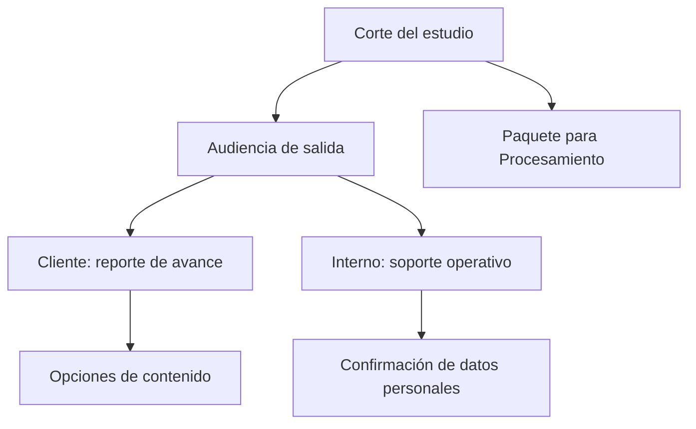

# Salidas territoriales

> Genera las entregas del corte territorial y el paquete que continúa hacia Procesamiento.

## Objetivo

Aquí el corte sale de la aplicación. En territorial la decisión de audiencia tiene un matiz propio: el detalle interno incluye ubicaciones, responsables por manzana y observaciones de validación, que son material de gestión y no de cliente.

## Antes de empezar

- El corte debe ser el que quieres entregar: las salidas congelan lo que hay.
- Las anulaciones y subsanaciones deberían estar aplicadas; si no, entregas cifras que van a cambiar.
- Comprueba el alcance: una salida generada con un distrito filtrado describe esa zona, no el estudio.

## Mapa de la pantalla

## Elementos de la pantalla

| Elemento | Para qué sirve | Qué cambia o produce |
|---|---|---|
| **Corte del estudio** | Declara qué corte se exporta, con su alcance | Es la procedencia del archivo |
| **Audiencia de salida** | Separa entrega al cliente de soporte interno | Condiciona el contenido admisible |
| Opciones de contenido | Ajustan qué incluye el reporte | Adaptan la entrega a lo acordado |
| Confirmación de datos personales | Exige declarar que la salida interna puede incluirlos | Evita que datos de campo salgan por descuido |
| **Spreadsheet destino** | Publica el resultado en una hoja | Es la única acción que saca contenido de la aplicación |
| Paquete para Procesamiento | Prepara data e instrumento del corte | Es el puente al pipeline de análisis |
| Estado de preparación | Indica si el corte alcanza para cada salida | Bloquea entregas incompletas |

## Cómo interpretar lo que ves

La consecuencia territorial que conviene tener presente: el soporte interno lleva **ubicaciones y responsables por manzana**. Esa información permite reconstruir dónde y quién trabajó cada punto, y no pertenece a una entrega de cliente.

Comprueba el **alcance** del corte antes de generar. Un reporte producido con un distrito filtrado se ve idéntico a uno del estudio completo salvo por su contexto, y esa confusión llega al cliente.

Generar no envía: el archivo vive local salvo que se publique explícitamente en una hoja de destino.

El estado de preparación mide suficiencia, no exactitud: un corte con validaciones pendientes se exporta igual.

## Cómo se usa

1. Confirma el corte, su fecha y su alcance.
2. Elige la **audiencia** antes de cualquier otra opción.
3. Ajusta el contenido según lo acordado con el cliente.
4. Marca la confirmación de datos personales sólo para salidas internas y de forma consciente.
5. Genera, revisa el archivo y, si el estudio continúa, prepara el paquete para Procesamiento.

## Ejemplo guiado

**Situación inicial.** Hay que entregar el avance semanal al cliente y pasar el corte al equipo de análisis.

**Acciones.** Se comprueba que no haya un distrito filtrado activo, para que el reporte cubra el estudio completo. Para el cliente se elige audiencia externa y se deja fuera el detalle por manzana y responsable. Después se prepara el paquete de data e instrumento para Procesamiento.

**Resultado observable.** El cliente recibe el avance sin ubicaciones ni nombres del equipo de campo. Análisis recibe el paquete del mismo corte, con la misma fecha, así que cualquier diferencia posterior es rastreable. La comprobación del alcance evitó entregar el avance de una sola zona como si fuera el del estudio.

## Resultado y siguiente paso

- Quedan generadas las entregas del corte con el contenido que su audiencia admite.
- Con el paquete preparado, el estudio continúa en Procesamiento.

## Estados, alertas y límites

- Las salidas **congelan** el corte visible, incluido su alcance.
- El soporte interno incluye ubicaciones y responsables: no es material de cliente.
- Generar no envía; publicar en una hoja de destino sí, y es explícito.
- El estado de preparación evalúa suficiencia, no exactitud.
- Los secretos y credenciales nunca viajan en los archivos generados.

## Si algo no coincide

Si el reporte cubre menos de lo esperado, comprueba si había un distrito filtrado al generarlo. Si sus cifras no coinciden con la pantalla, verifica que ambos sean del mismo corte y que no se hayan aplicado anulaciones en medio. Si una salida aparece bloqueada, el estado de preparación indica qué falta.

## Ubicación en la jerarquía

- Padre: [[Avance territorial]].
