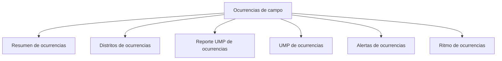

# Ocurrencias de campo

> Documenta el esfuerzo donde **no** hubo entrevista: cuántas visitas, con qué motivos de no efectividad y en qué unidades.

## Propósito de esta guía

Todas las demás secciones cuentan lo que salió bien. Ésta cuenta lo otro, y es lo que convierte un avance en un expediente defendible: un operativo que dice *no se logró* sin explicar cuántas veces se intentó ni por qué falló no puede sostener su tasa de respuesta ante un cliente.

Su fuente es un formulario propio, distinto del de la encuesta: el encuestador reporta lo ocurrido en la manzana aunque no haya conseguido ninguna entrevista.

## Antes de recorrer este nivel

- Hace falta un formulario de ocurrencias vinculado, con su propia cuenta y fuente.
- La vista necesita el scope de consultas hidratado; si aparece el aviso de preparación, actualiza la vista antes de leer.
- El marco de UMP debe estar leído: los reportes se validan contra las unidades esperadas de la ruta.

## Mapa de navegación

## Guía de destinos

| Destino | Cuándo entrar | Qué hacer allí | Qué deja listo |
|---|---|---|---|
| [[Resumen de ocurrencias]] | Para la lectura general | Revisar la tasa de no efectividad y sus motivos | La foto del esfuerzo |
| [[Distritos de ocurrencias]] | Para localizar dónde cuesta más | Comparar estados por distrito | La brecha geográfica de efectividad |
| [[Reporte UMP de ocurrencias]] | Para saber qué unidades reportaron | Revisar con y sin reporte | La cobertura del propio registro |
| [[UMP de ocurrencias]] | Para el detalle por unidad | Revisar qué ocurrió en cada manzana | El expediente por unidad |
| [[Alertas de ocurrencias]] | Cuando algo no cuadra | Revisar sin reporte, observaciones y fuera de ruta | Los casos a corregir |
| [[Ritmo de ocurrencias]] | Para ver la evolución del esfuerzo | Revisar días e historial | La tendencia de efectividad |

## Recorrido recomendado

1. **Resumen** para situar la tasa de no efectividad y sus motivos.
2. **Reporte UMP** para comprobar que el registro mismo tiene cobertura.
3. **Distritos** y **UMP** para localizar dónde y en qué unidades.
4. **Alertas** para lo que exige corrección.
5. **Ritmo** para ver si la efectividad mejora o empeora.

## Cómo interpretar avance y estados

Dos reglas gobiernan el conteo de esta sección y explican casi todas sus cifras:

**Sólo cuentan los reportes reconocidos.** Un reporte debe corresponder a una UMP esperada de la ruta —titular o su reemplazo—. Los que apuntan a unidades no esperadas quedan fuera del conteo, porque un reporte sobre una manzana que no era de nadie no documenta el esfuerzo del plan.

**Un reporte por unidad.** Cuando una misma UMP tiene varios reportes, se conserva sólo el más completo —el de más intentos, y ante empate el más reciente—. Por eso el número de reportes contados suele ser menor que el de reportes recibidos, y no es una pérdida.

Una **UMP sin reporte** no significa que no se haya trabajado: significa que no hay constancia de lo que allí ocurrió, que a efectos del expediente es casi lo mismo.

## Resultado de este nivel

Al terminar, el operativo tiene documentado el esfuerzo desplegado donde no hubo entrevista, con sus motivos, sus unidades y su evolución. Es la mitad del expediente que las cifras de avance no cuentan.

## Ubicación en la jerarquía

- Padre: [[Territorial]].
