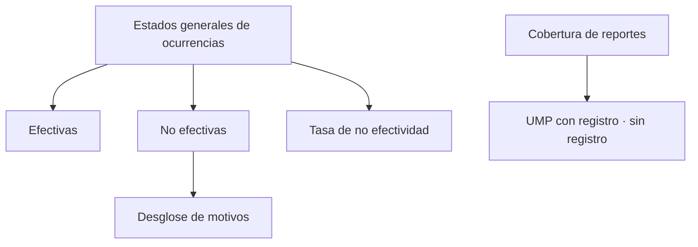

# Resumen de ocurrencias

> Presenta la tasa de no efectividad del operativo y el desglose de motivos por los que no se logró la entrevista.

## Objetivo

Es la lectura de entrada de la sección y la que se usa para explicar el rendimiento del campo. Una tasa de no efectividad alta no es mala noticia por sí sola: en zonas difíciles es lo esperado, y lo que importa es que esté **explicada** por sus motivos.

## Antes de empezar

- La fuente de ocurrencias debe estar vinculada y la vista hidratada.
- Conviene traer del avance cuántas encuestas se lograron: la tasa se lee contra el esfuerzo total.

## Mapa de la pantalla

## Elementos de la pantalla

| Elemento | Para qué sirve | Qué cambia o produce |
|---|---|---|
| **Tasa de no efectividad** | Proporción de visitas que no produjeron entrevista | Es el titular de la sección |
| **Efectivas** | Visitas que sí lograron entrevista | El contrapunto de la tasa |
| Desglose de motivos | Reparte la no efectividad entre sus causas | Es lo que convierte la tasa en explicación |
| **UMP con registro** | Unidades que reportaron ocurrencias | Mide la cobertura del propio registro |
| **Sin registro** | Unidades sin constancia de lo ocurrido | Es el hueco del expediente |
| **Reemplazos usados como titular** | Sustituciones que operaron como unidad principal | Señala dónde el plan cambió en la práctica |

## Cómo interpretar lo que ves

La tasa sola no dice nada; el **desglose de motivos** sí. Rechazos altos apuntan a la presentación del estudio o a la carta de contacto; ausencias altas apuntan a horarios de visita; viviendas desocupadas o inaccesibles apuntan a la calidad del marco de manzanas. Tres causas, tres correcciones distintas.

**Sin registro** es la cifra que más conviene vigilar: no es que no se haya trabajado, es que no hay constancia. Para un expediente, una manzana sin reporte y una manzana sin trabajar se parecen demasiado.

**Reemplazos usados como titular** dice cuánto se apartó la operación del plan. Un número alto no es necesariamente malo —puede reflejar un marco con muchas unidades inviables— pero exige explicación.

Recuerda que sólo se cuentan reportes reconocidos y uno por unidad: el número de reportes contados es menor que el de recibidos por diseño.

## Cómo se usa

1. Lee la tasa y ve inmediatamente al desglose: la tasa sin motivos no es accionable.
2. Identifica el motivo dominante y decide qué corrección le corresponde.
3. Mira **sin registro** y compáralo con las UMP que sabes trabajadas.
4. Revisa los reemplazos usados como titular y comprueba que estén justificados.
5. Baja a Distritos o a UMP para localizar dónde se concentra lo que encontraste.

## Ejemplo guiado

**Situación inicial.** La tasa de no efectividad es alta y el cliente pregunta si el equipo está trabajando bien.

**Acciones.** Se abre el desglose de motivos. La causa dominante no es el rechazo sino la ausencia: viviendas donde no había nadie en el momento de la visita. Se comprueba en el ritmo que el patrón se repite en días laborables.

**Resultado observable.** La respuesta al cliente es concreta y verificable: el rendimiento no refleja la calidad del trabajo sino la franja horaria de las visitas, y la corrección es operativa. El equipo ajusta horarios y la tasa mejora en los días siguientes, cosa que el propio historial de la sección documenta.

## Resultado y siguiente paso

- Queda la tasa de no efectividad explicada por sus causas.
- Continúa en Distritos de ocurrencias para localizar dónde se concentra, o en Reporte UMP para cerrar los huecos de registro.

## Estados, alertas y límites

- La tasa sin desglose no es accionable ni explicable.
- **Sin registro** es ausencia de constancia, no ausencia de trabajo.
- Sólo se cuentan reportes reconocidos, uno por unidad: los contados son menos que los recibidos.
- La sección documenta esfuerzo; no modifica el avance ni las cuotas.

## Si algo no coincide

Si la tasa parece alta, mira el motivo dominante antes de concluir sobre el equipo. Si el número de reportes no cuadra con lo que el equipo envió, recuerda la deduplicación por unidad y el filtro de unidades esperadas. Si la vista aparece sin preparar, actualízala antes de leer.

## Ubicación en la jerarquía

- Padre: [[Ocurrencias de campo]].
