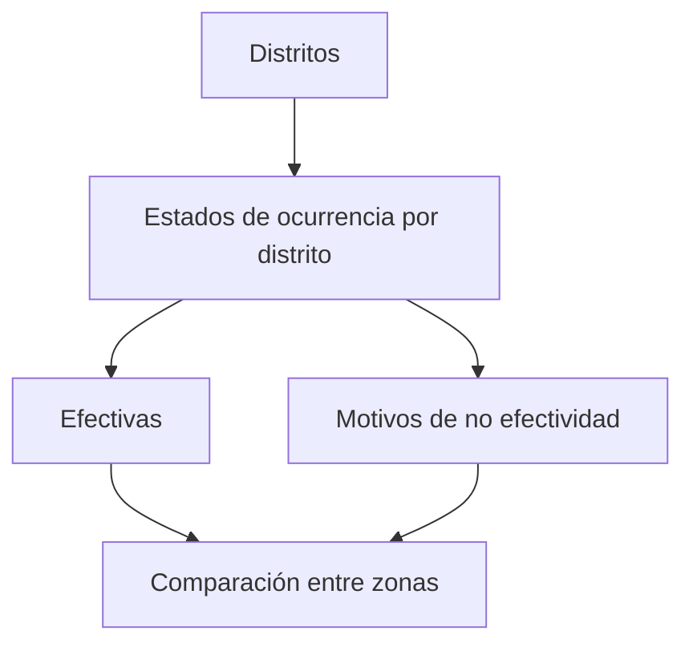

# Distritos de ocurrencias

> Reparte los estados de ocurrencia por distrito para ver dónde cuesta más conseguir la entrevista y por qué.

## Objetivo

La tasa general del operativo promedia zonas que no se parecen. Un distrito residencial de clase alta y uno de vivienda popular tienen tasas de rechazo y de ausencia muy distintas, y esperar el mismo rendimiento de ambos lleva a decisiones injustas con el equipo.

Esta pestaña separa esa realidad.

## Antes de empezar

- Conviene traer del Resumen cuál es el motivo dominante del estudio: aquí verás si se reparte o se concentra.
- Ten presente qué distritos son más difíciles por naturaleza; la comparación debe tenerlo en cuenta.

## Mapa de la pantalla

## Elementos de la pantalla

| Elemento | Para qué sirve | Qué cambia o produce |
|---|---|---|
| Fila por distrito | Presenta cada zona con su reparto de estados | Es la unidad de comparación |
| Efectivas por distrito | Visitas que lograron entrevista allí | Es el rendimiento de la zona |
| Motivos por distrito | Cómo se reparte la no efectividad en esa zona | Explica su rendimiento |
| Volumen de visitas | Cuánto esfuerzo se ha desplegado allí | Contextualiza las proporciones |

## Cómo interpretar lo que ves

Compara **proporciones**, no totales: un distrito con muchas visitas acumula más no efectividad en términos absolutos sin ser peor.

El perfil de motivos es lo que caracteriza a cada zona. Predominio de rechazo apunta a desconfianza o a la presentación del estudio; predominio de ausencia apunta a horarios; predominio de vivienda desocupada o inaccesible apunta a que el marco de manzanas de esa zona no refleja la realidad, que es un problema del diseño y no del campo.

Un distrito con muy pocas visitas todavía no es comparable: sus proporciones son inestables.

## Cómo se usa

1. Ordena por tasa de no efectividad, pero mira antes el volumen de cada distrito.
2. Para los distritos más costosos, revisa su perfil de motivos.
3. Distingue las causas corregibles en campo —horarios, presentación— de las que son del marco.
4. Ajusta las expectativas de rendimiento por zona en lugar de exigir la misma tasa a todas.
5. Si una zona muestra marco inadecuado, escálalo: se corrige en Hojas de ruta, no llamando más puertas.

## Ejemplo guiado

**Situación inicial.** Un distrito tiene una tasa de no efectividad muy superior a la del resto y se plantea reforzarlo con más encuestadores.

**Acciones.** Se revisa su perfil de motivos. No predomina ni el rechazo ni la ausencia: la causa dominante es vivienda desocupada o inaccesible, en proporción muy superior al resto de zonas.

**Resultado observable.** Más encuestadores no habrían ayudado: el problema es que el marco de manzanas de esa zona incluye unidades que ya no son residenciales. La corrección va a Hojas de ruta, para revisar la selección de ese distrito, y a la activación de reemplazos. El refuerzo se destina a otra zona donde sí hay puertas que tocar.

## Resultado y siguiente paso

- Queda localizado dónde cuesta más la entrevista y qué tipo de causa lo explica.
- Las causas de marco continúan en Hojas de ruta; las operativas, en la organización del campo.

## Estados, alertas y límites

- Compara proporciones; los totales favorecen a los distritos con más visitas.
- Un distrito con pocas visitas no es comparable todavía.
- El perfil de motivos distingue causas de campo de causas de marco.
- La pestaña describe; no reasigna equipos ni corrige el marco.

## Si algo no coincide

Si un distrito parece muy malo, comprueba su volumen antes de concluir. Si su perfil apunta a marco inadecuado, verifica la selección de esa zona en Hojas de ruta. Si la suma por distritos no da el total, busca reportes sin distrito reconocido.

## Ubicación en la jerarquía

- Padre: [[Ocurrencias de campo]].
