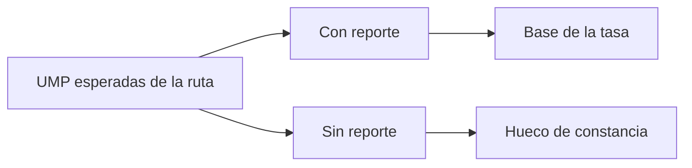

# Reporte UMP de ocurrencias

> Comprueba qué unidades del plan tienen reporte de ocurrencias y cuáles no dejaron constancia de lo ocurrido.

## Objetivo

Antes de interpretar los motivos hay que saber sobre cuánto se está hablando. Si buena parte de las unidades no reportó, la tasa de no efectividad describe una fracción del campo y no el campo entero.

Esta pestaña mide la **cobertura del propio registro**, que es la condición para que el resto de la sección signifique algo.

## Antes de empezar

- El marco de UMP debe estar leído: la comprobación es contra las unidades esperadas de la ruta.
- Conviene traer del avance qué unidades ya produjeron entrevistas: no todas necesitan reporte de ocurrencias.

## Mapa de la pantalla

## Elementos de la pantalla

| Elemento | Para qué sirve | Qué cambia o produce |
|---|---|---|
| **UMP con registro** | Unidades que dejaron reporte de ocurrencias | Es la base sobre la que se calcula todo |
| **Sin registro** | Unidades esperadas sin constancia | Es el hueco del expediente |
| Cobertura de reportes | Proporción entre ambas | Dice cuánto del campo está documentado |
| Detalle por unidad | Muestra qué unidades faltan | Convierte la cifra en una lista accionable |
| Responsable de la unidad | Quién tenía asignada cada UMP | Permite pedir el reporte a quien corresponde |

## Cómo interpretar lo que ves

Una **UMP sin registro** no es una unidad sin trabajar: es una unidad sin constancia. La diferencia importa para la operación —quizá sí se trabajó— y no importa para el expediente, donde ambas se ven igual.

Cuando la cobertura de reportes es baja, todas las cifras de la sección quedan en entredicho: la tasa de no efectividad se calcula sobre lo reportado, y si lo reportado es una parte sesgada del campo —típicamente las unidades más difíciles, que son las que motivan a reportar— la tasa saldrá peor de lo real.

Recuerda que sólo cuentan los reportes que corresponden a una unidad **esperada** de la ruta. Un reporte sobre una manzana ajena al plan no aparece aquí, y eso explica diferencias entre lo enviado y lo contado.

## Cómo se usa

1. Lee la cobertura antes que cualquier tasa de la sección.
2. Si es baja, trata las cifras de motivos como provisionales.
3. Abre el detalle y cruza las unidades sin registro con su responsable.
4. Pide los reportes faltantes mientras el campo siga abierto.
5. Vuelve a comprobar la cobertura antes de usar la sección en una entrega.

## Ejemplo guiado

**Situación inicial.** La tasa de no efectividad del estudio parece muy alta y preocupa de cara al informe.

**Acciones.** Se abre esta pestaña y se mira la cobertura de reportes: sólo una parte de las UMP esperadas dejó constancia. Al cruzar con los responsables, las unidades sin registro se concentran en dos encuestadores que no están usando el formulario de ocurrencias.

**Resultado observable.** La tasa estaba calculada sobre un subconjunto sesgado: reportaban sobre todo quienes tenían problemas que contar. Se pide a los dos encuestadores que registren sus visitas y, con la cobertura completa, la tasa baja a un nivel coherente con lo que el equipo observa en campo. El informe se libra de una cifra que no era cierta.

## Resultado y siguiente paso

- Queda establecido cuánto del campo está documentado y qué unidades faltan.
- Continúa en UMP de ocurrencias para el detalle unidad por unidad, o en Alertas de ocurrencias para lo que exija corrección.

## Estados, alertas y límites

- **Sin registro** es falta de constancia, no necesariamente falta de trabajo.
- Con cobertura baja, la tasa de no efectividad puede estar sesgada al alza.
- Sólo cuentan reportes de unidades esperadas de la ruta.
- La pestaña mide cobertura del registro; no crea reportes ni los sustituye.

## Si algo no coincide

Si la cobertura es baja, comprueba qué responsables no están reportando antes de interpretar ninguna tasa. Si el número de reportes contados es menor que el de enviados, recuerda el filtro de unidades esperadas y la deduplicación. Si una unidad trabajada figura sin registro, verifica que su reporte apunte a una UMP del plan.

## Ubicación en la jerarquía

- Padre: [[Ocurrencias de campo]].
