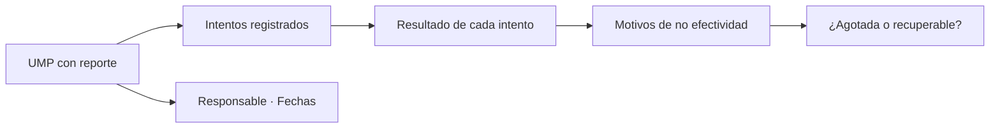

# UMP de ocurrencias

> Detalle por unidad: qué se intentó en cada manzana, cuántas veces y con qué resultado.

## Objetivo

Es el expediente a nivel de manzana. Cuando hay que explicar por qué una unidad concreta no produjo entrevistas —a un cliente, a un supervisor, o a uno mismo al decidir si activar su reemplazo— la respuesta está aquí.

## Antes de empezar

- Conviene traer del Reporte UMP qué unidades tienen registro: sólo ésas tienen detalle que mostrar.
- Ten a mano el marco: la comparación es entre la unidad esperada y lo que allí ocurrió.

## Mapa de la pantalla

## Elementos de la pantalla

| Elemento | Para qué sirve | Qué cambia o produce |
|---|---|---|
| Lista de unidades | Presenta las UMP con reporte | Es el índice del detalle |
| **Intentos** | Cuántas visitas se registraron en esa unidad | Es la medida del esfuerzo |
| Resultado por intento | Qué ocurrió en cada visita | Reconstruye la historia de la manzana |
| Motivos de la unidad | Cómo se reparten sus no efectividades | Caracteriza el problema local |
| Responsable | Quién trabajó la unidad | Permite contrastar con la persona |
| Fechas | Cuándo se hicieron las visitas | Distingue insistencia real de una única pasada |

## Cómo interpretar lo que ves

**Intentos** y **fechas** juntos son la lectura importante. Tres visitas el mismo día a la misma hora no son insistencia: son una sola oportunidad repetida. Tres visitas en días y horarios distintos sí agotan razonablemente la unidad.

Esa distinción es la que sostiene la decisión de activar un reemplazo: una manzana con esfuerzo real documentado justifica la sustitución; una con una sola pasada no, y sustituirla debilita la muestra sin necesidad.

Recuerda que se conserva **un reporte por unidad**, el más completo. Si el equipo envió varios, lo que ves es el de más intentos, no la suma de todos.

## Cómo se usa

1. Localiza la unidad que estás investigando.
2. Mira intentos y fechas juntos, no el número de intentos solo.
3. Revisa el reparto de motivos: caracteriza si el problema es de acceso, de horario o de rechazo.
4. Decide si la unidad está razonablemente agotada o si merece otra visita en distinto horario.
5. Si está agotada, activa su reemplazo desde Manzanas territoriales dejando registro del motivo.

## Ejemplo guiado

**Situación inicial.** Un encuestador propone reemplazar una manzana porque "no hay nadie".

**Acciones.** Se abre la unidad en esta pestaña. Tiene tres intentos registrados, pero los tres son del mismo día y en horario laboral. El motivo dominante es ausencia, no rechazo ni inaccesibilidad.

**Resultado observable.** La unidad no está agotada: nunca se visitó en otro horario. Se le pide una pasada en franja de tarde o fin de semana antes de sustituirla. Reemplazarla habría eliminado del marco una manzana perfectamente viable, y el patrón de ausencias sugiere que ahí sí hay gente, sólo que no a esa hora.

## Resultado y siguiente paso

- Cada unidad tiene su historia de intentos documentada y su decisión de agotamiento fundamentada.
- Las sustituciones que procedan continúan en Manzanas territoriales.

## Estados, alertas y límites

- Intentos sin fechas distintas no equivalen a esfuerzo agotado.
- Se conserva un reporte por unidad, el más completo: no es la suma de los enviados.
- Sólo aparecen unidades con reporte reconocido.
- La pestaña documenta; activar reemplazos se hace en Manzanas territoriales.

## Si algo no coincide

Si una unidad muestra menos intentos de los que el equipo reporta, recuerda que se conserva un solo reporte por unidad. Si una unidad trabajada no aparece, comprueba en Reporte UMP si dejó registro. Si los motivos no cuadran con lo que el encuestador cuenta, contrasta las fechas de las visitas.

## Ubicación en la jerarquía

- Padre: [[Ocurrencias de campo]].
