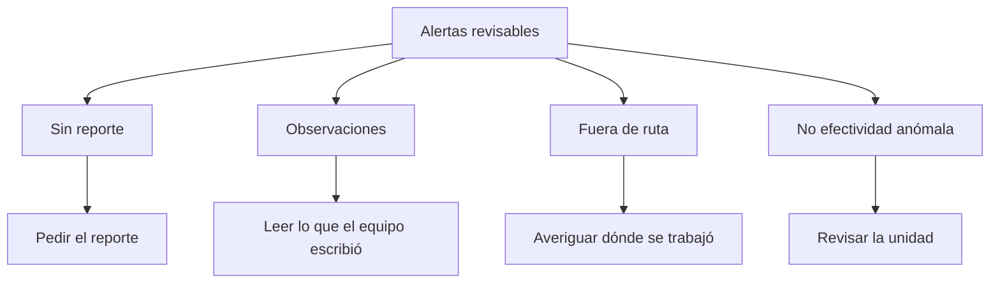

# Alertas de ocurrencias

> Reúne lo revisable del registro de ocurrencias: unidades sin reporte, observaciones del equipo, reportes fuera de ruta y no efectividad anómala.

## Objetivo

Es la lista de trabajo de la sección. Agrupa cuatro clases de señal que exigen acciones distintas, y su valor está en no mezclarlas: una unidad sin reporte se resuelve pidiendo el reporte, y un reporte fuera de ruta se resuelve averiguando dónde estuvo el equipo.

## Antes de empezar

- La vista necesita el scope de consultas hidratado.
- Conviene traer del Reporte UMP cuánta cobertura de registro hay: si es baja, la clase dominante será previsible.

## Mapa de la pantalla

## Elementos de la pantalla

| Elemento | Para qué sirve | Qué cambia o produce |
|---|---|---|
| Lista revisable de alertas | Reúne las señales del registro | Es el trabajo pendiente |
| **Sin reporte** | Unidades esperadas que no dejaron constancia | Se resuelve pidiendo el reporte |
| **Observaciones** | Notas que el equipo escribió en sus reportes | Contienen información que ningún indicador captura |
| **Fuera de ruta** | Reportes que apuntan a unidades no esperadas | Indican trabajo fuera del plan o error de código |
| **No efectividad** anómala | Unidades cuyo rendimiento se aparta del patrón | Merecen revisión individual |
| Filtros de alertas | Acotan a una clase o a un distrito | Permiten trabajar una cosa a la vez |

## Cómo interpretar lo que ves

Las **observaciones** son la clase más subestimada. Son texto libre que el encuestador escribió estando allí, y con frecuencia explican en una frase lo que ningún indicador muestra: una calle en obras, un condominio que no permite el ingreso, una zona con un evento que vació el vecindario. Leerlas es barato y suele ahorrar diagnósticos equivocados.

**Fuera de ruta** tiene dos causas opuestas: el equipo trabajó donde no debía, o el código de la unidad se escribió mal y el reporte sí corresponde al plan. La segunda se resuelve en Reconciliación de códigos territorial y es más frecuente.

**Sin reporte** dominante casi siempre refleja un problema de hábito con el formulario, no de campo: se corrige recordando el procedimiento al equipo, no revisando unidades.

## Cómo se usa

1. Filtra por clase y empieza por leer las **observaciones**: son las que más contexto aportan por menos esfuerzo.
2. Resuelve **fuera de ruta** comprobando primero si es un problema de código.
3. Trata **sin reporte** como un tema de procedimiento con el equipo.
4. Revisa individualmente las unidades con no efectividad anómala.
5. Deriva cada caso a donde se corrige, en lugar de resolverlo aquí.

## Ejemplo guiado

**Situación inicial.** Un sector concreto muestra no efectividad muy por encima del resto y no se entiende por qué.

**Acciones.** Se filtran las alertas de ese distrito y se leen las **observaciones**. Varios encuestadores anotaron la misma circunstancia: un tramo de manzanas corresponde a un conjunto cerrado que no permite el ingreso de encuestadores.

**Resultado observable.** La causa aparece en una frase escrita por quien estuvo allí, no en ningún indicador. Se activan los reemplazos de esas unidades con motivo documentado, y el resto del sector se sigue trabajando con normalidad. Sin leer las observaciones, el diagnóstico habría apuntado al rendimiento del equipo.

## Resultado y siguiente paso

- Las señales quedan clasificadas y derivadas a donde se corrigen.
- Los códigos mal escritos continúan en Reconciliación de códigos territorial; las sustituciones, en Manzanas territoriales.

## Estados, alertas y límites

- Las **observaciones** son texto del equipo: la mejor fuente de contexto de la sección.
- **Fuera de ruta** suele ser un problema de código antes que de ubicación.
- **Sin reporte** dominante indica hábito de registro, no problema de campo.
- La pestaña señala; ninguna corrección se aplica aquí.

## Si algo no coincide

Si dominan las alertas sin reporte, revisa el procedimiento del equipo antes que las unidades. Si hay muchos reportes fuera de ruta, comprueba la reconciliación de códigos. Si una unidad tiene no efectividad extrema, léela en UMP de ocurrencias antes de decidir nada.

## Ubicación en la jerarquía

- Padre: [[Ocurrencias de campo]].
