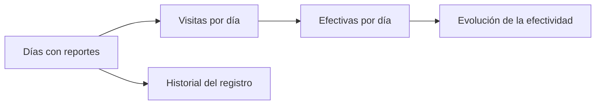

# Ritmo de ocurrencias

> Muestra cómo evoluciona el esfuerzo y la efectividad día a día, y conserva el historial del registro.

## Objetivo

Las demás pestañas describen el estado; ésta describe la **evolución**. Sirve para saber si las correcciones que se aplicaron —cambio de horarios, refuerzo, ajuste de presentación— funcionaron, que es una pregunta que sólo el tiempo contesta.

## Antes de empezar

- Los reportes deben traer fecha.
- Conviene saber cuándo se aplicó cada corrección: la lectura es antes y después de esa fecha.

## Mapa de la pantalla

## Elementos de la pantalla

| Elemento | Para qué sirve | Qué cambia o produce |
|---|---|---|
| Serie de días | Presenta el esfuerzo desplegado cada jornada | Es la base de la lectura |
| Visitas por día | Cuánto se intentó | Mide la actividad |
| Efectividad por día | Qué proporción logró entrevista | Es la medida de rendimiento |
| Historial | Conserva la evolución del registro | Permite comparar periodos |

## Cómo interpretar lo que ves

Separa **actividad** de **efectividad**. Un día con muchas visitas y pocas entrevistas no es un mal día de trabajo: es un día de mucho esfuerzo en una zona difícil. Confundirlas lleva a penalizar al equipo cuando más está trabajando.

La lectura útil es antes y después de una corrección concreta. Si se cambiaron los horarios de visita, lo que hay que mirar no es el nivel general sino si la efectividad subió a partir de esa fecha.

Como en el resto del modo, la estacionalidad semanal es real y no debe confundirse con una caída. Compara días equivalentes.

## Cómo se usa

1. Sitúa en la serie las fechas de las correcciones aplicadas.
2. Compara efectividad antes y después de cada una.
3. Lee actividad y efectividad por separado antes de juzgar una jornada.
4. Compara días equivalentes de la semana, no consecutivos.
5. Usa el historial para documentar en el informe que la corrección funcionó.

## Ejemplo guiado

**Situación inicial.** Se cambiaron los horarios de visita para reducir las ausencias y no está claro si sirvió.

**Acciones.** Se abre la serie y se sitúa la fecha del cambio. Se comparan las jornadas equivalentes de las semanas anteriores y posteriores, en vez de días consecutivos. La actividad se mantiene similar, pero la efectividad de las jornadas posteriores es claramente superior.

**Resultado observable.** La corrección funcionó, y queda documentado con la propia serie del operativo. Ese dato entra al informe como evidencia de gestión del campo, no como afirmación. Comparar días consecutivos habría mezclado el efecto del cambio con la estacionalidad semanal.

## Resultado y siguiente paso

- Queda documentada la evolución del esfuerzo y el efecto de las correcciones.
- Con la efectividad estabilizada, continúa en Avance territorial para leer el cierre.

## Estados, alertas y límites

- Actividad y efectividad son ejes distintos: mucho esfuerzo con poco resultado no es mal trabajo.
- La estacionalidad semanal es real; compara días equivalentes.
- Sin fecha en los reportes no hay serie.
- La pestaña describe la evolución; no proyecta cierre, que es competencia de Ritmo diario territorial.

## Si algo no coincide

Si la efectividad parece caer, comprueba si estás comparando días equivalentes. Si la serie tiene huecos, revisa la cobertura del registro en Reporte UMP. Si el efecto de una corrección no se ve, comprueba que la fecha del cambio sea la que crees.

## Ubicación en la jerarquía

- Padre: [[Ocurrencias de campo]].
