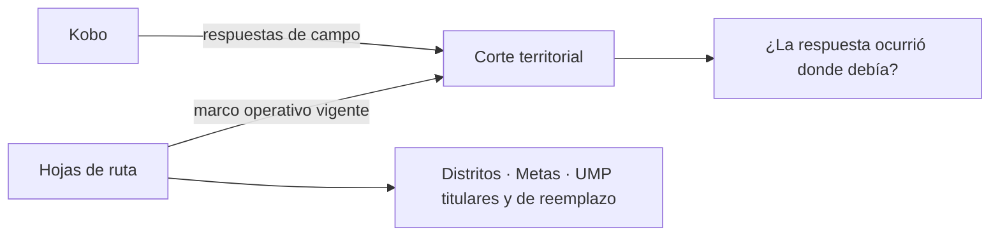
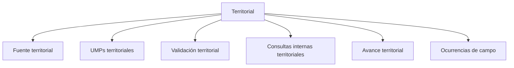

# Territorial

> Controla un operativo de campo puerta a puerta reconciliando las respuestas de Kobo con el marco operativo que produce Hojas de ruta.

## Propósito de esta guía

Este modo se usa cuando el levantamiento ocurre en el territorio y se controla por distrito, UMP, manzana, ruta y encuestador. Su unidad de trabajo es la **UMP** —la unidad muestral primaria, típicamente un bloque de manzanas— y su tarea permanente es comprobar que lo que llegó de campo corresponde a donde el plan decía que debía ocurrir.

Es el modo con más superficie del módulo, porque el campo territorial tiene más formas de salir mal: una encuesta puede estar completa, ser rápida, tener buen GPS y aun así haberse levantado en la manzana equivocada.

## Las dos fuentes que este modo reconcilia

**Kobo** aporta lo que el encuestador levantó. **Hojas de ruta** aporta el marco: qué distritos entran, qué metas hay, qué UMP son titulares y cuáles son sus reemplazos. Ninguna de las dos basta sola, y el modo entero consiste en cruzarlas.

## El contrato que hay que entender antes de leer cualquier cifra

**1. Titular y reemplazo no son intercambiables.** Cada UMP titular tiene reemplazos previstos. Usar un reemplazo es legítimo, pero tiene que quedar justificado: la sustitución sin motivo registrado es lo que un cliente cuestiona al revisar la muestra.

**2. El GPS se lee como una escala, no como un sí o no.** La disposición de cada respuesta va de lo más defendible a lo que no lo es:

| Disposición | Qué significa | Cómo leerla |
|---|---|---|
| **En zona** | El punto cae dentro de la zona de la UMP asignada | Lo esperado |
| **Fuera de zona** | Cae en el distrito correcto pero fuera de la zona | Revisar: puede ser deriva del GPS o manzana equivocada |
| **Fuera de distrito** | Cae en otro distrito | No defendible sin explicación |
| **Sin cruce territorial** | No hay ruta ni correspondencia con la que comparar | No se pudo evaluar |
| **Sin GPS** | La respuesta no trae coordenadas | Ausencia de evidencia, no un fallo |

**Sin GPS** y **fuera de distrito** son cosas opuestas: la primera no dice nada, la segunda dice algo malo. Tratarlas igual descarta casos válidos.

**3. Un cero no es lo mismo que S/D.** Un control ejecutado que no encontró casos vale cero; un control que no pudo evaluarse es S/D. En este modo la distinción es constante, porque muchas comprobaciones dependen de que exista cartografía o marco.

## Antes de recorrer este nivel

Confirma que Hojas de ruta tiene un marco vigente para este estudio y que el formulario de Kobo está vinculado. Ten presente qué distritos entran en el alcance: casi todas las cifras del modo se leen por distrito.

## Mapa de navegación

## Guía de destinos

| Destino | Cuándo entrar | Qué hacer allí | Qué deja listo |
|---|---|---|---|
| [[Fuente territorial]] | Al montar el estudio y cuando una cifra no cuadre | Vincular Kobo, acotar distritos, mapear encuestadores y reconciliar códigos | El corte con procedencia y alcance definidos |
| [[UMPs territoriales]] | Para saber qué se cubrió del plan | Revisar cobertura por zona y el detalle de manzanas | El estado del marco operativo |
| [[Validación territorial]] | Antes de dar por buenas las respuestas | Revisar GPS, reconciliación espacial, duración, cuotas y anulaciones | Las respuestas que se pueden defender |
| [[Consultas internas territoriales]] | Cuando hay que responder por un caso | Revisar registro, GPS, tiempos, responsables y subsanaciones | La evidencia caso a caso |
| [[Avance territorial]] | Para leer el estado del campo y entregar | Revisar resumen, distritos, mapa, ritmo y salidas | El reporte del corte |
| [[Ocurrencias de campo]] | Para entender por qué no se logró una entrevista | Revisar motivos de no efectividad por UMP y distrito | El esfuerzo documentado |

## Recorrido recomendado

1. **Fuente territorial** al configurar: sin alcance ni encuestadores mapeados, todo lo demás se lee mal.
2. **UMPs territoriales** para situar lo cubierto contra el plan.
3. **Validación territorial** como control permanente durante el campo.
4. **Consultas internas** cuando un caso concreto exija explicación.
5. **Ocurrencias de campo** para documentar el esfuerzo donde no hubo entrevista.
6. **Avance territorial** para leer y entregar.

## Cómo interpretar avance y estados

Este modo tiene dos denominadores que conviven y no son el mismo: la **meta** del estudio y el **marco operativo** —las UMP previstas—. Un distrito puede ir bien contra su meta y mal contra su plan de UMP, o al revés, y las dos lecturas importan por razones distintas: la primera es cumplimiento, la segunda es fidelidad a la muestra.

Las respuestas sin GPS no son un problema de calidad por sí solas. Lo que sí lo es son las que tienen GPS y caen fuera del distrito.

## Cómo se llega a cada pantalla

Este modo publica su ubicación: `/monitoreo?modo=territorial&seccion=<sección>&pestana=<pestaña>`.

## Resultado de este nivel

Al completar Territorial queda un corte de campo con procedencia: qué se levantó, dónde ocurrió, quién lo hizo, qué se cubrió del plan de UMP y qué esfuerzo se documentó donde no hubo entrevista.

## Ubicación en la jerarquía

- Padre: [[Monitoreo]].
