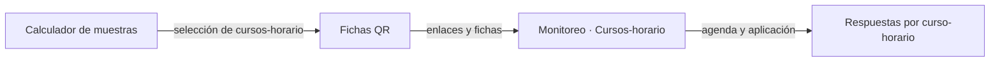
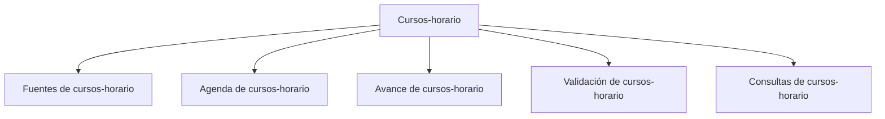

# Cursos-horario

> Sigue una intervención universitaria cuya unidad operativa es el curso-horario: de la selección muestral a la agenda, la aplicación en aula y el cierre.

## Propósito de esta guía

Este modo se usa cuando el estudio se levanta dentro de sesiones de clase. Su unidad no es una persona ni un territorio, sino el **curso-horario**: una sesión concreta, con su docente, su horario y su aula. Se encuesta a quienes están allí en ese momento.

Eso lo hace distinto de los otros tres modos en un punto decisivo: la oportunidad de levantar datos **no se repite**. Una sesión que pasó sin aplicarse no se recupera insistiendo; hay que reemplazarla por otra.

## La cadena que atraviesa tres módulos

El plan de titulares y reservas lo produce **Calculador de muestras**; los accesos individuales, **Fichas QR**; este modo sigue la aplicación. Si el plan no se importó, el modo no tiene qué monitorear.

## El contrato que hay que entender antes de leer cualquier cifra

**1. Titular, reserva y cadena de reemplazo.** Cada curso-horario seleccionado es titular y tiene reservas encadenadas. Cuando un titular no se puede aplicar —se canceló la sesión, no hubo acceso, el docente no autorizó— se activa la siguiente de su cadena. Sustituir fuera de la cadena rompe la lógica de la selección.

**2. Los estados son una secuencia, no etiquetas sueltas.** Una sesión recorre *agendada → contactada → aplicada → cerrada*, y puede desviarse a *cancelada*, *sin acceso* o *reemplazada*. Cada estado responde una pregunta distinta del operativo, y saltarse el orden esconde dónde se atasca la operación.

**3. Respuestas válidas sin curso-horario existen y son un problema propio.** Una respuesta puede llegar sin poder atribuirse a ninguna sesión, típicamente porque se accedió por un enlace equivocado o genérico. Cuenta como respuesta y no cuenta para ninguna cuota, así que infla el total sin mejorar la cobertura.

**4. La cuota se lee por sexo y facultad.** El diseño no se satisface con un total: se satisface con la composición, y ésa depende de a quién había en el aula ese día.

## Antes de recorrer este nivel

Confirma que el plan de cursos-horario está importado, que las fichas QR o los enlaces están generados y que la fuente de respuestas está vinculada. Ten presente el calendario académico: la ventana de aplicación de una sesión es su horario, y no se negocia.

## Mapa de navegación

## Guía de destinos

| Destino | Cuándo entrar | Qué hacer allí | Qué deja listo |
|---|---|---|---|
| [[Fuentes de cursos-horario]] | Al montar el estudio | Importar el plan y vincular la fuente de respuestas | El marco y su origen de datos |
| [[Agenda de cursos-horario]] | Durante la operación, a diario | Seguir horarios, responsables, enlaces y QR | La programación viva del operativo |
| [[Avance de cursos-horario]] | Para leer cumplimiento | Revisar aplicados, cuotas y brechas | El estado contra el plan |
| [[Validación de cursos-horario]] | Antes de dar por buenas las respuestas | Revisar recolector, horarios y duplicados | Las respuestas atribuibles |
| [[Consultas de cursos-horario]] | Cuando hay que responder por una sesión | Revisar la trazabilidad por curso-horario | La evidencia por unidad |

## Recorrido recomendado

1. **Fuentes** al configurar: sin plan importado no hay modo.
2. **Agenda** en el día a día: es donde se gobierna la operación.
3. **Validación** en paralelo, porque las respuestas mal atribuidas se detectan mejor en caliente.
4. **Avance** para leer cumplimiento y decidir reemplazos.
5. **Consultas** cuando una sesión concreta exija explicación.

## Cómo interpretar avance y estados

Dos avances conviven y no son el mismo: **cursos-horario aplicados** mide sesiones cubiertas del plan, y **respuestas válidas** mide personas encuestadas. Un operativo puede tener muchas respuestas y pocas sesiones aplicadas —aulas muy llenas— o lo contrario. El primero habla de fidelidad a la muestra; el segundo, de volumen.

Un curso-horario **reemplazado** no es una pérdida: es la cadena funcionando. Lo que sí es un problema es un titular sin aplicar y sin reemplazo activado, porque su oportunidad ya pasó.

## Cómo se llega a cada pantalla

Este modo publica su ubicación: `/monitoreo?modo=aulas&seccion=<sección>`. Sus secciones no tienen pestañas: cada una es una superficie única.

## Resultado de este nivel

Al completar Cursos-horario queda una agenda ejecutada y trazable: qué sesiones se aplicaron, cuáles se reemplazaron y por qué, cuántas respuestas produjo cada una y si la composición por sexo y facultad cumple el diseño.

## Ubicación en la jerarquía

- Padre: [[Monitoreo]].
