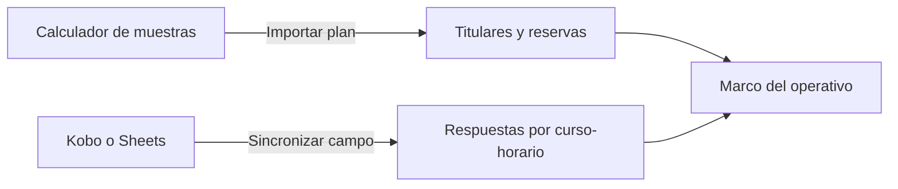

# Fuentes de cursos-horario

> Importa el plan de titulares y reservas producido por el cálculo de muestra, y vincula la fuente de respuestas del operativo.

## Objetivo

Esta sección conecta el modo con el resto de la cadena. El plan no se diseña aquí: se importa desde **Calculador de muestras**, que decidió qué cursos-horario entran como titulares y cuáles quedan como reservas encadenadas. Sin esa importación el modo no tiene marco y todas sus pantallas quedan vacías.

También es donde se declara de dónde llegan las respuestas: Kobo o Sheets, agregadas por curso-horario.

## Antes de empezar

- El cálculo de muestra de cursos-horario debe estar corrido y cerrado.
- Las fichas QR o los enlaces personalizados deberían estar generados: es lo que permitirá atribuir cada respuesta a su sesión.
- La conexión con la plataforma de respuestas debe estar configurada.

## Mapa de la pantalla

## Elementos de la pantalla

| Elemento | Para qué sirve | Qué cambia o produce |
|---|---|---|
| **Importar plan** | Trae los titulares y reservas desde el cálculo de muestra | Es lo que da marco al modo |
| **Sincronizar campo** | Trae las respuestas de la plataforma | Alimenta el avance |
| Fuente y plan | Muestra el origen declarado de cada cosa | Confirma sobre qué se está leyendo |
| Estado de la importación | Indica si el plan está cargado y de qué corrida | Explica un modo sin datos |
| Marca de sincronización | Cuándo llegaron las últimas respuestas | Dice si el avance es de hoy |

## Cómo interpretar lo que ves

Plan y respuestas son **dos importaciones independientes**. Un plan cargado con respuestas sin sincronizar muestra la agenda completa y cero avance; respuestas sincronizadas sin plan no tienen dónde atribuirse. Los dos síntomas son distintos y se corrigen con acciones distintas.

Importar el plan de nuevo lo actualiza a la corrida vigente del cálculo de muestra. Hacerlo con el campo en marcha puede cambiar titulares y reservas, así que conviene saber por qué se hace.

La atribución de cada respuesta a su curso-horario depende de que se haya accedido por el enlace o QR correcto. Ese vínculo se prepara en Fichas QR, no aquí.

## Cómo se usa

1. **Importa el plan** una vez que el cálculo de muestra esté cerrado.
2. Comprueba que el número de titulares y reservas coincida con lo que el cálculo entregó.
3. Vincula la fuente de respuestas y **sincroniza el campo**.
4. Verifica la marca de sincronización antes de leer cualquier avance.
5. Vuelve a importar sólo cuando la selección cambie de verdad.

## Ejemplo guiado

**Situación inicial.** El modo muestra la agenda completa pero todo el avance en cero, pese a que el equipo aplicó varias sesiones.

**Acciones.** Se revisa esta sección. El plan está importado correctamente —por eso hay agenda— pero la marca de sincronización de campo es anterior a las aplicaciones. Se sincroniza.

**Resultado observable.** Las respuestas entran y el avance refleja las sesiones aplicadas. El diagnóstico distinguió las dos importaciones: el marco estaba bien y lo que faltaba eran los datos, que es un problema de un solo clic y no de configuración.

## Resultado y siguiente paso

- El operativo tiene su marco de titulares y reservas, y su fuente de respuestas sincronizada.
- Continúa en Agenda de cursos-horario para gobernar la operación diaria.

## Estados, alertas y límites

- Sin plan importado el modo no tiene marco: las pantallas quedan vacías.
- Plan y respuestas son importaciones independientes y fallan por separado.
- Reimportar el plan lo actualiza a la corrida vigente y puede cambiar titulares y reservas.
- La atribución respuesta–sesión depende de los enlaces preparados en Fichas QR.

## Si algo no coincide

Si hay agenda y no hay avance, mira la marca de sincronización. Si no hay agenda, comprueba que el plan esté importado. Si el número de titulares no coincide con el cálculo de muestra, reimporta desde la corrida vigente.

## Ubicación en la jerarquía

- Padre: [[Cursos-horario]].
