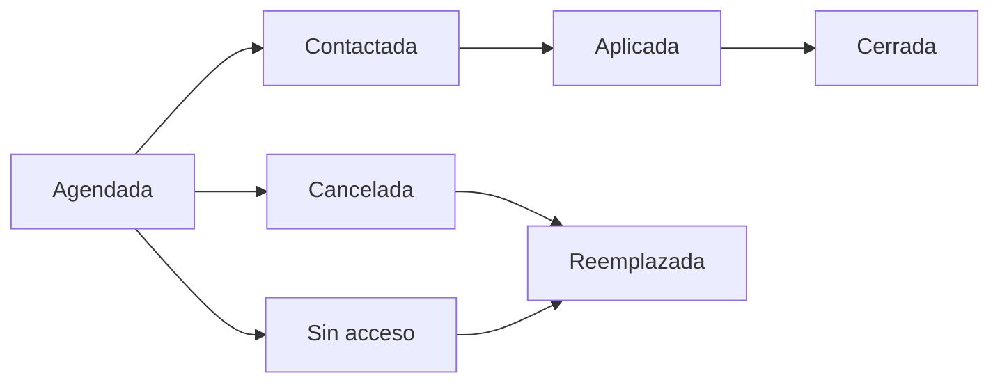

# Agenda de cursos-horario

> Programación viva del operativo: qué sesión toca, quién la cubre, con qué enlace o ficha, y en qué estado está.

## Objetivo

Es la sección de gobierno diario del modo. En un operativo por aulas la coordinación lo es casi todo, porque cada sesión tiene una ventana de aplicación fija: si el equipo no está allí a esa hora, la oportunidad se pierde y hay que gastar una reserva.

## Antes de empezar

- El plan debe estar importado y los enlaces o fichas QR generados.
- Ten a mano el calendario académico y los contactos docentes: la contactación previa es lo que hace viable la aplicación.
- Conoce quién del equipo cubre cada franja horaria.

## Mapa de la pantalla

## Elementos de la pantalla

| Elemento | Para qué sirve | Qué cambia o produce |
|---|---|---|
| Lista de cursos-horario | Presenta las sesiones con su horario y su curso | Es la programación del operativo |
| Estado de la sesión | Sitúa cada una en la secuencia operativa | Es lo que se gobierna a diario |
| **Responsable** | Quién cubre esa sesión | Reparte el trabajo por franja |
| **Correo docente** | Contacto para la coordinación previa | Es lo que hace viable la aplicación |
| Enlace y ficha QR | Acceso individual de esa sesión | Es lo que permitirá atribuir sus respuestas |
| **Cadena de reemplazo** | Muestra las reservas encadenadas del titular | Indica qué entra si la sesión no se puede aplicar |
| Carrera y sección | Sitúan la sesión en la estructura académica | Permiten leer las cuotas por facultad |

## Cómo interpretar avance y estados

Los estados forman una **secuencia**, y saltárselos oculta dónde se atasca la operación. Un operativo con muchas sesiones *agendadas* y pocas *contactadas* tiene un problema de coordinación previa, no de aplicación: el equipo no está llegando a los docentes. Uno con muchas *contactadas* y pocas *aplicadas* tiene el problema en el aula.

**Cancelada** y **sin acceso** son desvíos con la misma consecuencia —hay que activar la cadena— y causas distintas: la primera es del calendario académico, la segunda es de permiso o de puerta.

**Reemplazada** no es un fracaso: es la cadena funcionando. Lo grave es un titular pasado de fecha, sin aplicar y sin reemplazo activado, porque ahí se perdió una unidad de la muestra sin sustituirla.

## Resultado de este nivel

Al terminar cada jornada, la agenda refleja qué se aplicó, qué se perdió y qué reservas entraron, con los accesos preparados para las sesiones que vienen.

## Ubicación en la jerarquía

- Padre: [[Cursos-horario]].
