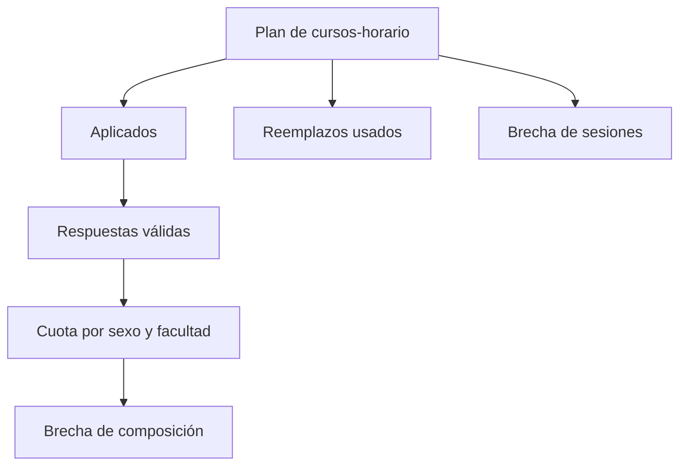

# Avance de cursos-horario

> Mide dos avances distintos —sesiones aplicadas y respuestas conseguidas— y los contrasta con las cuotas por sexo y facultad.

## Objetivo

Es la sección de lectura del modo, y su particularidad es que **hay dos avances y no significan lo mismo**:

| Avance | Qué mide | Qué compromete si va corto |
|---|---|---|
| **Cursos-horario aplicados** | Sesiones del plan efectivamente cubiertas | La fidelidad a la selección muestral |
| **Respuestas válidas** | Personas encuestadas | El tamaño de la muestra |

Un operativo puede ir bien en uno y mal en el otro, y las dos situaciones exigen acciones opuestas: más sesiones frente a mejor captación dentro de cada aula.

## Antes de empezar

- El plan debe estar importado y el campo sincronizado.
- Conviene traer de la Agenda cuántas sesiones quedan por aplicar y cuántas reservas están disponibles.
- Ten presente el diseño de cuotas: la composición es lo que satisface el diseño, no el total.

## Mapa de la pantalla

## Elementos de la pantalla

| Elemento | Para qué sirve | Qué cambia o produce |
|---|---|---|
| **Cursos-horario aplicados** | Sesiones cubiertas del plan | Es el avance de fidelidad |
| **Respuestas válidas** | Encuestas conseguidas y atribuibles | Es el avance de volumen |
| **Respuestas válidas sin curso-horario** | Respuestas que no se pudieron atribuir a ninguna sesión | Inflan el total sin cubrir cuota |
| **Válidas esperadas** | Cuántas respuestas se preveían por sesión | Permite juzgar el rendimiento de cada aula |
| **Cuota por sexo y facultad** | Composición conseguida frente a la diseñada | Es lo que satisface el diseño |
| **Reemplazos y brechas** | Qué reservas se usaron y qué falta | Es la lectura accionable |
| **Reserva adicional** | Unidades disponibles aún sin usar | Dice si queda margen |
| **Representatividad efectiva** | Lectura del peso real de lo conseguido | Advierte sobre desequilibrios de composición |

## Cómo interpretar avance y estados

**Respuestas válidas sin curso-horario** merece atención específica: son encuestas reales que no cuentan para ninguna cuota porque no se sabe de qué sesión salieron. Suben el total y no mejoran la cobertura, así que un avance de respuestas que crece mientras las cuotas no se mueven suele explicarse por ahí. Su causa se investiga en Validación de cursos-horario.

Comparar **respuestas válidas** con **válidas esperadas** por sesión indica si el problema es de acceso a las aulas o de captación dentro de ellas. Aulas aplicadas con muchas menos respuestas de las previstas apuntan a lo segundo: sesiones con poca asistencia o aplicación apresurada.

La **reserva adicional** es lo que determina si una brecha de sesiones se puede cerrar. Sin reserva disponible, la brecha es definitiva y hay que decidir cómo se explica en el informe.

## Resultado de este nivel

Al terminar queda claro cuántas sesiones del plan se cubrieron, cuántas respuestas produjeron, si la composición cumple el diseño y si queda reserva para cerrar lo que falta.

## Pestañas

- [[Resumen de avance de cursos-horario]] reúne la lectura operativa del corte.
- [[Salidas de cursos-horario]] publica ese corte hacia las hojas configuradas.

## Ubicación en la jerarquía

- Padre: [[Cursos-horario]].
