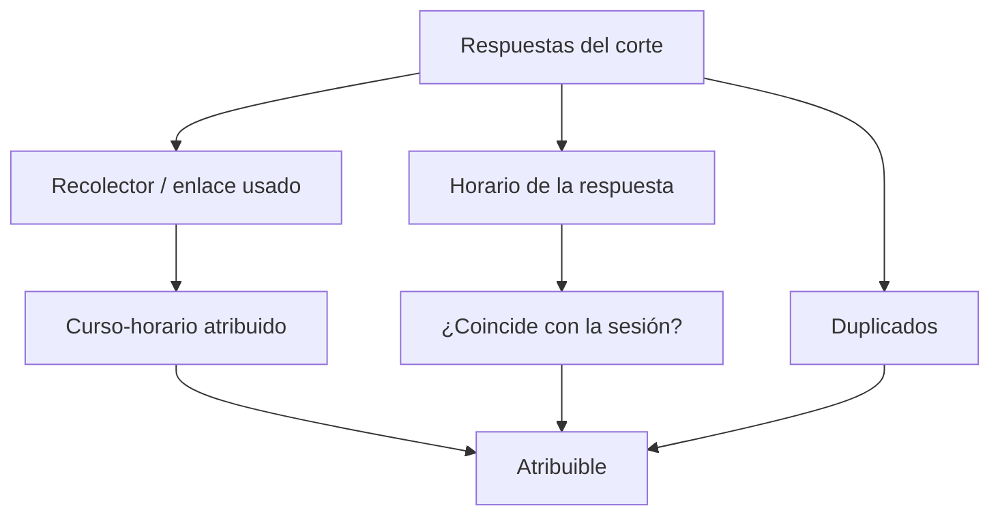

# Validación de cursos-horario

> Comprueba que cada respuesta se pueda atribuir a la sesión correcta: recolector, curso-horario declarado, horario y duplicados.

## Objetivo

En este modo la validación tiene una tarea dominante: la **atribución**. Una respuesta que no se puede ligar a su sesión no sirve para las cuotas por facultad, aunque sea una encuesta perfectamente respondida.

El origen del problema casi siempre es el acceso: se entró por un enlace que no era el de esa sesión, o por uno genérico que no identifica ninguna.

## Antes de empezar

- Las respuestas deben estar sincronizadas.
- Conviene saber qué enlaces y fichas QR se generaron por sesión: la atribución se apoya en ellos.
- Ten a mano el horario real de cada sesión: es la referencia para el control de tiempos.

## Mapa de la pantalla

## Elementos de la pantalla

| Elemento | Para qué sirve | Qué cambia o produce |
|---|---|---|
| Recolector o enlace | Muestra por qué vía entró cada respuesta | Es la base de la atribución |
| Curso-horario atribuido | La sesión a la que quedó ligada | Determina para qué cuota cuenta |
| Respuestas sin curso-horario | Las que no se pudieron ligar a ninguna sesión | Es el problema central de la sección |
| Control de horarios | Compara el momento de la respuesta con el de la sesión | Detecta respuestas fuera de la ventana |
| Duplicados | Señala respuestas repetidas del mismo origen | Evita contar dos veces |
| Alertas de la sección | Reúne lo revisable | Es la lista de trabajo |

## Cómo interpretar avance y estados

Una respuesta **fuera del horario** de su sesión no es necesariamente inválida: alguien puede completar la encuesta al salir del aula. Lo que sí es sospechoso es una respuesta de un enlace de sesión levantada horas o días después, porque significa que el acceso circuló más allá del aula.

Ése es el riesgo característico de este modo: un enlace o QR pensado para una sesión concreta se comparte, y empiezan a llegar respuestas de gente que no estaba allí. El control de horarios y los duplicados son las dos señales que lo detectan.

Las **respuestas sin curso-horario** son el saldo de todo lo anterior. Cuantas más haya, menos sirve el operativo para las cuotas por facultad, aunque el total de respuestas se vea bien.

## Resultado de este nivel

Al terminar, las respuestas quedan separadas entre las atribuibles a una sesión —que cuentan para las cuotas— y las que no, con su causa identificada.

## Ubicación en la jerarquía

- Padre: [[Cursos-horario]].
