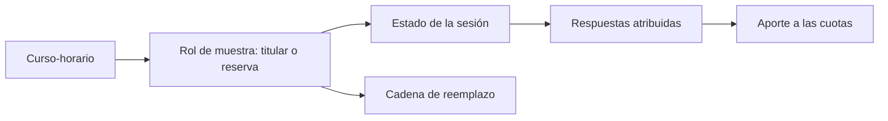

# Consultas de cursos-horario

> Trazabilidad por sesión: qué pasó con cada curso-horario del plan, desde su selección hasta sus respuestas.

## Objetivo

Es donde se responde por una unidad concreta. La pregunta típica llega del cliente o del equipo académico: *¿qué pasó con este curso?* La respuesta exige encadenar información que vive en tres módulos —por qué se seleccionó, qué acceso se le generó, qué ocurrió el día de la aplicación— y esta sección la reúne.

## Antes de recorrer este nivel

- El plan debe estar importado y el campo sincronizado.
- Conviene llegar con la sesión identificada: carrera, curso y horario.
- Si la duda es sobre atribución de respuestas, la sección adecuada es Validación de cursos-horario.

## Mapa de la pantalla

## Elementos de la pantalla

| Elemento | Para qué sirve | Qué cambia o produce |
|---|---|---|
| Buscador de sesión | Localiza el curso-horario por carrera, curso u horario | Es la vía de entrada |
| **Rol de muestra** | Indica si la sesión es titular o reserva | Explica por qué está en el plan |
| Estado de la sesión | Dónde quedó en la secuencia operativa | Cuenta qué pasó |
| **Cadena de reemplazo** | Muestra su relación con titulares o reservas | Explica sustituciones |
| Respuestas atribuidas | Cuántas encuestas produjo esa sesión | Es su aporte real |
| Aporte a las cuotas | Cómo contribuyó a la composición por sexo y facultad | Sitúa su valor en el diseño |
| Responsable y fechas | Quién la cubrió y cuándo | Completa el expediente de la unidad |

## Cómo interpretar avance y estados

El **rol de muestra** es lo primero que hay que leer. Una reserva que se aplicó no es una desviación: es la cadena funcionando, y su presencia se explica por la baja de un titular. Sin ese dato, una lista de sesiones aplicadas parece no corresponder al plan original.

Una sesión con estado **aplicada** y sin respuestas atribuidas señala un problema de acceso, no de aplicación: el equipo estuvo allí y las respuestas no encontraron su sesión. Es el mismo síntoma que produce las respuestas sin curso-horario, visto desde el otro lado.

El aporte a las cuotas explica por qué dos sesiones con el mismo número de respuestas no valen lo mismo: depende de a quién había en el aula.

## Resultado de este nivel

Al terminar, cada sesión del plan tiene una historia consultable —por qué entró, qué pasó, qué produjo— que permite responder preguntas puntuales sin reconstruir nada.

## Ubicación en la jerarquía

- Padre: [[Cursos-horario]].
