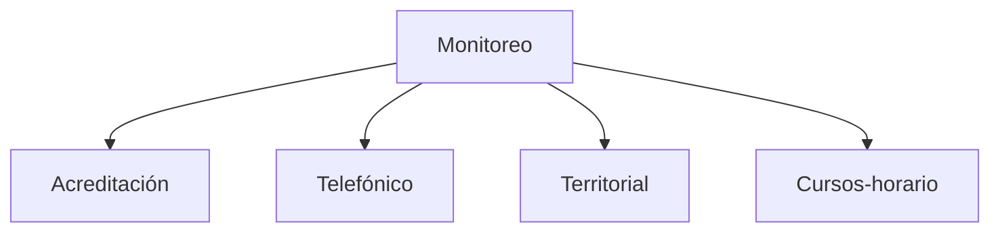

# Monitoreo

> Convierte las fuentes de campo en un corte operativo trazable para revisar avance, resolver excepciones y preparar resultados defendibles.

## Propósito de esta guía

Monitoreo acompaña el trabajo de campo mientras ocurre. No produce la muestra ni analiza los datos: comprueba que lo levantado corresponde a lo planificado, detecta lo que exige intervención y deja evidencia de por qué cada caso cuenta o no cuenta.

Su forma cambia según el estudio, porque un operativo institucional, uno telefónico, uno puerta a puerta y uno en aulas no se controlan igual.

## El modo lo determina el estudio

El módulo tiene cuatro **modos**, y cada uno reescribe el juego de secciones. No se elige con un click: lo determina el diseño del estudio del proyecto. Verlo escrito en la dirección confirma dónde estás; cambiarlo a mano no reconfigura nada.

## Antes de recorrer este nivel

Confirma que las fuentes visibles pertenecen al mismo operativo y a la misma fecha de corte. Dos pantallas sólo son comparables si comparten fase, alcance y fecha, y ese trío es lo primero que hay que mirar en cualquier modo.

## Guía de destinos

| Destino | Cuándo entrar | Qué hacer allí | Qué deja listo |
|---|---|---|---|
| [[Acreditación]] | El estudio sigue a varios actores institucionales, cada uno con su universo y sus canales | Declarar universos por actor, revisar caso a caso el cruce y leer el avance por actor | Un expediente por actor con su procedencia |
| [[Telefónico]] | El levantamiento se hace por llamadas sobre un marco contactable | Controlar el barrido, conciliar con la plataforma y seguir cuotas | Un corte de llamadas conciliado por código de caso |
| [[Territorial]] | La operación se controla por distrito, UMP, manzana y encuestador | Reconciliar Kobo con el marco de Hojas de ruta y validar ubicación y tiempos | Un corte de campo por distrito, UMP y responsable |
| [[Cursos-horario]] | La muestra selecciona sesiones de clase y hay que seguir su aplicación | Importar el plan, gobernar la agenda y cerrar con reemplazos justificados | Una agenda ejecutada y trazable por sesión |

## Lo que los cuatro modos comparten

Aunque su vocabulario difiera, los cuatro se organizan igual y esa simetría ayuda a moverse entre ellos:

| Sección | Qué hace en cualquier modo |
|---|---|
| **Fuentes** | Declara de dónde sale el corte |
| **Modelo operativo** | Declara qué se espera: metas, cuotas, cronograma |
| **Consultas** | Baja al caso individual y sostiene la cifra |
| **Avance** | Lee el resultado y produce las entregas |

Territorial añade **Ocurrencias de campo** para documentar el esfuerzo donde no hubo entrevista, y Telefónico convierte su sección de llamadas en el centro de gobierno diario.

## Cómo interpretar avance y estados

Tres reglas valen en los cuatro modos.

**Un cero no es S/D.** Un control que se ejecutó y no encontró casos vale cero; uno que no pudo evaluarse es S/D. Confundirlos convierte una laguna en un resultado.

**Ingesta, procesable y oficial son etapas distintas.** Lo que el corte trajo, lo que resulta utilizable y lo que cuenta como avance son tres cifras que descienden en ese orden, y la distancia entre ellas es información que hay que poder explicar.

**Abrir una pantalla no la vuelve lista.** Los estados de preparación describen requisitos: *sin configurar* señala una entrada ausente, *no evaluado* que aún no hay evidencia suficiente, *requiere atención* una causa concreta que inspeccionar.

## Cómo se llega a cada pantalla

Toda vista del módulo es enlazable: `/monitoreo?modo=<modo>&seccion=<sección>&pestana=<pestaña>`. La aplicación escribe esa dirección en la barra a medida que navegas, así que puede copiarse para volver exactamente al mismo sitio.

## Resultado de este nivel

Al completar Monitoreo queda identificado qué entradas sostienen la lectura, qué unidades requieren atención y qué evidencia produjo cada sección. Cualquier salida conserva la fecha y la procedencia del corte revisado, que es lo que permite defenderla después.

## Ubicación en la jerarquía

- Padre: [[Prosecnur]].
