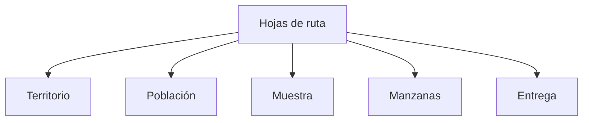

# Hojas de ruta

> Convierte el marco territorial y el diseño muestral en materiales operativos de campo.

## Propósito del módulo

Hojas de ruta transforma una definición geográfica en unidades que un equipo puede visitar. Cada sección responde dónde puede operar el estudio, cuál es el universo, cómo se distribuye N, qué manzanas se seleccionan y qué se entrega. El orden importa porque una modificación temprana puede invalidar resultados posteriores.

## Antes de recorrerlo

Necesitas distritos con códigos territoriales, una fuente censal compatible y una meta aprobada o lista para calcular. Confirma año y cobertura antes de usar totales. Aquí se aplica el marco territorial y se conserva la trazabilidad de las unidades; la preparación operativa no sustituye la decisión metodológica.

## Mapa del recorrido

## Guía de destinos

| Destino | Cuándo entrar | Qué hacer allí | Qué deja listo |
|---|---|---|---|
| [[Territorio]] | Al definir el ámbito | Seleccionar distritos y comprobar cobertura | Un ámbito respaldado |
| [[Población]] | Tras confirmar territorio | Revisar universo y filtros | Totales para la distribución |
| [[Muestra]] | Con universo y meta claros | Configurar y distribuir N | Una asignación trazable |
| [[Manzanas]] | Con la distribución aprobada | Seleccionar titulares y reservas | UMP localizables |
| [[Entrega]] | Al cerrar la selección | Revisar cuotas, titulares y reemplazos | Un paquete consistente para campo |

## Recorrido recomendado

Avanza en el orden mostrado. Si modificas distritos, población o N, vuelve a las etapas dependientes y recalcula; no conserves una selección anterior como si representara el marco nuevo.

## Cómo interpretar el avance

Una etapa está lista cuando coincide con la decisión anterior y conserva identificadores para la siguiente. Una suma correcta con códigos ausentes, o una lista localizable que ya no coincide con N, sigue siendo inconsistente.

## Resultado

Quedan cuotas y unidades listas para ejecutar junto con la relación que permite reconstruir el origen de cada selección.

## Ubicación en la jerarquía

- Padre: [[Prosecnur]].
